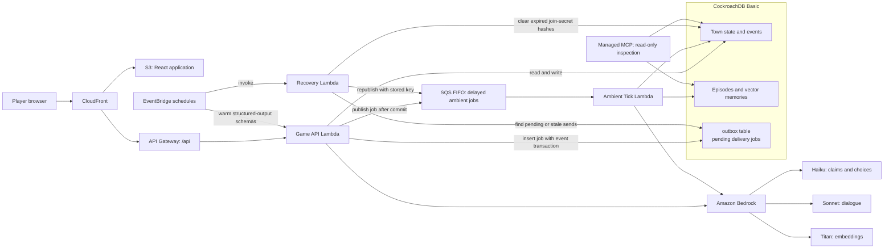
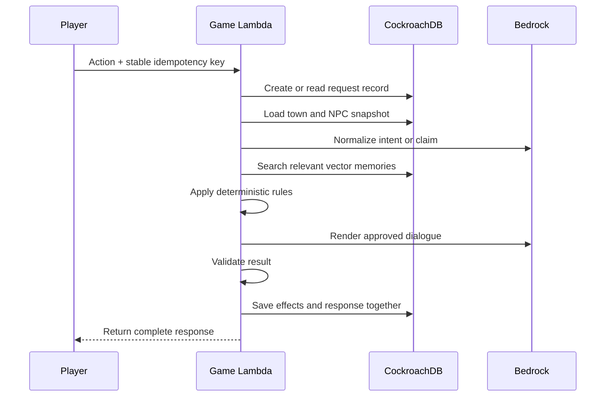

# Decision 002: MVP System Architecture

- **Project:** The Town Remembers
- **Status:** Accepted
- **Date:** 2026-07-26
- **Updated:** 2026-08-02
- **Scope:** Application stack, agent loop, data flow, deployment, security, cost, and hackathon proof

## Purpose

This document explains how the MVP works.

The short version is:

> Lambda runs the work. Bedrock provides language. CockroachDB remembers. SQS waits and retries.

The system is small on purpose. One developer must be able to build it in ten days and keep it online through judging.

## Hackathon fit

The project meets the main requirement:

> Build an agentic application on AWS with CockroachDB as its persistent memory.

It uses two required CockroachDB tools:

1. **Distributed Vector Indexing**
   - Used during NPC conversations and ambient ticks.
   - Finds memories that are semantically related to the current situation.
   - Runs inside CockroachDB. There is no separate vector database.

2. **CockroachDB Cloud Managed MCP Server**
   - Gives judges a read-only inspection path.
   - Shows beliefs, evidence, provenance, promises, relationships, and agent runs.
   - Does not take part in normal player requests.

It uses these AWS services:

- Amazon Bedrock
- AWS Lambda
- Amazon SQS FIFO
- Amazon API Gateway
- Amazon S3
- Amazon CloudFront
- AWS Secrets Manager
- Amazon CloudWatch
- Amazon EventBridge

We will not claim the `ccloud` CLI or Agent Skills as hackathon integrations.

## System map



CloudFront does not share-cache `/api/*`. Player views use private,
cookie-varying conditional caching; mutations, action status, invite preview,
town creation, and join use `no-store`.

## Main technology choices

| Area | Choice | Reason |
|---|---|---|
| Language | TypeScript | One language across the project |
| Web app | React and Vite | Small and fast to build |
| Infrastructure | AWS CDK in TypeScript | Repeatable AWS setup |
| API | API Gateway HTTP API | Simple Lambda entry point |
| Compute | AWS Lambda | No server to keep running |
| Async work | Amazon SQS FIFO | Delayed ambient ticks ordered within each town |
| Database | CockroachDB Basic | Persistent SQL and vector memory |
| Models | Amazon Bedrock | Required AWS-powered agent environment |
| Validation | Zod and Bedrock structured output | Reject malformed model results |
| SQL access | `pg` with Kysely | Typed queries with standard PostgreSQL drivers |
| Tests | Vitest and Playwright | Unit, integration, and browser tests |

## What “agentic” means here

An NPC does more than return chat text.

Each turn follows a bounded loop:

1. **Observe:** Read the player action and current town state.
2. **Recall:** Retrieve relevant memories from CockroachDB.
3. **Decide:** Choose from allowed claims, disclosures, or ambient actions.
4. **Validate:** Reject invented facts or invalid actions.
5. **Act:** Update deterministic game state.
6. **Persist:** Save the event, memory, evidence, and provenance.

The loop ends after one player response or one ambient tick. It cannot run forever.

Lambda is temporary. A Lambda invocation starts, does this work, and ends. It never acts as permanent memory.

## Model responsibilities

### Claude Haiku 4.5

Use Haiku for small, structured tasks:

- Normalize a natural-language claim.
- Choose a bounded ambient action.
- Repair one invalid structured response.

### Claude Sonnet 4.6

Use Sonnet for player-facing dialogue:

- Speak in the NPC's voice.
- Express doubt, trust, fear, or suspicion.
- Mention only approved memories and claims.

### Titan Text Embeddings V2

Use Titan for semantic memory search:

- Embed each episode once.
- Embed the current query once.
- Store 256-dimensional vectors in CockroachDB.

### Model boundary

Models may:

- Interpret language.
- Select from allowed choices.
- Render short dialogue.

Models may not:

- Change objective truth.
- Invent people, places, objects, or evidence.
- Calculate belief scores.
- Decide whether a promise was kept.
- Commit directly to the database.

The application validates every model result before saving it.

Responses are not streamed. The full response is generated, checked, saved, and then shown to the player.

Exact prompt versions, Bedrock output schemas, semantic validators, repair
rules, and evaluation gates are defined in
[Decision 010: Bedrock Prompt and Structured-Output Contracts](010-bedrock-prompt-contracts.md).

## Player action flow



Bedrock calls happen outside database transactions. This avoids holding a transaction open while waiting for a model.

Before committing, Lambda checks the town revision. If relevant state changed, it reloads and tries once more.

The HTTP API has a 30-second integration limit, so application work uses a
24-second completion budget inside a 28-second Lambda timeout. The last four
seconds are reserved for validation, fallback, and commit; dependency calls
receive earlier abort deadlines. Dialogue falls back safely within that budget.
Claim normalization may store a safe terminal response requiring a new action.
A second relevant town change instead stores retryable `409 ACTION_CONFLICT`
with no effects, waits one second, and reuses the same logical action key.

The browser creates one random UUID when it creates a pending action.
Double-clicks and network retries reuse it; an intentional new action gets a new
UUID.

The server keeps one `player_actions` request record for that UUID. The record
remembers what was requested, whether it is still being processed, and the final
response.

| When the same key arrives | Result |
|---|---|
| No request record exists | Create one and process the action |
| The action is still being processed | Return `202 Accepted`; do not start another copy |
| The action hit a retryable conflict | Before the delay, replay `409`; afterward the same key may resume it |
| The action is complete | Return the saved response |
| The action terminally failed | Return the saved safe failure response |
| The key is attached to different input | Return `409 IDEMPOTENCY_KEY_REUSED` |

While an action is being processed, its record temporarily names the worker
allowed to finish it. This **processing claim** expires, so another worker can
recover the action if the first one crashes. Only the worker named by the
current claim may save the result. The completed response and all game effects
are saved in one transaction.

`202` includes `Retry-After: 2` and a dedicated action-status location. The
browser polls that `GET` route; repeating the identical `POST` remains safe.
Player processing claims last 35 seconds and do not renew. If polling still
shows `processing` after that expiry, the browser resends the identical `POST`
and key once to permit conditional takeover. Automatic recovery lasts 70
seconds. Only one action may be processing for a player at a time.

## Ambient tick flow

Pressing **Leave Town** allocates an ambient range and creates a tick only when
that range contains an ambient-eligible event.

1. The Game Lambda atomically ends the visit, writes a departure event, and
   assigns a disjoint range of as-yet-unscheduled events. An eligible range
   creates an outbox row with one stable job key; an ineligible range advances
   the scheduling boundary without a job.
2. The outbox job is sent to an SQS FIFO queue configured with a 20-second
   queue-level delay, `MessageGroupId = town_id`, and
   `MessageDeduplicationId = job_key`.
3. SQS wakes the Ambient Tick Lambda with the outbox ID and job key.
4. The tick creates or reads the job's `ambient_job_executions` record.
5. A completed duplicate stops immediately. Otherwise, the worker takes a
   temporary processing claim and loads ambient-eligible events from its
   assigned range plus relevant NPC memories.
6. Haiku chooses allowed actions or `do_nothing`.
7. Application code validates and applies the choices.
8. CockroachDB atomically stores the episodes, provenance, belief evidence, and
   completed job execution.

A tick may perform at most two ambient actions.

SQS may deliver a job more than once. The job key lets every delivery find the
same job record, where a completed status prevents the town from advancing
twice.

One tick may legitimately produce two actions. The job key identifies the whole
tick, while `ambient:<job-key>:0` and `ambient:<job-key>:1` identify its
numbered `world_events`. This prevents a retry from confusing two valid actions
with duplicate work.

The Recovery Lambda checks for unsent or uncertain outbox rows. EventBridge runs
it once every minute. It republishes the stored outbox row with the original
job key, repairing both a stop before send and a send whose success was not
recorded. A duplicate publication is safe. The same invocation clears hashes
for unconfirmed join requests after their ten-minute transport-replay window;
it never issues a session or recovers an identity.

Every player-facing ambient transition has a five-minute deadline. At the
deadline, undelivered work becomes abandoned and nonterminal execution becomes
quarantined with no effects. Completion or quarantine permits the player to
start another visit; late delivery cannot apply abandoned work. Ambient claims
last 45 seconds and do not renew. The Ambient Tick Lambda times out after 30
seconds; the queue visibility timeout is 180 seconds, batch size is one, and
ambient concurrency is capped at five towns.

## CockroachDB as persistent memory

CockroachDB stores authored identities, current state, causal history, and
operational retry state.

### Authored and identity tables

- `story_entities`
- `actors`, `players`, and `npcs`
- `npc_contact_edges`
- `inspectables` and `clues`
- `world_facts` and `case_solutions`

These tables answer: “What entities and authored rules exist in this version of
the mystery?”

### Current-state tables

- `towns` and `player_visits`
- `items` and `player_capabilities`
- `npc_beliefs` and `npc_player_relationships`
- `promises`
- `case_board_entries` and `town_resolutions`

These tables answer: “What is true now?”

### Causal-history tables

- `world_events`
- `npc_interactions`, `episodes`, and `episode_references`
- `claims`, `claim_relations`, and `claim_transmissions`
- `belief_evidence` and `relationship_changes`
- `clue_discoveries` and `case_attempts`
- `agent_runs`

These tables answer: “How did we get here?” Event, interaction, episode,
transmission, evidence, relationship-change, discovery, and attempt rows are
append-only. New evidence never erases old evidence.

### Operational tables

- `town_creation_requests` and `join_requests`
- `player_sessions` and `api_rate_limits`
- `player_actions` and `claim_drafts`
- `outbox` and `ambient_job_executions`

These tables answer: “Has this request or job already run, what response did it
produce, and has its queued work been delivered and applied?” Their working
status, temporary processing claims, draft status, and delivery fields are
mutable. Terminal identity and response fields do not change.

### Tenant isolation

Every town-owned row includes `town_id`.

Composite keys and foreign keys include `town_id`. A query for one town must not reach another town.

### Vector memory

Each memory row includes:

- `town_id`
- `npc_id`
- Episode text
- Importance
- Event time
- Related claim and entity IDs
- `embedding VECTOR(256)`

The vector index uses `town_id` and `npc_id` as prefix columns. Retrieval stays inside one NPC in one town.

Vector similarity only finds candidates. Application code reranks them using:

- Semantic similarity
- Recency
- Importance
- Direct observation
- Open promises or grievances
- Contradictions

Usually, only six to ten memories enter a prompt.

## Beliefs and provenance

Beliefs use an integer evidence ledger. They are not fake probabilities.

Evidence can add or remove weight based on:

- Direct observation
- Trust at the time testimony was heard
- Number of hearsay hops
- Independent support
- Contradictory evidence
- Caught lies
- Broken promises

Trust is saved with the testimony. A later argument does not rewrite old testimony.

Only an explicit `source_discredited` event can trigger a targeted review of past testimony.

Players see simple labels:

- Doubtful
- Leaning
- Convinced

Players do not see numeric scores.

The case board may show a spoiler-safe path:

> You told Mara → Mara spoke with Nessa → Nessa mentioned it to another player

It does not reveal hidden truth or private NPC reasoning.

## Judge inspection

Managed MCP uses a separate, read-only inspection surface.

The `inspection` schema exposes views such as:

- `inspection.npc_beliefs`
- `inspection.belief_evidence`
- `inspection.claim_paths`
- `inspection.relationship_timeline`
- `inspection.promise_status`
- `inspection.object_history`
- `inspection.objective_truth`
- `inspection.case_progress`
- `inspection.world_event_timeline`
- `inspection.agent_runs`
- `inspection.idempotency_status`
- `inspection.ambient_jobs`

These views make the system explainable without granting write access.

## Reliability rules

- Use short CockroachDB transactions.
- Retry serialization conflicts at most three times.
- Use conditional updates for unique items.
- Allocate disjoint ambient event ranges when visits end.
- Implement the player and ambient retry behavior above with durable records,
  unique database constraints, processing claims, and atomic completion.
- Apply the concrete timeouts, retry bounds, FIFO settings, and recovery limits
  in [MVP Reliability Parameters](007-mvp-reliability-parameters.md).
- Validate all model output.
- Retry one invalid model result.
- Use an authored fallback if the retry fails.
- If an Ask query embedding fails, retrieve only already-authorized recent or
  important memories, unresolved promises, and public disclosures before using
  authored dialogue; never widen the NPC or town boundary.
- Do not commit a claim that failed normalization.
- Do nothing if an ambient choice remains invalid.
- Store model name, prompt version, token use, latency, and outcome in `agent_runs`.

## Security

### Player access

- A shared judge code is required to create a town.
- The code lives in AWS Secrets Manager.
- Joining an existing town only requires its unguessable invite link.
- A separate application security secret derives retry-safe invite tokens and
  privacy-preserving IP hashes.
- Historical application-security key versions remain available while any
  retained creation-request record references them; a completed request remains
  through the created town's lifetime.
- A secure, HTTP-only, path-scoped cookie identifies a guest player in one
  town; a browser may hold independent cookies for several towns.
- Only session-token hashes are stored in `player_sessions`.
- Server sessions do not expire from inactivity; an active session lasts until
  revocation or town retirement. The browser cookie has a one-year `Max-Age`
  and is reissued on the first authenticated response at least thirty days
  after its prior issuance.
- First-time join replay additionally requires a hashed, short-lived
  join-attempt secret. The first authenticated view or ten minutes, whichever
  comes first, closes reissuance permanently and clears that hash. At most three
  session cookies can be issued before closure, so an ordinary idempotency key
  never becomes an identity-recovery credential.
- Losing all valid cookies means losing the identity; there is no account or
  recovery flow.

### Database access

The MVP uses default Lambda internet access and the public CockroachDB Basic endpoint. It does not use a VPC or NAT Gateway.

This is acceptable for a temporary, low-sensitivity demo. It is not the intended production network design.

Required controls:

- Use `sslmode=verify-full`.
- Store only the `app_runtime` database credential in AWS Secrets Manager and
  grant only the Game, Ambient, and Recovery roles access to that secret.
- Keep `migration_admin` in the operator's local encrypted credential store for
  manual migrations; never deploy it to AWS or expose it to Lambda.
- Provision read-only inspection access through CockroachDB Cloud Managed MCP;
  its credential remains in CockroachDB's managed connection, not AWS.
- Use a random 256-bit password.
- Use separate `migration_admin`, `app_runtime`, and read-only inspection access.
- Give `app_runtime` only required DML permissions.
- Use parameterized SQL.
- Set query and connection timeouts.
- Keep database pools small.
- Cap Lambda concurrency.
- Rate-limit API and access-code attempts.
- Send `Referrer-Policy: no-referrer`, load no third-party resources on invite
  pages, and remove invite capabilities from browser history after invite
  resolution.
- Disable CloudFront and S3 access logs that would record raw invite paths. Keep
  only a custom API Gateway access log with request ID, route template, status,
  and latency.
- Never log secrets, raw request URLs or events, headers, cookies, join secrets,
  invite tokens, or connection strings.
- Rotate credentials after recording and after judging.

A production version should use private networking.

## Cost controls

The monthly operating ceiling is **$12.50**.

The application records estimated model cost from actual input and output tokens.

Cost modes:

| Internal monthly model-cost ledger | Behavior |
|---|---|
| Below $8 | Sonnet dialogue; Haiku mechanics |
| $8 to $9.50 | Haiku handles all dialogue |
| $9.50 to $10.35 | Stop new towns and tighten action limits |
| $10.35 and above | Use authored fallbacks; keep data readable |

AWS Budget alerts are set at:

- $5
- $9
- $11

AWS billing alerts can be delayed. The internal ledger is the immediate control.

Other controls:

- Keep prompts short.
- Retrieve at most ten memories.
- Keep dialogue short.
- Embed each episode once.
- Apply per-player and per-town model-action limits.
- Set a CockroachDB Basic resource limit.

## Deployment

Deployment is run from the developer's laptop.

### One-time setup

1. Create a CockroachDB Basic cluster in `us-east-1`.
2. Configure AWS credentials.
3. Run `pnpm cdk:bootstrap`.
4. Run `pnpm cdk:deploy`.
5. Add the runtime database credential, judge code, and application security
   key to Secrets Manager. Keep migration administration local and inspection
   access inside the CockroachDB managed connection.
6. Run `pnpm prompts:prewarm` for every configured model/schema pair.

### Before submission

```bash
pnpm test
pnpm cdk:deploy
pnpm db:migrate
pnpm db:seed-demo
pnpm prompts:prewarm
pnpm smoke-test
```

Run migrations only when the schema changes. Seed the demo town before recording.

Judges use the live URL and access code. They do not need to deploy the project.

Keep the project online through the judging period. Keep all towns until the project is retired.

## Test plan

The minimum test set is:

- Unit tests for claims, beliefs, promises, gates, and reducers.
- Database tests for town isolation and conflicting item transfers.
- Database tests for idempotency uniqueness, mismatched request fingerprints,
  processing-claim takeover, saved-response replay, and numbered event effects.
- Database tests for actor/entity subtype rules, claim drafts, event-range
  disjointness, relationship ledgers, case resolution, and every cross-town
  foreign key.
- API tests for creation and join replay windows, town-scoped sessions,
  normalized display-name uniqueness, hidden-state-safe ETags, retryable
  same-key action conflicts, invite-token log/referrer suppression, and
  structured errors.
- Agent evaluations for valid structure and allowed claims.
- Two-browser tests for asynchronous multiplayer behavior.
- Queue tests for duplicate delivery, uncertain-send republishing, deadline
  quarantine, and guaranteed re-entry.
- A production smoke test.
- A repeatable demo seed.

## Demo proof

The short demo uses two browser sessions and one MCP inspection.

1. Player A tells Mara a misleading claim.
2. Player A leaves town.
3. The ambient tick propagates the claim.
4. Player B receives changed dialogue.
5. Player B presents contradictory evidence.
6. MCP shows why the belief formed and why it changed.

All shown actions are live. The mystery data is pre-seeded for reliability.

## Main trade-offs

### Chosen

- Small, bounded agent loops
- Deterministic game rules
- Persistent and explainable memory
- Serverless AWS compute
- Public CockroachDB endpoint with strong credentials
- Manual, repeatable deployment

### Deferred

- Bedrock Agents
- ECS or EKS
- PrivateLink or a NAT Gateway
- Continuous simulation
- User accounts
- Admin dashboard
- CI/CD pipeline
- A separate vector database
- More mysteries

## Glossary

- **API Gateway:** The public door to the backend.
- **Bedrock:** AWS service that provides the language and embedding models.
- **CDK:** TypeScript code that creates AWS resources.
- **CloudFront:** The public web address and content delivery layer.
- **CockroachDB:** The permanent town database and vector memory.
- **Embedding:** A list of numbers used to find text with similar meaning.
- **Idempotency key:** An opaque identifier reused for every attempt at one
  logical operation so the database can return the prior result instead of
  applying the operation twice.
- **Idempotent:** Safe to run again without applying the same change twice.
- **Lambda:** Temporary code that wakes for one task and then stops.
- **MCP:** A standard way for an AI tool to inspect approved external data and tools.
- **Outbox:** A transactional database list of queued messages and their
  delivery-attempt status.
- **Processing claim:** A temporary, expiring assignment that identifies the
  worker currently allowed to finish a request or job.
- **Provenance:** The recorded path showing where a claim came from.
- **Request record:** A database row that remembers an idempotency key, request
  status, input fingerprint, and completed response.
- **SQS:** A reliable AWS queue that holds work until Lambda can process it.
- **Vector index:** A database index used to find semantically similar memories.

## References

- [HTTP API Contract](006-http-api-contract.md)
- [Logical Data Model and Schema Contract](005-logical-data-model-and-schema-contract.md)
- [MVP Reliability Parameters](007-mvp-reliability-parameters.md)
- [Decision 008: Deterministic Game Rules](008-deterministic-game-rules.md)
- [Decision 009: Authored Game Content](009-authored-game-content.md)
- [Decision 010: Bedrock Prompt and Structured-Output Contracts](010-bedrock-prompt-contracts.md)
- [CockroachDB vector indexes](https://www.cockroachlabs.com/docs/stable/vector-indexes)
- [CockroachDB Cloud Managed MCP Server](https://www.cockroachlabs.com/docs/cockroachcloud/connect-to-the-cockroachdb-cloud-mcp-server)
- [CockroachDB Basic clusters](https://www.cockroachlabs.com/docs/cockroachcloud/plan-your-cluster-basic)
- [Amazon Bedrock structured output](https://docs.aws.amazon.com/bedrock/latest/userguide/structured-output.html)
- [AWS Lambda with Amazon SQS](https://docs.aws.amazon.com/lambda/latest/dg/with-sqs.html)
- [Titan Text Embeddings V2](https://docs.aws.amazon.com/bedrock/latest/userguide/titan-embedding-models.html)
