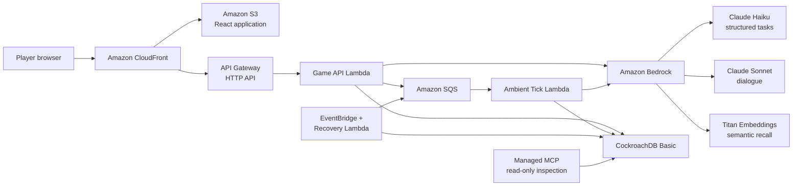

# Technical Architecture and Logical Schema

- **Project:** The Town Remembers
- **Status:** Design reference; implementation pending
- **Date:** 2026-07-26
- **Audience:** Judges, reviewers, and implementers

This document expands the accepted
[MVP system architecture](002-mvp-system-architecture.md) into concrete request
flows, information boundaries, and a logical CockroachDB schema. It is not yet a
SQL migration specification; column types and secondary indexes may be refined
during implementation without changing the responsibilities described here.

## Architectural goals

The system must:

1. Keep objective simulation state separate from subjective NPC knowledge.
2. Let player actions persist and affect later players.
3. Preserve an inspectable causal path for every consequential belief.
4. Use models for bounded interpretation and expression, never authority.
5. Remain reliable and affordable for one developer operating a ten-day MVP.

## System topology



CloudFront has separate behaviours for static assets and `/api` traffic. Lambda
is temporary compute; it does not retain memory between invocations.
CockroachDB is the durable source for both current state and causal history.

## Component responsibilities

| Component | Responsibility | Explicitly does not do |
|---|---|---|
| React + Vite | Render the town, collect bounded actions, and display player-visible state | Read CockroachDB or decide game truth |
| CloudFront + S3 | Deliver static assets and route `/api` requests | Apply game rules |
| API Gateway | Expose the HTTP API and invoke Game Lambda | Generate dialogue or store memory |
| Game Lambda | Authenticate, validate, retrieve, apply rules, call models, and commit | Retain state after invocation |
| Ambient Tick Lambda | Process one bounded off-screen reaction job | Run continuously or create arbitrary actions |
| CockroachDB | Store canonical state, history, provenance, beliefs, vectors, and outbox jobs | Decide what a model should say |
| Bedrock models | Interpret bounded input, embed text, and render approved dialogue | Access the database or mutate state |
| SQS | Delay, redeliver, and buffer ambient jobs | Guarantee exactly-once delivery |
| EventBridge + Recovery Lambda | Find committed outbox jobs that were not sent | Re-run completed jobs |
| Managed MCP | Expose authenticated read-only inspection views | Participate in player requests or mutate state |

## Information boundaries

### Authority is not visibility

The `items` table is authoritative about the bell's physical location. That
does not make the table player-visible or model-visible.

There is no general endpoint that answers, "What is objectively true?" A player
can ask an NPC or perform a mechanically gated inspection:

- **Ask Mara:** build a context from Mara's episodes, received claims, beliefs,
  relationship stance, and permitted disclosures. Do not send the bell's
  objective location to Sonnet.
- **Inspect the chapel:** verify location and access gates, then consult
  objective item state. Reveal the bell only if the action legitimately
  discovers it.

The application should maintain separate code-level capabilities:

```text
SimulationRepository
    Reads canonical state for deterministic mechanics.

NpcContextBuilder
    Produces an NPC-scoped ApprovedDisclosureBundle.

DialogueService
    Accepts the bundle; has no database client and no objective-state input.
```

The model-facing type intentionally excludes objective truth:

```ts
type ApprovedDisclosureBundle = {
  townId: string;
  npcId: string;
  allowedClaimIds: string[];
  requiredClaimIds: string[];
  allowedMemoryIds: string[];
  relationshipStance: "wary" | "neutral" | "trusting" | "suspicious";
  actionOutcome?: "allowed" | "denied";
};
```

Explicit API response types, explicit SQL projections, and tests prevent raw
database rows from being serialized to the browser or copied into prompts.

### Objective state, claims, and beliefs

These layers must remain distinct:

| Layer | Question answered | Mutability |
|---|---|---|
| Canonical simulation state | What is physically or mechanically true now? | Updated only by validated world actions |
| World events | What objectively happened, and in what order? | Append-only |
| Episodes | What did this NPC personally experience? | Append-only |
| Claims | What canonical proposition entered conversation? | Immutable; reused when the proposition repeats |
| Claim transmissions | Who communicated that claim to whom? | Append-only |
| Belief evidence | Why did this NPC's belief gain or lose weight? | Append-only |
| NPC beliefs | What is the NPC's current deterministic conclusion? | Recalculated or updated from evidence |

A valid claim is not necessarily true. Validation confirms that it uses
canonical entities, a supported predicate, valid polarity, and a
player-confirmed normalization. It does not compare the claim with objective
state and reject lies.

## Player `Ask` flow

1. React sends an explicit `Ask` action with an idempotency key and secure
   player cookie.
2. CloudFront routes `/api` to API Gateway, which invokes Game Lambda.
3. Lambda validates the schema, player token, town membership, NPC target,
   action limits, and tenant scope.
4. Lambda loads the town revision and the NPC-scoped current snapshot.
5. Titan embeds the question. The temporary query vector is not normally
   persisted.
6. CockroachDB vector search retrieves candidate episodes using `town_id` and
   `npc_id` prefix columns.
7. Application code reranks candidates using similarity, recency, importance,
   directness, contradictions, and unresolved commitments.
8. Deterministic rules calculate belief stance, access gates, and the allowed
   and required disclosure sets.
9. Sonnet renders short dialogue from the approved bundle.
10. Lambda validates structure, canonical entities, referenced IDs, and
    expressed claims.
11. An invalid result receives at most one bounded repair attempt; another
    failure uses an authored fallback.
12. Lambda opens a short transaction, checks the town revision, and commits the
    interaction and causal records.
13. If relevant state changed during model calls, Lambda reloads and retries
    once.
14. The player receives the response only after persistence succeeds.

Bedrock calls happen outside database transactions.

## Output validation and bounded repair

Zod and Bedrock structured output validate shape, but shape alone cannot prove
that arbitrary prose contains no unsupported claim. The MVP validation chain is:

1. Validate the structured response schema.
2. Require every referenced memory, claim, and entity ID to appear in the
   approved bundle.
3. Normalize propositions expressed in the dialogue into the bounded claim
   grammar and compare them with the approved claim set.
4. Reject unsupported entities or propositions.
5. Attempt one repair using the invalid result, sanitized validation errors,
   NPC style, strict schema, and only the approved disclosure bundle.
6. Validate the repair from scratch.
7. Use an authored fallback if it remains invalid.

The repair model never receives the complete mystery truth. Invalid output may
be recorded as a failed `agent_runs` outcome, but it never becomes an episode,
claim transmission, belief, or player-visible response.

## Ambient propagation

NPC-to-NPC communication is an off-screen claim transmission, not physical
movement or an ongoing autonomous conversation.

1. A consequential player action and an outbox job are committed together.
2. The outbox job is sent to SQS with a short delay.
3. SQS invokes Ambient Tick Lambda at least once.
4. The tick loads newly committed events and relevant NPC memories.
5. Application code constructs allowed `(existing claim, contactable NPC)`
   choices plus `do_nothing`.
6. Haiku selects one supplied choice.
7. Application code validates contactability, disclosure rules, promise
   constraints, provenance, hop limits, tick limits, and idempotency.
8. A valid share appends a transmission, recipient episode, belief evidence,
   event, and agent-run record in one transaction.

Hard bounds:

- At most two ambient actions per tick.
- At most one new gossip hop per claim during a tick.
- Tick-created events cannot trigger another action until a later tick.
- No new facts, entities, items, locations, or promises.
- One unique idempotency key per tick job.
- An invalid choice becomes `do_nothing`.

### Authored NPC contact graph

The ambiguous term "reachable NPC" is replaced with **contactable NPC**.
Contactability is a directed, authored social link and does not imply NPC
movement.

The MVP seed uses Mara as the social hub:

| From | May contact |
|---|---|
| Mara | Nessa, Corin |
| Nessa | Mara |
| Corin | Mara |

Contactability permits an off-screen conversation opportunity. It does not
override secrecy, trust, promise, cover-story, or claim-disclosure rules.

## Model roles

| Model | Normal role | Persistence |
|---|---|---|
| Titan Text Embeddings V2 | Embed episodes once and embed retrieval queries | Episode vectors are stored; query vectors normally are not |
| Claude Sonnet 4.6 | Render short player-facing dialogue from approved information | Output is stored only after validation |
| Claude Haiku 4.5 | Normalize claims, classify unclear intent, select a bounded ambient action, or attempt one structured repair | Structured output is stored only after application validation |

For an explicit `Ask`, Titan and Sonnet are part of the normal path. Haiku is
conditional unless separate semantic validation requires it.

## Logical data model

### Shared conventions

- Every town-owned row includes `town_id`.
- Composite primary and foreign keys preserve tenant isolation.
- Identifiers are opaque and generated server-side.
- Times use UTC timestamps.
- Player and invite tokens are stored only as hashes.
- History rows are append-only unless explicitly identified as operational.
- Player actions, world events, transmissions, and jobs carry idempotency keys.
- JSON payloads may contain event-specific detail but do not replace relational
  keys for important entities.

### Town and identity

| Table | Key fields | Responsibility |
|---|---|---|
| `towns` | `id`, `invite_token_hash`, `revision`, `status`, `created_at` | Isolated mystery instance and optimistic-concurrency revision |
| `players` | `town_id`, `id`, `display_name`, `token_hash`, `created_at`, `last_seen_at` | Guest identity within one town |
| `locations` | `town_id`, `id`, `location_key`, `display_name` | Authored canonical locations copied into each town |
| `npcs` | `town_id`, `id`, `npc_key`, `location_id`, `profile_version` | NPC identity and authored location |
| `npc_contact_edges` | `town_id`, `from_npc_id`, `to_npc_id`, `enabled` | Directed off-screen contact opportunities |

Important constraints:

- `players(town_id, token_hash)` is unique.
- `npc_contact_edges(town_id, from_npc_id, to_npc_id)` is unique.
- Both NPCs in a contact edge belong to the same town.

### Canonical simulation state

| Table | Key fields | Responsibility |
|---|---|---|
| `items` | `town_id`, `id`, `item_key`, `location_id`, `held_by_player_id`, `held_by_npc_id`, `revision` | Authoritative location or custodian of each unique item |
| `relationships` | `town_id`, actor IDs, `trust_score`, `suspicion_score`, `updated_at` | Current player-to-NPC stance and authored NPC-to-NPC trust |
| `promises` | `town_id`, `id`, `kind`, requester/accepter IDs, `claim_id`, `item_id`, `status`, `resolving_event_id` | Mechanically verifiable commitments |
| `case_board_entries` | `town_id`, `id`, `entry_kind`, `claim_id`, `event_id`, `author_player_id`, `verification_status`, `created_at` | Player-visible evidence, testimony, hearsay, contradictions, and notes |

Exactly one item custody location is active: physical location, player holder, or
NPC holder. Unique-item transfers use conditional updates against the item or
town revision.

`verification_status` describes how an entry was acquired; it never turns
testimony into objective truth.

### Claims, memories, and beliefs

| Table | Key fields | Responsibility |
|---|---|---|
| `claims` | `town_id`, `id`, subject, `predicate`, object, `polarity`, `normalized_key`, `created_at` | Canonical proposition, independent of truth and source |
| `claim_transmissions` | `town_id`, `id`, `claim_id`, communicator, recipient, `parent_transmission_id`, alleged source, `hop_count`, `event_id`, `idempotency_key` | Actual communication and provenance chain |
| `episodes` | `town_id`, `id`, `npc_id`, `event_id`, `summary`, `importance`, `occurred_at`, `embedding VECTOR(256)` | Immutable NPC experience and vector memory |
| `npc_beliefs` | `town_id`, `npc_id`, `claim_id`, `score`, `label`, `updated_at` | Current deterministic belief aggregate |
| `belief_evidence` | `town_id`, `id`, `npc_id`, `claim_id`, `episode_id`, `transmission_id`, `kind`, `weight`, `trust_snapshot`, `hop_count`, `created_at` | Append-only explanation for belief changes |

Important constraints:

- `claims(town_id, normalized_key)` is unique. Repeating the same proposition
  reuses the claim.
- A new act of communication always creates a new transmission, even when it
  references an existing claim.
- A retry of the same action cannot create another transmission because its
  idempotency key is unique.
- `npc_beliefs(town_id, npc_id, claim_id)` is unique.
- Belief labels are derived from integer score thresholds; they are not model
  probabilities.
- Trust is copied into `belief_evidence` at transmission time. Later relationship
  changes do not rewrite historical evidence.

The vector index prefixes `town_id` and `npc_id` before the episode embedding.
Vector similarity generates candidates; deterministic application code reranks
them. Usually six to ten episodes enter a prompt.

### History and operations

| Table | Key fields | Responsibility |
|---|---|---|
| `world_events` | `town_id`, `id`, `event_type`, actor/target IDs, `payload`, `idempotency_key`, `occurred_at` | Append-only objective and consequential event log |
| `agent_runs` | `town_id`, `id`, action/job ID, `model`, `prompt_version`, token counts, `latency_ms`, `outcome`, `validation_error_code`, `estimated_cost`, `created_at` | Model audit, validation, latency, and cost telemetry |
| `outbox` | `town_id`, `id`, `event_id`, `job_type`, `payload`, `not_before`, `status`, `attempt_count`, `idempotency_key`, timestamps | Transactional handoff from CockroachDB to SQS |

`agent_runs` records whether generation was accepted, repaired, rejected, or
replaced by a fallback. Rejected model text does not enter the knowledge model.
Sensitive prompts, tokens, credentials, and connection strings are not logged.

The outbox is operationally mutable as delivery status changes. The event that
created it remains append-only.

## Example: one false rumour

Objective state:

```text
items
  bell.location = Old Chapel
```

A player tells Nessa, "The bell is in Reed's Garden":

```text
claims
  #42  bell is_at Reed's Garden

claim_transmissions
  #100  player → Nessa, claim #42

episodes
  #200  Nessa heard the player assert claim #42

belief_evidence
  #300  Nessa received player testimony for claim #42
```

The `items` row does not change.

If a later ambient tick makes Nessa repeat it to Mara, claim `#42` is reused:

```text
claim_transmissions
  #101  Nessa → Mara, claim #42, parent #100

episodes
  #201  Mara heard Nessa assert claim #42

provenance
  player → Nessa → Mara
```

The new transmission and episode are not duplicates; they record a new
communication and a new personal experience. An SQS retry cannot recreate them
because transmission `#101` is protected by the tick idempotency key.

## Concurrency and transaction boundaries

- No Bedrock call runs inside a database transaction.
- Game Lambda loads a town revision, performs model work, then conditionally
  commits against that revision.
- A relevant revision conflict causes one bounded reload and retry.
- CockroachDB serialization conflicts receive bounded retries.
- Unique-item transfers use conditional updates.
- A player action idempotency key prevents double submission.
- An ambient job idempotency key prevents SQS redelivery from advancing the
  town twice.
- Departure event and outbox job are written in one transaction.
- Recovery Lambda sends committed but unsent outbox jobs.

## Tenant isolation and security

- All town-owned queries require `town_id`.
- Composite foreign keys prevent cross-town references.
- Guest player tokens live in secure, HTTP-only cookies; only hashes are stored.
- Town creation requires a shared judge code stored in Secrets Manager.
- Database connections use `sslmode=verify-full`.
- `migration_admin`, `app_runtime`, and inspection access use separate
  credentials and least privilege.
- SQL is parameterized and connections have strict query, pool, and concurrency
  limits.
- Models receive no database credentials or tools.
- The player API exposes explicit safe projections rather than raw tables.
- The Managed MCP connection is separately authenticated and read-only.

## Inspection schema

The read-only `inspection` schema is intended for judges and developers, not
normal player requests.

| View | Shows |
|---|---|
| `inspection.npc_beliefs` | Current labels and scores by NPC and claim |
| `inspection.belief_evidence` | Evidence weights, trust snapshots, and contradictions |
| `inspection.claim_paths` | Ordered claim provenance paths |
| `inspection.relationship_timeline` | Trust and suspicion changes |
| `inspection.promise_status` | Promise conditions and resolving events |
| `inspection.object_history` | Authoritative item transitions |
| `inspection.agent_runs` | Model, prompt version, tokens, latency, validation, and fallback outcomes |

These views reveal causal information for evaluation without granting mutation
access. Player-facing case-board projections remain spoiler-safe.

## Verification priorities

The minimum high-risk tests are:

1. A false claim changes belief evidence but never changes `items`.
2. Mara's initial dialogue prompt does not contain the hidden chapel location.
3. Unsupported model claims are rejected, repaired once, then replaced by a
   fallback.
4. Two towns cannot read or reference each other's rows.
5. Two simultaneous unique-item transfers cannot both succeed.
6. Replaying a player action or SQS job produces no duplicate effects.
7. A player-A rumour changes player-B dialogue only after a valid ambient
   transmission.
8. The inspection views reconstruct the exact belief and provenance path.

## Related decisions

- [Decision 001: MVP Product Direction](001-mvp-product-direction.md)
- [Decision 002: MVP System Architecture](002-mvp-system-architecture.md)
