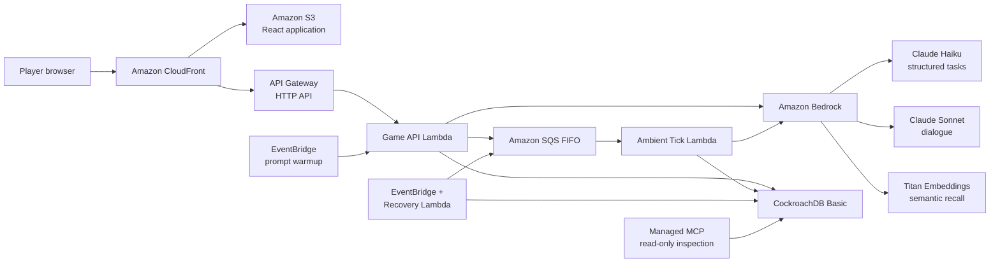

# Technical Architecture and Runtime Flows

- **Project:** The Town Remembers
- **Status:** Accepted technical design; implementation pending
- **Date:** 2026-07-26
- **Updated:** 2026-08-02
- **Audience:** Judges, reviewers, and implementers

This document expands the accepted
[MVP system architecture](002-mvp-system-architecture.md) into concrete runtime
flows, information boundaries, model responsibilities, and reliability
behavior. The implementation-ready database design is maintained separately in
the [Logical Data Model and Schema Contract](005-logical-data-model-and-schema-contract.md),
and the public transport surface in the
[HTTP API Contract](006-http-api-contract.md).

## Architectural goals

The system must:

1. Keep objective simulation state separate from subjective NPC knowledge.
2. Let player actions persist and affect later players.
3. Preserve an inspectable causal path for every consequential belief.
4. Use models for bounded interpretation and expression, never authority.
5. Remain reliable and affordable for one developer operating a ten-day MVP.

## System topology



CloudFront has separate behaviours for static assets and `/api` traffic. Shared
caching is disabled for `/api/*`; player views are private and cookie-varying,
and mutations, action status, invites, creation, and join are not stored.
Lambda is temporary compute; it does not retain memory between invocations.
CockroachDB is the durable source for both current state and causal history.

## Component responsibilities

| Component | Responsibility | Explicitly does not do |
|---|---|---|
| React + Vite | Render the town, collect bounded actions, and display player-visible state | Read CockroachDB or decide game truth |
| CloudFront + S3 | Deliver static assets and route `/api` requests | Apply game rules |
| API Gateway | Expose the HTTP API and invoke Game Lambda | Generate dialogue or store memory |
| Game Lambda | Authenticate, validate, retrieve, apply rules, call models, and commit | Retain state after invocation |
| Ambient Tick Lambda | Process one bounded off-screen reaction job | Run continuously or create arbitrary actions |
| CockroachDB | Store canonical state, history, provenance, beliefs, vectors, and outbox jobs | Decide what a model should say |
| Bedrock models | Interpret bounded input, embed text, and render approved dialogue | Access the database or mutate state |
| SQS FIFO | Delay, order per-town work, redeliver, and buffer ambient jobs | Guarantee exactly-once effects without the database ledger |
| EventBridge + Recovery Lambda | Find committed outbox jobs whose delivery is pending or uncertain, and clear expired join-replay secrets | Re-run completed jobs, recover a player identity, or generate replacement keys |
| EventBridge prompt warmup | Keep stable Bedrock structured-output grammars compiled during live judging | Create town state or weaken a task fallback |
| Managed MCP | Expose authenticated read-only inspection views | Participate in player requests or mutate state |

## Information boundaries

### Authority is not visibility

The `items` table is authoritative about the bell's physical location. That
does not make the table player-visible or model-visible.

There is no general endpoint that answers, "What is objectively true?" A player
can ask an NPC or perform a mechanically gated inspection:

- **Ask Mara:** build a context from Mara's episodes, received claims, beliefs,
  relationship stance, and permitted disclosures. Do not send the bell's
  objective location to Sonnet.
- **Inspect the chapel:** verify location and access gates, then consult
  objective item state. Reveal the bell only if the action legitimately
  discovers it.

The application should maintain separate code-level capabilities:

```text
SimulationRepository
    Reads canonical state for deterministic mechanics.

NpcContextBuilder
    Produces an NPC-scoped ApprovedDisclosureBundle.

DialogueService
    Accepts the bundle; has no database client and no objective-state input.
```

The model-facing type intentionally excludes objective truth:

```ts
type ApprovedDisclosureBundle = {
  townId: string;
  npcId: string;
  allowedClaimIds: string[];
  requiredClaimIds: string[];
  allowedMemoryIds: string[];
  relationshipStance: "wary" | "neutral" | "trusting" | "suspicious";
  actionOutcome?: "allowed" | "denied";
};
```

Explicit API response types, explicit SQL projections, and tests prevent raw
database rows from being serialized to the browser or copied into prompts.

The sole gameplay read model is the aggregated `player-view`. Its opaque
`viewVersion` and HTTP `ETag` are derived from that player's canonical safe
projection after excluding `viewVersion` and volatile transport fields, never
from `towns.revision`. Hidden changes therefore cannot leak through a changing
version. The browser refreshes after actions and uses conditional light
polling; unchanged views return `304 Not Modified`. The HTTP contract defines
the exact domain separator and canonical serialization.

Invite resolution reveals only town status, mystery title, and join mode.
After joining, ordinary routes use an opaque town ID plus an independent
town-scoped HTTP-only cookie, so invite tokens do not remain in routine API
URLs. Town creation, first-time join, and authenticated actions use separate
durable request ledgers because they occur under different authority.
The SPA sends `Referrer-Policy: no-referrer`, loads no third-party invite-page
resources, and replaces the invite URL after resolution. CloudFront and S3 raw
access logging are disabled; the API access log records the route template but
not raw paths, queries, headers, or bodies.

### Objective state, claims, and beliefs

These layers must remain distinct:

| Layer | Question answered | Mutability |
|---|---|---|
| Canonical simulation state | What is physically or mechanically true now? | Updated only by validated world actions |
| World events | What objectively happened, and in what order? | Append-only |
| Episodes | What did this NPC personally experience? | Append-only |
| Claims | What canonical proposition entered conversation? | Immutable; reused when the proposition repeats |
| Claim transmissions | Who communicated that claim to whom? | Append-only |
| Belief evidence | Why did this NPC's belief gain or lose weight? | Append-only |
| NPC beliefs | What is the NPC's current deterministic conclusion? | Recalculated or updated from evidence |

A valid claim is not necessarily true. Validation confirms that it uses
canonical entities, a supported predicate, valid polarity, and a
player-confirmed normalization or authored seed record. It does not compare the
claim with objective state and reject lies.

## Player `Ask` flow

1. React creates one UUID idempotency key for the logical `Ask` action, keeps it
   with the pending action, and sends it to the versioned typed action route in
   the `Idempotency-Key` header with the town-scoped secure player cookie.
   Transport retries reuse both the key and request.
2. CloudFront routes `/api` to API Gateway, which invokes Game Lambda.
3. Lambda validates the basic schema, player token, town membership, NPC target,
   and tenant scope.
4. Lambda applies the [player-action idempotency rules](#player-actions).
   Completed or already-processing requests return here; new or recoverable work
   continues.
5. Lambda loads the town revision and the NPC-scoped current snapshot.
6. Titan embeds the question. The temporary query vector is not normally
   persisted.
7. CockroachDB vector search retrieves candidate episodes using `town_id` and
   `npc_id` prefix columns.
8. Application code reranks candidates using similarity, recency, importance,
   directness, contradictions, and unresolved commitments.
9. Deterministic rules calculate action limits, belief stance, access gates, and
   the allowed and required disclosure sets.
10. Sonnet renders short dialogue from the approved bundle.
11. Lambda validates structure, canonical entities, referenced IDs, and
    expressed claims.
12. An invalid result receives at most one bounded repair attempt; another
    failure uses an authored fallback.
13. Lambda opens a short transaction, checks that it still owns the processing
    claim and that the town revision is current, and saves the interaction,
    causal records, response, and completed status together.
14. If relevant state changed during model calls, Lambda reloads and retries
    once while retaining its processing claim.
15. The player receives the response only after persistence succeeds.

If query embedding fails at step 6, Ask uses only deterministic, already
authorized recent or important episodes, unresolved promises, and public
disclosures. If those yield no safe context, it uses authored dialogue. This
fallback never broadens the NPC/town visibility boundary.

Bedrock calls happen outside database transactions.

The HTTP API integration allows 30 seconds, Game Lambda 28 seconds, and
application work 24 seconds. The application records an absolute deadline,
reserves the final four seconds for validation, fallback, and commit, and makes
all pre-commit reads and model calls finish before that window. The final
transaction uses the remaining application time while preserving 500
milliseconds for response serialization.
Dialogue uses an authored fallback if its safe result cannot finish within that
budget. Claim normalization stores a terminal retry-with-new-action `503`
because it has no safe semantic fallback. A repair or revision rerun starts
only if its worst-case bound fits before the reserve. An initial request is
never detached into untracked background work.

## Idempotency contract

An idempotency key names one player action or background job. Every retry of
that action uses the same key.

The design stores two simple things:

| Stored information | How long it lasts | Purpose |
|---|---|---|
| **Request record** | For the lifetime of the town | Remembers the key, input, status, and final response |
| **Processing claim** | Until a short expiry time | Names the worker currently allowed to finish the work |

A request record is sometimes called an operation ledger. A processing claim is
sometimes called a lease. The plainer terms are used here because they describe
their roles more directly.

### Player actions

The browser creates one random UUID when an action becomes pending.
Double-clicks and automatic retries reuse it. Editing or intentionally repeating
an action creates a new UUID.

After authentication and basic validation, Lambda calculates a fingerprint of
the input and creates or reads the matching `player_actions` record. The
fingerprint is a fixed-size hash used only to detect whether the same key was
accidentally attached to different input.

| Existing record | Server behavior |
|---|---|
| None | Create a `processing` record, take the processing claim, and begin |
| Same input, still processing | Return `202 Accepted` with `Retry-After` |
| Same input, completed | Return the saved status and response |
| Same input, terminally failed | Return the saved safe failure response |
| Different input | Return `409 IDEMPOTENCY_KEY_REUSED` |
| Processing claim expired | Replace the claim and retry the work |

The MVP uses `Retry-After: 2` and returns an action-status `Location`. The
browser polls that dedicated `GET` route; resending the identical request and
key remains a safe fallback.

The processing claim contains a random token and an expiry time. The final
database transaction succeeds only if its token still matches the request
record. Therefore, if a retry replaces an expired claim, the old worker can no
longer save a late result.

The winning worker saves all game effects, the safe response, and the completed
status in one transaction. If the response is lost on the network, the next
retry reads and returns the saved result instead of applying the action again.

Implementation details:

- A player key is unique within `(town_id, player_id)`.
- `request_hash` is SHA-256 over canonical JSON containing the API version,
  action kind, target IDs, and action input. Cookies, the key itself, and
  transport-only headers are excluded.
- Authentication and malformed-request failures happen before a request record
  is created. Rule-based denials for a valid request are saved as completed
  responses.
- Completed and terminally failed request records and fingerprints remain for
  the lifetime of the town.
- Keys identify retries; they are not secrets or authentication credentials.
- Player processing claims last 35 seconds and do not renew. The browser polls
  every two seconds and resends the identical `POST` once after claim expiry to
  permit takeover, with a 70-second automatic recovery window. A second
  relevant town-revision conflict stores a nonterminal
  `409 ACTION_CONFLICT` with no effects and a one-second retry delay; the
  identical request reuses the same key after that delay.

Town creation and joining do not use this player ledger. Creation replays
require the judge code. Joining uses a `join_requests` record plus a separate
hashed join-attempt secret that authorizes at most three cookie issuances until
the first authenticated view or ten minutes, whichever comes first. Closing
that bootstrap path clears the hash; the ordinary join idempotency key is not
an identity credential.
Server sessions have no inactivity expiry: an active session lasts until
revocation or town retirement. The browser cookie has a one-year `Max-Age` and
is reissued on the first authenticated response at least thirty days after its
prior issuance; losing it still has no recovery flow.

### Ambient jobs

The same pattern protects background work:

1. Game Lambda creates an outbox row with one server-generated job key.
2. Every SQS publication and retry carries that same job key. The FIFO queue
   uses `town_id` as its message group and the job key as its deduplication ID.
3. Ambient Tick Lambda creates or reads the matching
   `ambient_job_executions` record.
4. A completed job stops immediately. A new or recoverable job takes the
   temporary processing claim.
5. The worker saves all tick effects and the completed status in one
   transaction.

The SQS message contains only `town_id`, `outbox_id`, and the job key. The worker
loads the authoritative payload from the outbox row. A fingerprint mismatch for
an existing outbox ID or job key is treated as corruption and is not applied.

One tick can produce two legitimate actions, so two levels of identity are
needed:

- The **job key** identifies the whole tick.
- `ambient:<job-key>:0` and `ambient:<job-key>:1` identify its numbered
  `world_events`.

The completed job record prevents the whole tick from running again. Unique
event effect keys provide a second database safeguard and keep the two valid
actions distinct. Player actions use `player:<action-key>:<index>`.

### What this guarantees

It protects against:

- Coalesced double-clicks and HTTP retries.
- A response being lost after the database commit.
- Two workers receiving the same request at the same time.
- SQS redelivery and Recovery Lambda republishing.
- A crashed worker returning after another worker has taken over.

It does not:

- Merge equivalent requests that use different keys.
- Authenticate or authorize a player.
- Guarantee that SQS will eventually deliver a job.
- Resolve conflicts between different actions.

Town revisions and conditional item updates handle conflicts between different
actions. The outbox and SQS retries handle delivery. A future external side
effect must accept the same key or use an equivalent transactional outbox.

## Output validation and bounded repair

Zod and Bedrock structured output validate shape, but shape alone cannot prove
that arbitrary prose contains no unsupported claim. The MVP validation chain is:

1. Validate the structured response schema.
2. Require every referenced memory, claim, and entity ID to appear in the
   approved bundle.
3. Normalize propositions expressed in the dialogue into the bounded claim
   grammar and compare them with the approved claim set.
4. Reject unsupported entities or propositions.
5. Attempt one repair using the invalid result, sanitized validation errors,
   NPC style, strict schema, and only the approved disclosure bundle.
6. Validate the repair from scratch.
7. Use an authored fallback if it remains invalid.

The repair model never receives the complete mystery truth. Invalid output may
be recorded as a failed `agent_runs` outcome, but it never becomes an episode,
claim transmission, belief, or player-visible response.

## Ambient propagation

NPC-to-NPC communication is an off-screen claim transmission, not physical
movement or an ongoing autonomous conversation.

1. Consequential actions append events marked `ambient_eligible`; they do not
   publish directly.
2. Leave Town atomically ends the visit and allocates the next disjoint event
   range. A range containing an eligible event creates an outbox job; an
   ineligible range advances the boundary without a job.
3. An outbox job is sent to SQS with a short delay. Recovery republishes the
   same row if delivery status is uncertain.
4. SQS invokes Ambient Tick Lambda at least once.
5. The worker applies the [ambient-job idempotency rules](#ambient-jobs).
   Completed jobs stop here; new or recoverable jobs load ambient-eligible
   events from the outbox row's disjoint sequence range and relevant NPC
   memories.
6. Application code constructs allowed `(existing claim, contactable NPC)`
   choices plus `do_nothing`.
7. Haiku selects supplied choices.
8. Application code validates contactability, disclosure rules, promise
   constraints, provenance, hop limits, and tick limits.
9. The worker saves the transmissions, recipient episodes, belief evidence,
   events, agent-run records, and completed job status in one transaction.

Hard bounds:

- At most two ambient actions per tick.
- At most one new gossip hop per claim during a tick.
- Tick-created events cannot trigger another action until a later tick.
- No new facts, entities, items, locations, or promises.
- An invalid choice becomes `do_nothing`.

Recovery runs once per minute. Player-facing ambient transitions have a hard
five-minute deadline. At that point pending delivery is abandoned and
nonterminal execution quarantines with no effects; a late message is a no-op.
Completion or quarantine unblocks the next visit, so queue or model failure
cannot strand a player away. The Ambient Tick Lambda has a 30-second hard
timeout and 24-second application budget. Processing claims last 45 seconds
without renewal; SQS visibility is 180 seconds, batch size is one, and global
ambient concurrency is five. No worker may commit after the transition
deadline or after the town leaves `active`.

The same invocation also clears hashes on unconfirmed join requests whose
ten-minute transport-replay window expired. This is credential cleanup only; it
cannot issue a cookie or recover an identity.

### Authored NPC contact graph

The ambiguous term "reachable NPC" is replaced with **contactable NPC**.
Contactability is a directed, authored social link and does not imply NPC
movement.

The MVP seed uses Mara as the social hub:

| From | May contact | From NPC's trust in contact |
|---|---|---:|
| Mara | Nessa | `30` |
| Mara | Corin | `40` |
| Nessa | Mara | `20` |
| Corin | Mara | `20` |

Contactability permits an off-screen conversation opportunity. It does not
override secrecy, trust, promise, cover-story, or claim-disclosure rules.

## Model roles

| Model | Normal role | Persistence |
|---|---|---|
| Titan Text Embeddings V2 | Embed episodes once and embed retrieval queries | Episode vectors are stored; query vectors normally are not |
| Claude Sonnet 4.6 | Render short player-facing dialogue from approved information | Output is stored only after validation |
| Claude Haiku 4.5 | Normalize claims, select a bounded ambient action, or attempt one structured repair | Structured output is stored only after application validation |

For an explicit `Ask`, Titan and Sonnet are part of the normal path. Haiku is
conditional unless separate semantic validation requires it.

The exact system prompts, output schemas, cross-field validators, and prompt
evaluation gates are defined in
[Decision 010: Bedrock Prompt and Structured-Output Contracts](010-bedrock-prompt-contracts.md).

## Logical schema contract

The accepted 39-table model now lives in
[Logical Data Model and Schema Contract](005-logical-data-model-and-schema-contract.md).
That reference owns:

- SQL value conventions and subtype-safe identities
- Every table, relationship, state machine, and column-presence rule
- Belief, relationship, disclosure, access, and recall constants
- Event effects, idempotency records, outbox delivery, and ambient ranges
- Required indexes, inspection views, and database verification priorities

Exact gameplay calculations and balance constants are consolidated in
[Decision 008: Deterministic Game Rules](008-deterministic-game-rules.md). The
schema contract owns how their inputs and outputs are persisted and constrained.

This runtime document intentionally keeps only the information needed to
understand how requests, models, queues, and transactions interact.

## Runtime consistency summary

- Bedrock and embedding calls never run inside database transactions.
- Player effects and the saved response commit atomically against the current
  processing claim and town revision.
- Ambient effects and completed job execution commit atomically.
- World events provide stable numbered effect identities.
- Leave Town assigns disjoint event ranges before publishing the outbox job.
- Unique-item transfers and town resolution use conditional updates.
- All town-owned access is scoped by `town_id`; cross-town foreign keys are
  impossible under the schema contract.
- Player-safe view versions are derived from the projection rather than the
  canonical revision.
- Provisioning, joining, sessions, and application rate limits use their own
  operational records instead of overloading player actions.

## Runtime verification focus

- Model prompts never receive hidden objective truth.
- Unsupported generated claims are rejected, repaired once, then replaced by
  an authored fallback.
- A retry cannot duplicate a player effect or ambient action.
- Tick-created events cannot trigger another action inside their own tick.
- A false claim may change belief evidence but never authoritative item state.
- Read-only inspection reconstructs the complete action, provenance, belief,
  relationship, and queue path.


## Related decisions

- [Decision 001: MVP Product Direction](001-mvp-product-direction.md)
- [Decision 002: MVP System Architecture](002-mvp-system-architecture.md)
- [Infrastructure Cost Estimate](004-infrastructure-cost-estimate.md)
- [Logical Data Model and Schema Contract](005-logical-data-model-and-schema-contract.md)
- [HTTP API Contract](006-http-api-contract.md)
- [MVP Reliability Parameters](007-mvp-reliability-parameters.md)
- [Decision 008: Deterministic Game Rules](008-deterministic-game-rules.md)
- [Decision 009: Authored Game Content](009-authored-game-content.md)
- [Decision 010: Bedrock Prompt and Structured-Output Contracts](010-bedrock-prompt-contracts.md)
