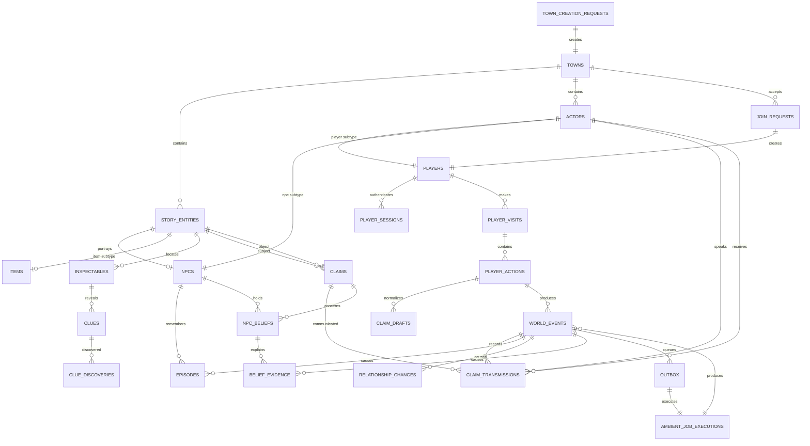

# Logical Data Model and Schema Contract

- **Project:** The Town Remembers
- **Status:** Accepted logical design; SQL implementation pending
- **Date:** 2026-08-01
- **Updated:** 2026-08-02
- **Scope:** Entity boundaries, table contracts, value domains, invariants, indexes, inspection views, and schema verification

This document is the implementation contract for the CockroachDB data model.
It is intentionally separate from the runtime architecture so implementers can
work from a focused schema reference without reading request-flow and model-role
explanations on every visit.

## How to use this document

- Start with [Technical Architecture and Runtime Flows](003-technical-architecture-and-schema.md) to understand system behavior and model boundaries.
- Use [Decision 008: Deterministic Game Rules](008-deterministic-game-rules.md)
  for the authoritative calculations behind belief, relationship, disclosure,
  access, recall, promises, ambient selection, and case progression.
- Use this document when designing migrations, Kysely types, repositories, seed data, inspection views, and database tests.
- The entity boundaries, value domains, nullability, relationships, uniqueness rules, and required indexes are accepted decisions.
- Numeric ranges repeated here are schema-enforced mirrors of `mvp-rules-v1`;
  Decision 008 owns the behavioral calculations.
- Migration syntax and constraint names may change without changing this contract.

## Contents

- [Logical data model](#logical-data-model)
  - [Settled modelling decisions](#settled-modelling-decisions)
  - [SQL value conventions](#sql-value-conventions)
  - [Relationship map](#relationship-map)
  - [Town and identity](#town-and-identity)
  - [Authored truth, evidence, and current state](#authored-truth-evidence-and-current-state)
  - [Claims, memories, and beliefs](#claims-memories-and-beliefs)
  - [Relationships, promises, and player-visible progress](#relationships-promises-and-player-visible-progress)
  - [History, operations, idempotency, and ambient ranges](#history-operations-idempotency-and-ambient-ranges)
  - [Transaction retry policy](#transaction-retry-policy)
  - [Required indexes](#required-indexes)
- [Example: one false rumour](#example-one-false-rumour)
- [Concurrency and transaction boundaries](#concurrency-and-transaction-boundaries)
- [Tenant isolation and security](#tenant-isolation-and-security)
- [Inspection schema](#inspection-schema)
- [Verification priorities](#verification-priorities)

## Logical data model

The settled model contains 40 tables. Each exists because it owns a distinct
identity, lifecycle, consistency boundary, or append-only causal record; there
are no generic entity-attribute-value tables.

### Settled modelling decisions

- The MVP has one authored mystery. Authored content lives in versioned
  TypeScript seed data; `towns.content_version` records exactly which version
  was copied into a town. There is no multi-mystery CMS in the MVP.
- Authored people, locations, items, and motives share one `story_entities`
  identity space. Claims therefore use real foreign keys instead of
  polymorphic, unvalidated IDs. Lark is a `character` entity but not an NPC.
- Players and conversational NPCs share one `actors` identity space. This makes
  player-to-NPC, NPC-to-NPC, and NPC-to-player communication use one provenance
  model without nullable speaker and recipient columns.
- Every visit is explicit. Current player location belongs to an active
  `player_visits` row rather than to the persistent player identity.
- Town creation, first-time join, player sessions, and application rate limits
  have explicit operational records. Pre-authentication retries do not reuse
  the authenticated `player_actions` ledger.
- Physical evidence is authored as `clues` attached to `inspectables`. Discovery
  is recorded separately and attributed to the player who found it.
- Claim normalization and confirmation are separate operations. Unconfirmed
  normalized text lives in `claim_drafts` and cannot affect beliefs.
- `world_events` is the stable effect ledger. One action or ambient job may
  create several numbered events; downstream records link to those events
  instead of carrying duplicate idempotency keys.
- Player-to-NPC trust and suspicion use dedicated current and history tables.
  Authored directional NPC-to-NPC trust lives on `npc_contact_edges`.
- Accusation attempts and the irreversible shared ending are explicit records.
- JSON is reserved for versioned request, response, event-detail, and queue
  payloads. Canonical entities, actors, claims, clues, promises, and causal
  sources use relational foreign keys.

### SQL value conventions

| Logical value | CockroachDB representation | Rule |
|---|---|---|
| Primary and foreign IDs | `UUID` | Generated server-side; never meaningful to players |
| Idempotency and processing tokens | `UUID` | Random and opaque; join-attempt secrets are separate credentials |
| Token and request fingerprints | `BYTES` | SHA-256 output; raw tokens are never stored |
| Time | `TIMESTAMPTZ` | Written and compared in UTC |
| Revisions, sequences, and counters | `INT8` | Non-negative |
| Scores, weights, and hop counts | `INT4` | Range checks described below |
| Closed value domains | `STRING` plus `CHECK` | Easier to evolve than database enum types |
| Versioned flexible payloads | `JSONB` | Must have a Zod schema and version field |
| Model cost | `DECIMAL(12,6)` | USD estimate, never floating point |
| Episode embedding | `VECTOR(256)` | Nullable until the embedding attempt finishes |

Except for the root `towns` table, every town-owned table has a composite
primary key beginning with `town_id` or a unique constraint that includes
`town_id`. Every foreign key between
town-owned records includes `town_id`. Runtime deletes are not used; foreign
keys use `RESTRICT`. History rows are append-only. Operational rows may change
only in fields explicitly described as mutable. Expired `api_rate_limits` rows
are the sole routine-delete exception and may be pruned after 24 hours.

All mutable current-state rows have `updated_at`. All durable rows have
`created_at`. Table descriptions omit those columns only where repeating them
would obscure the domain fields.

### Relationship map



The diagram intentionally omits supporting links so the main causal path
remains readable. The table contracts below are authoritative.

### Town and identity

#### `towns`

| Column | Type and nullability | Meaning |
|---|---|---|
| `id` | `UUID NOT NULL` | Town identifier and primary key |
| `invite_token_hash` | `BYTES NOT NULL UNIQUE` | Hash of the unguessable invite token |
| `content_version` | `STRING NOT NULL` | Version of the authored seed and deterministic rules |
| `status` | `STRING NOT NULL` | `active`, `awaiting_resolution`, `resolved`, or `retired` |
| `revision` | `INT8 NOT NULL DEFAULT 0` | Optimistic-concurrency revision |
| `last_event_sequence` | `INT8 NOT NULL DEFAULT 0` | Last sequence allocated to a world event |
| `ambient_scheduled_through_sequence` | `INT8 NOT NULL DEFAULT 0` | Highest event sequence consumed by ambient range allocation, whether or not the range required a job |
| `winning_case_attempt_id` | `UUID NULL` | Correct attempt that opened the final choice |
| `resolution_owner_player_id` | `UUID NULL` | Player with the initial exclusive choice |
| `resolution_reservation_expires_at` | `TIMESTAMPTZ NULL` | End of the owner's ten-minute reservation |
| `created_at` | `TIMESTAMPTZ NOT NULL` | Creation time |
| `resolved_at` | `TIMESTAMPTZ NULL` | Set only when the town becomes `resolved` |

Valid transitions are `active -> awaiting_resolution -> resolved -> retired`
and `active -> retired`. A failed accusation leaves the town `active`.
The three resolution-reservation fields are null while `active`, are all
present while `awaiting_resolution`, and remain as audit identity after
resolution. Before expiry only the owner may choose; afterward any player with
a visit whose `started_at` is no later than the winning correct attempt's event
time may choose. A resolved town accepts read-only joins and views but no visits
or gameplay. A retired town accepts neither joins nor player views.

#### `story_entities`

| Column | Type and nullability | Meaning |
|---|---|---|
| `town_id`, `id` | `UUID NOT NULL` | Composite primary key |
| `entity_type` | `STRING NOT NULL` | `character`, `location`, `item`, or `motive` |
| `entity_key` | `STRING NOT NULL` | Stable authored key within the content version |
| `display_name` | `STRING NOT NULL` | Safe public name |
| `content_key` | `STRING NOT NULL` | Lookup key into versioned authored content |

`(town_id, entity_key)` is unique. A story entity never represents a player.
Type-specific rules are validated whenever another table references an entity:
NPCs portray characters, locations use location entities, and item state uses
item entities.

`story_entities(town_id, id, entity_type)` is also unique. References whose
allowed type matters carry the expected discriminator as a checked constant and
use this three-column foreign key. Claims additionally store checked
`subject_entity_type` and `object_entity_type` columns, so the predicate/type
matrix below is enforced by the database rather than merely trusted to
application code.

#### `actors`, `players`, and `npcs`

| Table | Required domain columns | Responsibility |
|---|---|---|
| `actors` | `town_id UUID`, `id UUID`, `actor_type STRING`, `display_name STRING`, `display_name_normalized STRING` | Shared identity for a `player` or `npc` that can speak, receive claims, hold an item, or participate in an event |
| `players` | `town_id UUID`, `id UUID`, `last_seen_at TIMESTAMPTZ` | Guest-player subtype of `actors`; authentication belongs to session rows |
| `npcs` | `town_id UUID`, `id UUID`, `character_entity_id UUID`, `location_entity_id UUID`, `profile_key STRING`, `profile_version STRING` | Conversational-NPC subtype of `actors` |

Subtype tables reuse the actor ID as their primary key and foreign key.
Each subtype stores its checked constant `actor_type` and references
`actors(town_id, id, actor_type)`, which prevents a player actor from acquiring
an NPC subtype or vice versa. Actor and subtype creation are one transaction,
and an inspection invariant reports any parent without its required subtype.
`actors(town_id, display_name_normalized)` is unique, preventing both duplicate
player names and authored-NPC impersonation. Display names are normalized with
Unicode NFKC, trimmed, whitespace-collapsed, and fully case-folded for
comparison; the accepted display casing is immutable. Names contain 2 through
24 grapheme clusters and use only letters, numbers, spaces, apostrophes, and
hyphens. `npcs.character_entity_id` is unique within a town; one authored
character has at most one conversational actor. Lark has no `npcs` row.

#### `town_creation_requests`

| Column group | Required values |
|---|---|
| Identity | `idempotency_key UUID` primary key, `request_hash BYTES`, `content_version STRING`, `security_key_version STRING` |
| Processing claim | `status STRING`, `processing_token UUID NULL`, `processing_expires_at TIMESTAMPTZ NULL`, `attempt_count INT4` |
| Saved result | `town_id UUID NULL`, `response_status INT4 NULL`, `response_payload JSONB NULL`, `error_code STRING NULL`, timestamps |

Town creation happens before a town-owned player exists, so this global
operational ledger is separate from `player_actions`. Every attempt and replay
requires the valid judge code. The invite token is a versioned HMAC of the
creation key using the application security secret; only its hash is stored on
`towns`. The recorded key version permits exact invite replay after secret
rotation without storing plaintext. Referenced historical security-key
versions remain retrievable while any retained creation-request record uses
them. A completed request that created a town remains through the town's
lifetime.

Status is `processing`, `completed`, or `failed`, with the same claim and
terminal-field rules as other request ledgers. The MVP request body is exactly
`{}` because the server selects the sole authored mystery. Its fingerprint
includes the API version, operation kind, and canonical empty body but excludes
the judge code and idempotency key. The first claim freezes `content_version`
and `security_key_version`; all retries use those values even after deployment
or rotation. A completed request references exactly one town and remains
through that town's lifetime. Its `response_payload` contains only the safe town
ID and status, never the invite token or URL; the API derives the invite on each
initial response or replay from the request key and recorded security-key
version.

#### `join_requests` and `player_sessions`

| Table | Required domain columns | Responsibility |
|---|---|---|
| `join_requests` | `town_id UUID`, `idempotency_key UUID`, `request_hash BYTES`, `join_secret_hash BYTES NULL`, `status STRING`, processing-claim fields, `player_id UUID NULL`, `initial_visit_id UUID NULL`, `replay_expires_at TIMESTAMPTZ NULL`, `bootstrap_confirmed_at TIMESTAMPTZ NULL`, `replay_closed_at TIMESTAMPTZ NULL`, `replay_closed_reason STRING NULL`, `session_issue_count INT4`, safe response fields, timestamps | Make first-time guest creation retry-safe without turning an ordinary idempotency key into a lasting credential |
| `player_sessions` | `town_id UUID`, `id UUID`, `player_id UUID`, `join_request_id UUID`, `token_hash BYTES`, `status STRING`, `last_cookie_issued_at TIMESTAMPTZ`, `created_at TIMESTAMPTZ` | Authenticate one browser session for one town and close its bootstrap replay path |

`join_requests(town_id, idempotency_key)` and
`player_sessions(town_id, token_hash)` are unique. A join request also requires
a separate 256-bit join-attempt secret; only its hash is stored and it is never
logged. Processing claims last 30 seconds.

A completed join maps permanently to one player. Before both
`bootstrap_confirmed_at` and `replay_expires_at`, the same request, key, and
join secret may mint another session row for that player if the initial response
was lost. The first successful authenticated player-view conditionally sets
`bootstrap_confirmed_at` through the session's join request and atomically
clears `join_secret_hash`. Later replay
returns `410 JOIN_REPLAY_CLOSED`; time expiry returns
`410 JOIN_REPLAY_EXPIRED`. Neither can issue a session. Losing all session
cookies after bootstrap means losing the identity; there is no recovery flow.
`session_issue_count` starts at one and is conditionally incremented when a
cookie is minted. It may not exceed three; the next replay closes with
`410 JOIN_REPLAY_EXHAUSTED`. Thus one request can own at most three
simultaneously active bootstrap sessions.

Closing for confirmation, time expiry, or issue exhaustion sets
`replay_closed_at` and the matching reason and clears `join_secret_hash`; open
completed requests have none of those closure fields. A processing request has
`session_issue_count = 0`; a completed request has a count from one through
three. Recovery scans expired open requests once per minute and performs this
conditional closure; an incoming replay performs it synchronously if the sweep
has not run. This cleanup cannot authenticate a player or issue a session.

Session tokens are random, stored only as hashes, and may coexist for the small
number of response replays. Sessions use `active` or `revoked` and have no
inactivity expiry; an active row is accepted until revocation or town
retirement. The browser cookie has a one-year `Max-Age` and is reissued on the
first authenticated response at least thirty days after its prior issuance,
including for a resolved-town view. A conditional timestamp update elects one
concurrent response to emit `Set-Cookie`. This changes
`last_cookie_issued_at`, not a server expiry.
Loss of the cookie remains unrecoverable. Each town cookie is independently
named and path-scoped, so one browser can retain several town identities.

Every join atomically creates the player actor, zeroed NPC relationships, and a
session. An active-town join additionally creates a Festival Square visit and
an internally completed `start_visit` action; the join request references that
visit. Joining an `awaiting_resolution` or `resolved` town creates no visit.

#### `api_rate_limits`

| Column | Type and nullability | Meaning |
|---|---|---|
| `scope_kind`, `scope_key`, `bucket_kind` | `STRING, BYTES, STRING NOT NULL` | Composite identity for IP hash, player, or town and the protected operation |
| `tokens_milli` | `INT8 NOT NULL` | Remaining token-bucket capacity in thousandths |
| `last_refill_at` | `TIMESTAMPTZ NOT NULL` | Last atomic refill calculation |
| `updated_at` | `TIMESTAMPTZ NOT NULL` | Operational pruning timestamp |

The server atomically refills and consumes every applicable bucket before it
creates a new operation record. A rejection therefore does not consume an
idempotency key. Source IPs use rotating HMAC hashes, never raw addresses.
Expired buckets may be pruned after 24 hours. The exact rates live in the HTTP
API contract. The model-backed player-action bucket covers exactly `ask`,
`normalize_claim`, `tell`, `show`, `give`, and `accept_promise`; ambient work is
accounted for separately. Processing and terminal same-input replays bypass
model quota because they execute no model. Reclaiming a `retryable` action
consumes the applicable attempt buckets before returning it to `processing`; a
rejected attempt leaves the existing record retryable under the same key.

#### `npc_contact_edges`

| Column | Type and nullability | Meaning |
|---|---|---|
| `town_id`, `from_npc_id`, `to_npc_id` | `UUID NOT NULL` | Composite primary key |
| `trust_score` | `INT4 NOT NULL` | Authored directional trust from -100 to 100 |
| `enabled` | `BOOL NOT NULL DEFAULT true` | Whether off-screen contact is currently possible |

The two NPCs must be different and in the same town. Contact and trust are
directional. This table replaces the ambiguous NPC-to-NPC rows previously
implied by `relationships`.

The `mvp-rules-v1` seed contains:

| From NPC | To NPC | From NPC's trust in To NPC |
|---|---|---:|
| Mara | Nessa | `30` |
| Mara | Corin | `40` |
| Nessa | Mara | `20` |
| Corin | Mara | `20` |

When one NPC hears another, testimony weighting reads the listener-to-speaker
edge. Contact eligibility reads the speaker-to-listener edge.

#### `player_visits`

| Column | Type and nullability | Meaning |
|---|---|---|
| `town_id`, `id` | `UUID NOT NULL` | Composite primary key |
| `player_id` | `UUID NOT NULL` | Visiting player |
| `current_location_entity_id` | `UUID NOT NULL` | Current authored location |
| `status` | `STRING NOT NULL` | `active` or `ended` |
| `start_revision` | `INT8 NOT NULL` | Town revision observed at entry |
| `end_revision` | `INT8 NULL` | Town revision after Leave Town completes |
| `started_by_action_id`, `ended_by_action_id` | `UUID NOT NULL`, `UUID NULL` | Start action and, once ended, the action that closed the visit |
| `end_reason` | `STRING NULL` | `left_town` or `town_resolved` |
| `started_at`, `ended_at` | `TIMESTAMPTZ` | Visit bounds; `ended_at` is nullable while active |

A partial unique index permits at most one active visit for a player. Travel
conditionally updates `current_location_entity_id` and the town revision.
Ending a visit, creating its departure event, allocating the next ambient
range, and conditionally creating an outbox row are one transaction. Starting
while an active visit exists returns that visit rather than creating another.
Every visit begins at Festival Square. The first active-town join creates an
internal completed `start_visit` action before inserting the visit, then links
that action back to the new visit in the same transaction; later starts use the
ordinary authenticated action flow. No visit may start unless the town is
`active` and the player's prior ambient transition is terminal or absent.

### Authored truth, evidence, and current state

#### `world_facts` and `case_solutions`

| Table | Required domain columns | Responsibility |
|---|---|---|
| `world_facts` | `town_id UUID`, `id UUID`, `fact_key STRING`, `claim_id UUID`, `visibility STRING` | Immutable authored propositions known to be objectively true; visibility is `hidden`, `discoverable`, or `public` |
| `case_solutions` | `town_id UUID`, `culprit_entity_id UUID`, `motive_entity_id UUID`, `location_entity_id UUID`, `required_item_id UUID` | One private answer row per town |

`world_facts(town_id, fact_key)` and `world_facts(town_id, claim_id)` are unique.
`case_solutions.town_id` is its primary key, so there is exactly one solution.
Claims remain truth-neutral: objective truth exists only in `world_facts`,
`case_solutions`, and canonical current-state tables such as `items`. Neither
table is exposed to the player API or placed wholesale in a model prompt.
The solution's culprit is a character, motive is a motive entity, location is a
location entity, and required item is an item entity; constant type
discriminators and composite foreign keys enforce those roles.

#### `inspectables`, `items`, and `player_capabilities`

| Table | Required domain columns | Responsibility |
|---|---|---|
| `inspectables` | `town_id UUID`, `id UUID`, `inspectable_key STRING`, `location_entity_id UUID`, `linked_entity_id UUID NULL`, `display_name STRING`, `content_key STRING`, `gate_key STRING NULL`, `enabled BOOL` | Authored areas and objects that accept Inspect |
| `items` | `town_id UUID`, `id UUID`, `location_entity_id UUID NULL`, `held_by_actor_id UUID NULL`, `revision INT8`, `revealed_event_id UUID NULL` | Current location, custodian, and discovery state of a unique item; `id` is also an item `story_entities` ID |
| `player_capabilities` | `town_id UUID`, `id UUID`, `player_id UUID`, `capability_key STRING`, `status STRING`, `granted_event_id UUID`, `revoked_event_id UUID NULL` | Persistent authored permissions such as `enter_old_chapel` |

`inspectables(town_id, inspectable_key)` and
`player_capabilities(town_id, player_id, capability_key)` are unique. An item has
exactly one custodian: precisely one of `location_entity_id` and
`held_by_actor_id` is non-null. Transfers use a conditional update against
`items.revision`. `revealed_event_id` is immutable once set. Capabilities move
from `granted` to `revoked` only; access decisions that remain purely derived
from an item or relationship do not create redundant capabilities.

`inspectables.location_entity_id` must reference a location. A non-null
`linked_entity_id` must reference an item; fixed scenery has no linked entity.
When a linked item moves, its `items` custody is authoritative and the
inspectable is available only at that custody location.

#### `clues`, `clue_claim_effects`, and `clue_discoveries`

| Table | Required domain columns | Responsibility |
|---|---|---|
| `clues` | `town_id UUID`, `id UUID`, `clue_key STRING`, `inspectable_id UUID`, `clue_kind STRING`, `content_key STRING`, `required_for_resolution BOOL` | Authored verified evidence revealed by inspection |
| `clue_claim_effects` | `town_id UUID`, `clue_id UUID`, `claim_id UUID`, `effect_kind STRING`, `signed_weight INT4`, `rule_version STRING` | Deterministic support or contradiction applied when a clue is shown |
| `clue_discoveries` | `town_id UUID`, `id UUID`, `clue_id UUID`, `player_id UUID`, `event_id UUID` | Append-only attribution that a player found a clue |

`clues(town_id, clue_key)` is unique.
`clue_claim_effects(town_id, clue_id, claim_id)` is unique and its effect kind is
`supports` or `contradicts`. `clue_discoveries(town_id, clue_id, player_id)` is
unique, so repeated inspection by one player does not create contribution spam.
The first discovery creates the shared verified-evidence board entry; later
player discoveries create one additional attribution row and remain visible in
contribution history. Repeating the inspection by a player who already has that
row creates no write. The API names these outcomes `new_to_town`,
`new_to_player`, and `already_discovered_by_player`, respectively. Once that shared
entry exists, any player may submit the clue through `show`; a personal
discovery row is not required.

`clue_kind` is `physical_trace`, `document`, or `object_state`. These labels
control presentation only; the signed claim effects remain authoritative.
An explicit `contradicts` edge and a contradiction derived from the same clue's
`supports` edge coalesce into one contribution for that NPC, clue, and claim.
Positive support uses evidence kind `physical_clue`; every negative clue effect
uses `contradiction`.

The final confrontation gate requires the `case_solutions.required_item_id` to
be revealed and every clue marked `required_for_resolution` to have at least one
discovery. This is deterministic and does not depend on dialogue.

#### Deterministic disclosure and access gates

Authored NPC disclosure bundles classify each claim as `public`, `guarded`,
`confidential`, `cover_story`, or `final_truth`:

| Tier | Required gate |
|---|---|
| `public` | Always disclosable when relevant |
| `guarded` | Trust at least 20 and suspicion below 40, or presentation of a relevant verified clue |
| `confidential` | Trust at least 40, suspicion below 20, and no broken promise with that NPC |
| `cover_story` | Explicitly authored for Corin; permitted until the final confrontation and never treated as objective truth |
| `final_truth` | The final-confrontation evidence gate is satisfied |

For the MVP seed, Nessa's cart observation is guarded, Mara's knowledge of the
accident and offer of help is confidential, and Corin's complete explanation is
final truth. The dialogue model receives only claims whose tiers passed these
rules.

Nessa transfers the chapel key only when her trust is at least 40, suspicion is
below 40, and the player accepts the authored return-item promise in the same
action. A player may enter the Old Chapel when they hold the key or possess
`enter_old_chapel`. Corin grants that capability at trust 40 or above,
suspicion below 20, after the player presents a relevant required clue. These
conditions are evaluated in application code and their resulting item,
capability, promise, and relationship records are committed atomically.
Decision 008's action order evaluates same-action gates against the predicted
post-effect relationship state.

### Claims, memories, and beliefs

#### `claims` and `claim_relations`

| Column | Type and nullability | Meaning |
|---|---|---|
| `town_id`, `id` | `UUID NOT NULL` | Claim identity |
| `subject_entity_id`, `subject_entity_type` | `UUID, STRING NOT NULL` | Canonical character or item plus checked type discriminator |
| `predicate` | `STRING NOT NULL` | `was_at`, `moved`, `damaged`, `is_at`, or `acted_for` |
| `object_entity_id`, `object_entity_type` | `UUID, STRING NOT NULL` | Canonical object plus checked type discriminator |
| `polarity` | `STRING NOT NULL` | `positive` or `negative` |
| `context_key` | `STRING NOT NULL` | Authored context such as `festival_night` or `current` |
| `normalized_key` | `STRING NOT NULL` | Canonical serialization of the preceding fields |

`claims(town_id, normalized_key)` is unique. Allowed entity combinations are:

| Predicate | Subject type | Object type |
|---|---|---|
| `was_at` | `character` | `location` |
| `moved` | `character` | `item` |
| `damaged` | `character` | `item` |
| `is_at` | `item` | `location` |
| `acted_for` | `character` | `motive` |

`claim_relations` contains `town_id`, two claim IDs, `relation_kind`
(`contradicts` or `entails`), `rule_version`, and `created_at`. The ordered claim
pair and relation kind are unique. Exact positive/negative opposites and
mutually exclusive same-context locations are created deterministically;
authored semantic relations may be seeded. This table drives visible
contradictions without a separate case-board link table.

Claims not already in the authored catalog may be created through the bounded
grammar. Creating one also creates its deterministic relations and backfills
missing contradiction mirrors from existing, unreversed primary support
evidence in the same transaction. Each backfilled mirror uses the
claim-creation event as its causal event and points to its older primary
evidence row, making the result independent of claim-creation order.

#### `claim_drafts`

| Column group | Required values |
|---|---|
| Identity | `town_id UUID`, `id UUID`, `player_id UUID`, `visit_id UUID`, `target_npc_id UUID` |
| Original input | `original_text STRING` |
| Proposed normalization | `subject_entity_id UUID`, `subject_entity_type STRING`, `predicate STRING`, `object_entity_id UUID`, `object_entity_type STRING`, `polarity STRING`, `context_key STRING`, `normalized_key STRING`, `alleged_source_actor_id UUID NULL` |
| Lifecycle | `status STRING`, `expires_at TIMESTAMPTZ`, `normalization_action_id UUID`, `confirmed_by_action_id UUID NULL`, `confirmed_claim_id UUID NULL` |

The state machine is `pending -> confirmed`, `pending -> cancelled`, or
`pending -> expired`. Drafts expire 10 minutes after creation. Only the creating
player may confirm a pending, unexpired draft, and one draft may be confirmed
once. Confirmation creates or reuses `claims` and creates the player-to-NPC
transmission in the same transaction as the completed Tell action. A pending,
cancelled, or expired draft has no belief or gameplay effect.

Confirmation is bound to the draft's visit and target NPC. The visit must still
be active and co-located with that NPC; changing target or editing the text
requires a new draft and idempotency key.

When present, `alleged_source_actor_id` is a same-town canonical actor explicitly
named in the original text. Confirmation copies it to the resulting
transmission; application code never infers it from NPC dialogue.

Expiration is enforced by `expires_at` during reads and confirmation; no
scheduled cleanup is required. A stale pending row may be lazily marked
`expired` for inspection, but its time check applies even before that update.

#### `npc_interactions` and `claim_transmissions`

| Table | Required domain columns | Responsibility |
|---|---|---|
| `npc_interactions` | `town_id UUID`, `id UUID`, `player_action_id UUID`, `visit_id UUID`, `player_id UUID`, `npc_id UUID`, `event_id UUID`, `input_kind STRING`, `player_text STRING NULL`, `npc_text STRING`, `response_mode STRING` | Immutable accepted NPC turn and player-visible response |
| `claim_transmissions` | `town_id UUID`, `id UUID`, `claim_id UUID`, `speaker_actor_id UUID`, `recipient_actor_id UUID`, `parent_transmission_id UUID NULL`, `root_transmission_id UUID`, `source_episode_id UUID NULL`, `alleged_source_actor_id UUID NULL`, `source_kind STRING`, `hop_count INT4`, `event_id UUID`, `interaction_id UUID NULL`, `ordinal INT4`, `created_at TIMESTAMPTZ` | One actual act of communicating a structured claim |

`npc_interactions.player_action_id` is unique. `input_kind` is `ask`, `tell`,
`show`, `give`, or `promise`. `response_mode` is `selected`, `repaired`,
`fallback`, or `authored`.

A player-facing turn creates one `npc_interaction` world event. Every structured
claim actually spoken during that turn links to the same event and receives a
zero-based transmission `ordinal`. An off-screen NPC-to-NPC communication
creates a `claim_transmitted` world event, normally with one transmission at
ordinal zero.

Transmissions support player-to-NPC, NPC-to-NPC, and NPC-to-player speech.
Speaker and recipient must differ. `(town_id, event_id, ordinal)` is unique.
`source_kind` is one of:

- `original_assertion`: no parent; the speaker originates the claim.
- `direct_observation`: `source_episode_id` names the speaker's experience.
- `repeated_testimony`: `parent_transmission_id` names the prior communication;
  that prior recipient must be the new speaker and the claim must match.
- `alleged_hearsay`: `alleged_source_actor_id` records an asserted source when
  no observed parent transmission exists.

`hop_count` is zero for original assertions and direct observations. Repeating a
transmission sets it to the parent's hop count plus one. Alleged hearsay starts
at one. NPC recipients may receive only hop counts `0` through `3`. A repeated
NPC-to-player disclosure may use terminal hop `4` only when its parent is hop
`3`; players do not propagate claims through an ambient edge, and no hop-4
transmission may target an NPC or become a parent. This reserves one final
player-visible provenance edge without allowing a fourth off-screen gossip hop.
An originating transmission names itself as
`root_transmission_id`; a
repeat copies its parent's root. Provenance and independent-source identity are
therefore explicit and are not inferred from prose. A player-visible
provenance path starts at the displayed transmission, repeatedly follows
`parent_transmission_id` to the root, reverses that chain, and emits the root
speaker followed by each recipient. `hop_count` and `root_transmission_id` are
consistency checks, not sort keys; `ordinal` distinguishes claims spoken in one
event and never orders hearsay hops.

#### `episodes` and `episode_references`

| Table | Required domain columns | Responsibility |
|---|---|---|
| `episodes` | `town_id UUID`, `id UUID`, `npc_id UUID`, `event_id UUID`, `episode_kind STRING`, `summary STRING`, `importance INT4`, `occurred_at TIMESTAMPTZ`, `embedding VECTOR(256) NULL`, `embedding_status STRING` | Immutable NPC experience and vector memory |
| `episode_references` | `town_id UUID`, `episode_id UUID`, `reference_kind STRING`, `entity_id UUID NULL`, `claim_id UUID NULL` | Structured people, places, items, motives, and claims used in deterministic reranking |

`episodes(town_id, npc_id, event_id, episode_kind)` is unique. Importance is
0–100. `embedding_status` is `pending`, `ready`, or `failed`; the vector is
non-null only when ready. Each episode reference has exactly one of `entity_id`
or `claim_id`. Duplicate references are forbidden.

Episode identity, text, importance, event, and references are append-only. The
derived `embedding` and `embedding_status` columns are the sole mutable
exception and may move from `pending` or `failed` to `ready`; they never alter
what the NPC experienced.

`episode_kind` is `direct_observation`, `heard_claim`, `player_interaction`,
`promise_consequence`, `item_transfer`, or `world_consequence`.
`episode_references.reference_kind` is `participant`, `location`, `item`,
`motive`, or `claim` and must agree with the populated foreign key.

The vector index prefixes `town_id` and `npc_id` before `embedding` and includes
only ready embeddings. Candidate recall returns at most 30 rows; deterministic
reranking selects exactly the top 8 authorized rows, or every authorized row
when fewer than eight exist. The normalized reranking score is:

| Signal | Weight |
|---|---|
| Cosine similarity | 45% |
| Recency with a seven-day exponential half-life | 15% |
| Authored episode importance divided by 100 | 15% |
| Directness: direct 1.0, testimony 0.6, hearsay 0.3 | 10% |
| Unresolved promise or grievance match | 10% |
| Contradiction with a current belief | 5% |

Ties use newer `occurred_at` and then the opaque episode ID. Direct
observations, promise resolutions, betrayals, unique-item transfers, and active
contradictions receive importance of at least 80, so ordinary recency cannot
erase them from a relevant recall set.

An embedding failure never discards the episode. Recall unions vector
candidates with a fallback candidate pool of up to ten recent or
importance-80+ episodes selected through `episode_references`, then applies the
same final top-eight rerank. Structured memory therefore still works while
Titan is unavailable without widening the prompt. The failed vector may be
retried during a later invocation, using a conditional `failed -> ready`
update; the episode text and causal identity do not change.

#### `npc_beliefs` and `belief_evidence`

| Table | Required domain columns | Responsibility |
|---|---|---|
| `npc_beliefs` | `town_id UUID`, `npc_id UUID`, `claim_id UUID`, `score INT4`, `label STRING`, `revision INT8`, `updated_event_id UUID` | Current deterministic aggregate |
| `belief_evidence` | `town_id UUID`, `id UUID`, `npc_id UUID`, `claim_id UUID`, `event_id UUID`, `episode_id UUID NULL`, `transmission_id UUID NULL`, `source_root_transmission_id UUID NULL`, `independent_source_actor_id UUID NULL`, `corroboration_threshold INT4 NULL`, `clue_id UUID NULL`, `evidence_kind STRING`, `signed_weight INT4`, `trust_snapshot INT4 NULL`, `hop_count INT4 NULL`, `mirrors_evidence_id UUID NULL`, `reverses_evidence_id UUID NULL`, `rule_version STRING` | Append-only explanation for one score contribution |

`npc_beliefs(town_id, npc_id, claim_id)` is the primary key. Scores are clamped
to -100 through 100. Labels are derived:

| Score | Label |
|---|---|
| 60 to 100 | `convinced` |
| 20 to 59 | `leaning` |
| -100 to 19 | `doubtful` |

Initial evidence policy:

| Evidence | Signed weight |
|---|---|
| NPC direct observation | +80 |
| Verified physical clue | Value stored in `clue_claim_effects`; exactly +70 or -70 in `mvp-rules-v1` |
| Original player testimony | 35 + floor(current NPC-to-player trust / 10), yielding 25–45 |
| NPC testimony | 40 + floor(authored directional trust / 10), yielding 30–50 |
| Each recorded hearsay hop | -10 from the testimony weight, minimum absolute support 10 |
| Independent corroboration | +15 for the second and third originating actors; maximum +30 |

`belief_evidence.evidence_kind` is `direct_observation`, `player_testimony`,
`npc_testimony`, `physical_clue`, `corroboration`, `contradiction`, or
`source_reversal`. Column-presence checks require the matching episode,
transmission, clue, root transmission, independent source actor, corroboration
threshold, mirrored evidence, or reversed evidence reference.
`independent_source_actor_id` is
present only for testimony and corroboration; it references the actor who
originated the root transmission. `corroboration_threshold` is present only for
corroboration and is `2` or `3`.

Supporting evidence applies its positive weight to the supported claim and a
negative mirror to each explicit contradictory claim. Evidence authored only
as `contradicts` applies its negative weight to that claim without inferring
which alternative is true. A mirror never recursively creates another mirror,
stores `mirrors_evidence_id`, and is unique for its NPC, target claim, and
primary evidence. New claim relations backfill missing mirrors before the
creating action's own belief effects commit.
`trust_snapshot` and the final `signed_weight` are stored permanently. Caught
lies create targeted `source_discredited` effects for one listening NPC, source
actor, and claim; those effects append reversal evidence that points to
`reverses_evidence_id`. Broken promises change relationships and recall but do
not automatically reverse factual testimony. Old evidence is never edited. A reversal
uses the exact opposite weight, preventing repeated discrediting from subtracting
the same evidence twice. `reverses_evidence_id` is unique when present.
Testimony is unique by NPC, claim, and independent originating actor, even when
that actor creates another root transmission. `independent_source_actor_id`
stores that root speaker. Corroboration thresholds are `2` and `3` and are unique
within one causal event, NPC, and claim. Thresholds may be crossed again after
a source reversal. The aggregate score is the clamped sum of all ledger
weights. Decision 008 defines the exact contradiction, contestation,
corroboration, and reversal rules.

### Relationships, promises, and player-visible progress

#### `npc_player_relationships` and `relationship_changes`

| Table | Required domain columns | Responsibility |
|---|---|---|
| `npc_player_relationships` | `town_id UUID`, `npc_id UUID`, `player_id UUID`, `trust_score INT4`, `suspicion_score INT4`, `revision INT8`, `updated_event_id UUID` | Current directional NPC stance toward one player |
| `relationship_changes` | `town_id UUID`, `id UUID`, `npc_id UUID`, `player_id UUID`, `event_id UUID`, `trust_delta INT4`, `suspicion_delta INT4`, `reason_kind STRING`, `claim_id UUID NULL`, `clue_id UUID NULL`, `item_id UUID NULL`, `promise_id UUID NULL`, `source_root_transmission_id UUID NULL`, `rule_version STRING` | Append-only relationship ledger |

The current row is unique by `(town_id, npc_id, player_id)`. Both scores are
clamped to -100 through 100. Player creation seeds one zeroed row for each NPC.
The current score is reconstructed by grouping history rows by causal event,
summing that event's trust and suspicion deltas, applying events in
`world_events.sequence_no` order, and clamping after each event.
Initial qualitative UI labels are:

- Trust: `trusting` at 40 or above, `neutral` from -19 to 39, `wary` at -20 or
  below.
- Suspicion: `suspicious` at 40 or above; otherwise it is not shown as a
  separate warning.

The single dialogue-bundle stance uses deterministic precedence:
`suspicious` first, then `trusting`, then `wary`, otherwise `neutral`.

Exact action deltas are versioned authored rules, but every applied delta and
its reason are stored. NPC-to-NPC trust is not duplicated here.

The initial relationship policy is:

| Deterministic event | Trust delta | Suspicion delta |
|---|---:|---:|
| A player's earlier testimony is verified by physical evidence | +10 | -5 |
| A player presents relevant verified evidence without a lie implicated by that clue | +5 | -5 |
| A player gives an NPC an item that NPC requested | +15 | -5 |
| A promise is fulfilled | +25 | -15 |
| A player's asserted claim is disproved and marked as their lie | -30 | +40 |
| A promise is broken | -40 | +35 |
| Unsupported or irrelevant dialogue | 0 | 0 |

`relationship_changes.reason_kind` is `verified_testimony`,
`evidence_presented`, `requested_item_given`, `promise_fulfilled`,
`lie_established`, or `promise_broken`.

Column-presence checks bind `verified_testimony` to its claim, clue, and root
transmission; `evidence_presented` to its clue; `requested_item_given` to its
item; promise consequences to their promise; and `lie_established` to its claim
and root transmission. The partial unique indexes below enforce the repeat
rules in Decision 008.

One causal event applies each configured delta at most once. Evidence merely
contradicting a player is not automatically a caught lie: the system requires
an authored rule or explicit `source_discredited` event that establishes the
player knowingly supplied the false claim. A zero-delta event creates no
`relationship_changes` row.

#### `promises`

| Column | Type and nullability | Meaning |
|---|---|---|
| `town_id`, `id` | `UUID NOT NULL` | Promise identity |
| `npc_id`, `player_id` | `UUID NOT NULL` | NPC requester and player accepter |
| `kind` | `STRING NOT NULL` | `keep_secret` or `return_item` |
| `protected_claim_id` | `UUID NULL` | Required only for `keep_secret` |
| `item_id` | `UUID NULL` | Required only for `return_item` |
| `status` | `STRING NOT NULL` | `active`, `fulfilled`, or `broken` |
| `accepted_event_id` | `UUID NOT NULL` | Event that created the promise |
| `resolved_event_id` | `UUID NULL` | Event that fulfilled or broke it |
| `terms_version` | `STRING NOT NULL` | Deterministic evaluator version |

Exactly one of `protected_claim_id` and `item_id` is set, matching `kind`.
Transitions are `active -> fulfilled` or `active -> broken` and are irreversible.
Repeating a protected normalized claim to an actor other than the requester
breaks secrecy. Returning the item to the requester fulfills the return promise;
transferring it from the player to any other actor breaks it. Leaving town while
holding it does neither. A player may have only one active promise for the same
NPC, kind, and protected claim or item.

At town resolution, active return-item promises are fulfilled only if the
requester holds the item and otherwise become broken. Active secrecy promises
are fulfilled by `restore_bell_quietly` and broken by `expose_cover_up` when the
protected claim is part of the public resolution. All resulting promise and
relationship changes commit with the resolution event.

Promise offers do not own a separate lifecycle table. The source
`player_actions.response_payload` is their durable record and contains an
ordered `promiseOffers` array. Each canonical descriptor stores zero-based
`ordinal`, `npcId`, `kind`, `termsVersion`, player-safe summary, and exactly one
`subject` variant: `{ kind: "claim", claimId, text }` or
`{ kind: "item", itemId, displayName }`. Referenced entities must already be
visible to that player. A player-visible offer ID is deterministically encoded
as base64url UTF-8 of `promise-offer:v1`, the source action ID, and the ordinal,
with newline separators, exactly as defined by the HTTP contract.

`accept_promise` loads the saved source action, validates the ordinal against
that immutable descriptor, verifies the same town, player, visit, and NPC,
loads the matching retained authored terms version, and re-evaluates current
gates. It never reconstructs an old offer from current dialogue or the newest
content version. The offer ID is a reference, not authority; stale context
produces a completed gameplay denial. Content cleanup may not remove a terms
evaluator while a retained offer or active promise references its version.

#### `case_board_entries`

| Column group | Required values |
|---|---|
| Identity | `town_id UUID`, `id UUID`, `entry_kind STRING` |
| Attribution | `contributed_by_player_id UUID NOT NULL`, `source_event_id UUID` |
| Structured content | `clue_id UUID NULL`, `claim_id UUID NULL`, `transmission_id UUID NULL` |
| Player content | `note_text STRING NULL` |
| Classification | `verification_status STRING` |
| Ordering | `created_at TIMESTAMPTZ` |

`entry_kind` is `verified_evidence`, `testimony`, `hearsay`, or `note`.
`verification_status` is `verified_physical`, `attributed_testimony`,
`attributed_hearsay`, or `unverified_player_note` and must match the entry kind.
Column-presence checks enforce:

- Verified evidence has one `clue_id` and no note text.
- Testimony or hearsay has one `claim_id` and `transmission_id`.
- A note has a contributor and 1–280 Unicode grapheme clusters of `note_text`
  after trimming, with no clue, claim, or transmission.

Every MVP board entry is player-contributed. Verified evidence names its first
discoverer, testimony and hearsay name the receiving player, and a note names
its author; there is no anonymous or system-authored board-entry variant.

Account classification is deterministic from the displayed NPC-to-player
transmission. `original_assertion` and `direct_observation` are `testimony`.
`repeated_testimony` and `alleged_hearsay` are `hearsay`; when a repeated chain
began as alleged hearsay, the root's alleged source is projected separately.
The stored `entry_kind` and `verification_status` must match that classification.

There is at most one verified-evidence entry per clue and one testimony/hearsay
entry per transmission. Notes are append-only. Contradiction badges are derived
by joining board claims through `claim_relations`; objective truth is never
inferred from an NPC statement.

The first clue discoverer is the board-entry contributor for verified evidence;
later discoverers remain ordered contribution metadata for that clue. For an
NPC-to-player transmission, the receiving player is the contributor and the
speaker remains visible through the transmission. Player-to-NPC assertions do
not automatically become shared board entries; they appear only if a player
later hears them or deliberately writes a note.

#### `case_attempts` and `town_resolutions`

| Table | Required domain columns | Responsibility |
|---|---|---|
| `case_attempts` | `town_id UUID`, `id UUID`, `player_action_id UUID`, `player_id UUID`, `suspect_entity_id UUID`, `motive_entity_id UUID`, `location_entity_id UUID`, `outcome STRING`, `event_id UUID` | Immutable submitted culprit, motive, and location theory |
| `town_resolutions` | `town_id UUID`, `case_attempt_id UUID`, `chosen_by_player_id UUID`, `choice STRING`, `event_id UUID`, `created_at TIMESTAMPTZ` | The one irreversible shared ending |

One case attempt exists per Accuse action. Its outcome is `incorrect` or
`correct`. A correct attempt conditionally changes the town from `active` to
`awaiting_resolution`, installs its attempt and player as the resolution
reservation, and sets expiry ten minutes later; simultaneous later attempts
cannot win. An incorrect attempt has no permanent-failure effect and remains
visible in shared contribution history.

`case_attempts.player_action_id` is unique. Suspect, motive, and location use
the same checked entity-type foreign keys as `case_solutions`. The outcome is a
server comparison with that private row, never a model judgment.

`town_resolutions.town_id` is its primary key. `choice` is `expose_cover_up` or
`restore_bell_quietly`. It must reference the correct attempt that put the town
into `awaiting_resolution`. Inserting it and changing the town to `resolved`
happen in one transaction. Before reservation expiry, only the correct
accuser may choose. After expiry, a player may choose only if they have a
`player_visits` row whose `started_at` is no later than the winning correct
attempt's event time; a currently active visit is not required. This excludes
invite holders who first join after the reservation begins. The first
conditional insert wins; a concurrent loser returns the stored ending as
`no_change`.

The winning resolution transaction also moves the non-portable Festival Bell
from the Old Chapel to Festival Square with a conditional `items.revision`
update and an `item_relocated` world event. This authored ending consequence is
not autonomous NPC object manipulation. The item update, relocation event,
promise outcomes, relationship consequences, resolution row, and town status
commit atomically, so authoritative item state and both epilogues agree.

While `awaiting_resolution`, all gameplay and ambient effects are frozen;
player views, read-only joins, action-status reads, and `resolve` remain
available. On resolution, all active visits end with `town_resolved`, queued
ambient jobs become no-ops or quarantine, promises and relationships resolve,
and the town becomes permanently read-only until retirement.

### History, operations, idempotency, and ambient ranges

#### Player actions

| Column group | Required values |
|---|---|
| Identity | `town_id UUID`, `id UUID`, `player_id UUID`, `visit_id UUID NULL`, `idempotency_key UUID` |
| Request | `action_kind STRING`, `request_hash BYTES`, `request_payload JSONB`, `target_actor_id UUID NULL`, `target_entity_id UUID NULL` |
| Processing claim | `status STRING`, `processing_token UUID NULL`, `processing_expires_at TIMESTAMPTZ NULL`, `attempt_count INT4` |
| Saved result | `outcome STRING NULL`, `response_status INT4 NULL`, `response_payload JSONB NULL`, `error_code STRING NULL`, `retry_after_at TIMESTAMPTZ NULL`, `completed_at TIMESTAMPTZ NULL` |

`(town_id, player_id, idempotency_key)` is unique. Action kinds are
`start_visit`, `travel`, `inspect`, `ask`, `normalize_claim`, `tell`, `show`,
`give`, `accept_promise`, `add_note`, `leave`, `accuse`, and `resolve`.

Status is `processing`, `retryable`, `completed`, or `failed`. A completed
outcome is `applied`, `no_change`, or `denied`. Rule denials are completed and
replayable. A terminal failure stores its safe error response and is also
replayable; a player intentionally retries it with a new key. `retryable` is
reserved for a second relevant town-revision conflict: it stores
`409 ACTION_CONFLICT`, `retry_after_at = now + 1 second`, and no effects. After
that time, the identical request may conditionally return to `processing` under
the same idempotency key. That transition atomically installs a new processing
claim, increments `attempt_count`, and clears the saved conflict response,
`error_code`, and `retry_after_at`.

Column-presence checks require a processing token and expiry only while
`processing`; all saved-result fields are null in that state. `retryable`
requires response status `409`, error code
`ACTION_CONFLICT`, safe response payload, and `retry_after_at`, while outcome
and completion time remain null. `completed` requires outcome, response status,
response payload, and completion time. `failed` requires response status, safe
response payload, error code, and completion time. Every non-processing state
clears the processing claim; terminal states also clear `retry_after_at`.

`request_payload` is canonical versioned JSON and is retained for the life of
the town. `request_hash` is SHA-256 over the API version, action kind, relational
targets, and canonical payload. Tokens, cookies, the idempotency key, and
transport headers are excluded.

Completed `response_payload` conforms to the exact kind-specific
`CompletedActionResponse` union in the HTTP contract. Its promise offers and
other nested arrays use that contract's canonical order; the row's `outcome`
must equal the envelope outcome. A database check cannot validate the full JSON
shape, so repository writes pass the versioned Zod schema before entering the
completion transaction.

`start_visit` and `resolve` may have no visit at request creation; ordinary
gameplay requires an active visit, and NPC actions require co-location.
`normalize_claim` stores `no_change` with a `needs_revision` result when input
is unsupported. `show` targets either one authored clue discovered anywhere in
the town or one item currently held by that player. A held item can produce
dialogue or `no_change`; deterministic clue and belief effects apply only when
the item has an authored evidence link through its linked inspectable and clue.
Showing never transfers custody. Saved API responses exclude `towns.revision`;
player freshness uses the projection-derived view version defined by the HTTP
contract.

Player-action processing claims last 35 seconds and do not renew. A stale claim
may be replaced only after the original 28-second Lambda lifetime has ended.
Completion conditionally matches the current token. After three claimed
attempts without a committed result, the next owner stores a terminal
`ACTION_PROCESSING_EXHAUSTED` response without effects. API work has a
24-second application completion budget inside the
30-second HTTP integration limit. The final four seconds are reserved for
validation, fallback, and commit. Pre-commit reads and model calls end before
that reserve; the final transaction uses the remaining application time while
preserving 500 milliseconds for response serialization. Dialogue may use an authored
fallback at the budget; normalization stores a terminal retry-with-new-action
`503` because it has no safe semantic fallback. If `ask` query embedding fails,
retrieval uses only deterministic, already-authorized recent or important
episodes, unresolved promises, and public disclosures before falling back to
authored dialogue; it never widens the visibility boundary.

At most one `player_actions` row per `(town_id, player_id)` may have
`status = 'processing'`; enforce this with a partial unique index. A new,
different action encountered while the live claim exists is rejected before
record creation with `409 ACTION_IN_PROGRESS`. If that claim has expired, the
server may conditionally fail the abandoned action with
`409 ACTION_SUPERSEDED` and no effects, clear its claim, and then create the new
action in the same transaction. The expired worker cannot commit because
completion still requires its removed token.

#### `world_events`

| Column group | Required values |
|---|---|
| Identity | `town_id UUID`, `id UUID`, `sequence_no INT8`, `event_type STRING`, `ambient_eligible BOOL`, `occurred_at TIMESTAMPTZ` |
| Origin | `origin_kind STRING`, `player_action_id UUID NULL`, `ambient_job_execution_id UUID NULL`, `effect_index INT4`, `effect_key STRING` |
| Typed participants | `actor_id UUID NULL`, `target_actor_id UUID NULL`, `subject_entity_id UUID NULL`, `location_entity_id UUID NULL`, `claim_id UUID NULL`, `clue_id UUID NULL`, `promise_id UUID NULL` |
| Extra detail | `payload JSONB NOT NULL` |

`(town_id, sequence_no)` and `(town_id, effect_key)` are unique. `origin_kind` is
`player_action`, `ambient_job`, or `system_seed`. A player event has only
`player_action_id`; an ambient event has only `ambient_job_execution_id`; a seed
event has both origin foreign keys null and payload fields `contentVersion` and
`seedEventKey`. Effect indexes start at zero and are unique within their origin.
Effect keys are derived as `player:<action-key>:<index>`,
`ambient:<job-key>:<index>`, or `seed:<content-version>:<key>`.
Partial unique constraints on
`(town_id, player_action_id, effect_index)` and
`(town_id, ambient_job_execution_id, effect_index)` enforce the numbered
origins directly.

Initial event types are `authored_observation`, `visit_started`, `travelled`,
`inspected`, `clue_discovered`, `npc_interaction`, `claim_transmitted`,
`evidence_shown`, `item_transferred`, `item_relocated`, `promise_accepted`,
`promise_fulfilled`, `promise_broken`, `capability_changed`, `note_added`,
`visit_ended`, `relationship_changed`, `source_discredited`, `case_attempted`,
and `case_resolved`. Seed direct-observation episodes and their evidence use
`system_seed` `authored_observation` events; the two authored pre-story
communications use `system_seed` `claim_transmitted` events. Belief evidence
links to its causal event instead of creating redundant `belief_updated` events.

Allocating event sequence numbers and advancing `towns.revision` happen in the
same transaction as the effects. `world_events` is append-only. Typed columns
hold important domain references; `payload` contains only event-specific,
schema-versioned details. `ambient_eligible` is set by deterministic event rules;
workers consider only eligible events inside their assigned sequence range.

#### `agent_runs`

| Column group | Required values |
|---|---|
| Causal source | `town_id UUID`, `id UUID`, `player_action_id UUID NULL`, `ambient_job_execution_id UUID NULL`, `world_event_id UUID NULL` |
| Invocation | `purpose STRING`, `model STRING`, `inference_profile STRING`, `prompt_version STRING`, `target_prompt_version STRING NULL`, `prompt_sha256 BYTES NULL`, `task_input_version STRING NULL`, `output_schema_version STRING NULL`, `validation_policy_version STRING NULL` |
| Measures | `input_tokens INT8`, `output_tokens INT8`, `cache_read_tokens INT8`, `cache_write_tokens INT8`, `latency_ms INT8`, `estimated_cost DECIMAL(12,6)` |
| Result | `outcome STRING`, `validation_error_code STRING NULL`, `created_at TIMESTAMPTZ` |

`purpose` is `claim_normalization`, `dialogue_selection`, `ambient_choice`,
`structured_repair`, `episode_embedding`, or `query_embedding`. At least one
causal source is present. `outcome` is
`accepted`, `repaired`, `rejected`, `fallback`, `failed`, or `superseded`. One
action or job may have several runs. `superseded` records valid output discarded
because a revision retry rebuilt the context.

For structured model calls, `prompt_version` is the complete immutable identifier such
as `npc-dialogue/1.0.0`; the prompt hash, input contract, output schema, and
semantic validator versions make an accepted or rejected run reproducible
without storing the prompt or raw model output. Embedding runs use the stable
non-generative version identifiers defined by their model adapter.
`target_prompt_version` is present only for `structured_repair` and names the
source task prompt whose output is being repaired. The hash and contract-version
fields are required for structured model purposes and null for embedding
purposes.

Each run is appended in a short telemetry transaction after validation, so a
later state conflict cannot erase incurred cost or a rejected attempt. It is
not a game-state effect and need not share the final effect transaction.
The inference-profile scope and cache-token dimensions are included in the
cost calculation because in-region and global rates differ. Prompts, raw
invalid output, credentials, authentication tokens, and connection strings are
not stored.

#### `model_cost_reservations`

| Column group | Required values |
|---|---|
| Identity | `id UUID`, `billing_month DATE`, `town_id UUID NULL`, `player_action_id UUID NULL`, `ambient_job_execution_id UUID NULL`, `world_event_id UUID NULL`, `non_game_operation_key STRING NULL`, `attempt_ordinal INT4` |
| Admission | `purpose STRING`, `model STRING`, `inference_profile STRING`, `price_version STRING`, `maximum_cost DECIMAL(12,6)`, `status STRING`, `created_at TIMESTAMPTZ` |
| Settlement | `agent_run_id UUID NULL`, `actual_cost DECIMAL(12,6) NULL`, `settled_at TIMESTAMPTZ NULL` |

Exactly one of player action, ambient execution, world event, or non-game
operation key identifies the caller. Episode embedding/backfill uses its causal
world event; warmup and credential-gated synthetic smoke use a unique non-game
operation key. `town_id` is required for the first three and null for a
non-game operation. The source plus purpose and attempt ordinal is unique, so
retrying an admission step cannot reserve twice. `status` is `reserved`,
`settled`, or `released`. A reserved row has no actual cost or settlement time;
a settled row has both; a released row records that the invocation was proven
not to have occurred and has zero actual cost. `maximum_cost` and `actual_cost`
are non-negative, and settlement cannot exceed the reserved maximum unless a
release-blocking rate/configuration error is raised.

`maximum_cost` is computed from the resolved inference-profile price and
conservative hard ceilings for the already-built input, output tokens, cache
dimensions, and this single transport invocation. If any price or token ceiling
is unknown, admission fails closed before the call. Retry, repair, and revision
rerun invocations reserve separately; they never reuse a settled reservation.

Before any Bedrock or Titan invocation, a serializable short transaction sums
settled actual cost plus outstanding maximum reservations for the UTC billing
month, chooses the applicable cost mode, and inserts one reservation only when
the candidate maximum fits below that mode's next hard boundary. If it does not
fit, admission advances to the next cheaper/restricted mode and recomputes the
candidate maximum in the same transaction; authored fallback is selected when
no paid call fits below `$10.35`. The external call may begin only after this
commit. After the call, a second short transaction atomically appends the
corresponding `agent_runs` row and settles the reservation to actual token-based
cost. Warmups settle reservations without creating `agent_runs` rows.

If invocation acknowledgement or settlement is ambiguous, the maximum remains
reserved until an operator or bounded recovery path can prove whether to settle
or release it. Stale reservations are never expired merely by wall-clock age.
This conservative treatment makes concurrent admission safe and prevents stale
cost-mode reads from spending past `$8`, `$9.50`, or `$10.35`.

#### `outbox` and `ambient_job_executions`

| Table | Required domain columns | Responsibility |
|---|---|---|
| `outbox` | `town_id UUID`, `id UUID`, `source_event_id UUID`, `visit_id UUID`, `job_type STRING`, `job_key UUID`, `payload JSONB`, `payload_hash BYTES`, `after_event_sequence INT8`, `through_event_sequence INT8`, `not_before TIMESTAMPTZ`, `transition_deadline_at TIMESTAMPTZ`, `next_send_at TIMESTAMPTZ`, `delivery_status STRING`, `send_token UUID NULL`, `send_expires_at TIMESTAMPTZ NULL`, `send_attempt_count INT4`, `last_error_code STRING NULL`, `sent_at TIMESTAMPTZ NULL` | Transactional, retry-safe handoff to SQS with a bounded player transition |
| `ambient_job_executions` | `town_id UUID`, `id UUID`, `outbox_id UUID`, `job_key UUID`, `payload_hash BYTES`, `status STRING`, `processing_token UUID NULL`, `processing_expires_at TIMESTAMPTZ NULL`, `attempt_count INT4`, `action_count INT4 NULL`, `error_code STRING NULL`, `completed_at TIMESTAMPTZ NULL` | Durable execution identity and processing claim |

`outbox(town_id, job_key)`, `outbox(town_id, visit_id, job_type)`,
`ambient_job_executions(town_id, outbox_id)`, and
`ambient_job_executions(town_id, job_key)` are unique. The execution's job key
and payload hash must match its outbox row. The only MVP `job_type` is
`ambient_tick`. The authoritative payload is canonical JSON
`{version, visitId, afterEventSequence, throughEventSequence}` and must match the
same relational columns; SQS carries only `town_id`, `outbox_id`, and `job_key`.
`not_before` is set to 20 seconds after the departure commit and
`transition_deadline_at` to five minutes after that commit. The SQS FIFO queue
has a queue-level 20-second delay. Every publication uses
`MessageGroupId = town_id` and `MessageDeduplicationId = job_key`; this includes
Recovery because FIFO does not support per-message timers. The worker still
checks the authoritative `not_before` value before applying effects.

Outbox delivery states are `pending`, `sending`, `sent`, and `abandoned`:

1. A sender conditionally moves `pending` or expired `sending` to `sending`,
   installs a 30-second send token, and increments the attempt count.
2. It publishes `town_id`, `outbox_id`, and `job_key` to SQS.
3. An acknowledged publish conditionally moves the same token to `sent`.
4. A crash after publication leaves stale `sending`. Recovery republishes with
   the same job key, making the uncertain send safe.

Only `sending` has a send token and expiry. `sent` requires `sent_at`. A failed
send returns to `pending` with `next_send_at` set using one- then two-minute
backoff within the transition deadline. `abandoned` is terminal, clears any
send claim, records an error code, and is never published again.

Recovery runs every minute and publishes only due rows. It also scans every
nonterminal transition at or after its deadline regardless of send state,
conditionally moves pending or expired-sending delivery to `abandoned`,
ensures the matching execution is `quarantined`, and raises an alert. A sent
row remains historical `sent`, but its quarantined execution rejects the late
message. Recovery never changes a job key. A `start_visit` action may perform
the same conditional terminalization when the deadline has passed before
Recovery runs.

Ambient execution states are `processing`, `completed`, and `quarantined`.
The Ambient Tick Lambda has a 30-second hard timeout and 24-second application
budget. Claims last 45 seconds and do not renew. Completion must match the
current token. SQS visibility is 180 seconds, batch size is one, and ambient
concurrency is capped at five. A valid no-op completes with `action_count = 0`. Payload mismatch,
outbox identity corruption, five expired/failed processing claims, transition
deadline, or a non-active town moves the job to `quarantined` with no effects
and raises an alert where appropriate. A worker may commit only before the
deadline while it owns the current claim and the town remains `active`. The
hidden demo recovery control is not part of the settled MVP schema.

Only `processing` has a processing token and expiry. `completed` requires
`completed_at` and `action_count` from 0 through 2. `quarantined` requires an
error code, has no action count, and has no active claim.

#### Disjoint ambient event ranges

Ambient jobs process disjoint event ranges rather than asking each worker to
independently guess what is "new."

When Leave Town commits:

1. It locks or conditionally updates the town revision.
2. It appends the departure event and allocates its `sequence_no`.
3. It inspects that range for at least one `ambient_eligible` event.
4. If one exists, it creates an outbox row whose range is
   `(ambient_scheduled_through_sequence, last_event_sequence]`; otherwise it
   creates no job.
5. It advances `ambient_scheduled_through_sequence` to the new upper bound in
   either case.
6. It ends the visit and commits all of the above atomically.

Concurrent departures therefore receive non-overlapping ranges. An empty or
ineligible range is consumed without spending a model call. Events created by a
tick have sequence numbers above that tick's upper bound, so they cannot cause
another action in the same tick. A later Leave Town range includes them. Range
assignment prevents two different jobs from reacting to the same event; the job
idempotency record prevents two deliveries of one job from applying its range
twice. A completed or quarantined execution, or a departure with no job,
permits the player to start another visit. Late delivery of an abandoned job is
a no-op.

### Transaction retry policy

- CockroachDB serialization failures receive at most three transaction retries
  with jittered delays of approximately 25 ms, 75 ms, and 225 ms.
- A model-backed player action that loses its town revision reloads relevant
  state and reruns model work once. A second relevant revision conflict returns
  a saved nonterminal `409 ACTION_CONFLICT` response with no effects; after
  `retry_after_at`, the same request and key may reclaim the action.
- Unique-item transfers and town resolution use conditional updates and never
  rely only on an earlier read.
- Bedrock calls, embedding calls, and SQS publications never occur inside a
  database transaction.
- A player action's effects, response, terminal status, and town revision change
  commit together.
- An ambient job's events, transmissions, episodes, evidence, relationship
  changes, action count, terminal status, and town revision change commit
  together.

### Required indexes

In addition to primary keys and uniqueness constraints, migrations must provide:

- `actors(town_id, display_name_normalized)` for race-safe player and NPC name
  uniqueness.
- `town_creation_requests(idempotency_key)` and a partial stale-work index on
  processing claim expiry.
- `join_requests(town_id, idempotency_key)`,
  `join_requests(town_id, player_id)`, and a partial index on
  `replay_expires_at` where `join_secret_hash IS NOT NULL` and
  `bootstrap_confirmed_at IS NULL` for the cleanup sweep.
- `player_sessions(town_id, token_hash)` for cookie authentication and
  `player_sessions(town_id, player_id, status)` for session administration, and
  `player_sessions(town_id, join_request_id)` for bootstrap confirmation.
- `api_rate_limits(scope_kind, scope_key, bucket_kind)` and an
  `updated_at` pruning index.
- A partial index for active `player_visits(town_id, player_id)`.
- `world_events(town_id, sequence_no)` and
  `world_events(town_id, event_type, occurred_at DESC)`.
- `claim_transmissions(town_id, claim_id, created_at)` and
  `claim_transmissions(town_id, parent_transmission_id)`.
- `belief_evidence(town_id, npc_id, claim_id, created_at)`.
- A partial unique index on
  `belief_evidence(town_id, npc_id, claim_id, independent_source_actor_id)` for
  `player_testimony` and `npc_testimony`, and a partial unique index on
  `belief_evidence(town_id, event_id, npc_id, claim_id, corroboration_threshold)`
  for `corroboration`.
- A partial unique index on
  `belief_evidence(town_id, npc_id, claim_id, clue_id)` for `physical_clue` and
  clue-backed `contradiction`, preventing another player from applying the same
  discovered clue to the same NPC twice or duplicating an explicit and derived
  negative effect.
- A partial unique index on
  `belief_evidence(town_id, npc_id, claim_id, mirrors_evidence_id)` for
  `contradiction` mirrors.
- `relationship_changes(town_id, npc_id, player_id, created_at)`.
- Partial unique relationship-trigger indexes for
  `(town_id, npc_id, player_id, reason_kind, claim_id)` on
  `verified_testimony` and `lie_established`,
  `(town_id, npc_id, player_id, reason_kind, clue_id)` on
  `evidence_presented`, `(town_id, npc_id, player_id, reason_kind, item_id)` on
  `requested_item_given`, and `(town_id, promise_id, reason_kind)` on promise
  consequences.
- Partial unique active-promise indexes on
  `(town_id, npc_id, player_id, protected_claim_id)` for `keep_secret` and
  `(town_id, npc_id, player_id, item_id)` for `return_item`.
- `case_board_entries(town_id, created_at)`.
- `player_actions(town_id, player_id, idempotency_key)`, a partial unique index
  on `(town_id, player_id)` where `status = 'processing'`, a partial stale-work
  index on `status = 'processing'` and `processing_expires_at`, and a partial
  retry index on `status = 'retryable'` and `retry_after_at`.
- `model_cost_reservations(billing_month, status)` for serialized admission and
  reconciliation, plus partial unique source/purpose/attempt indexes for player
  actions, ambient executions, world events, and non-game operations so the
  same attempt cannot reserve twice.
- `outbox(town_id, delivery_status, next_send_at, send_expires_at,
  transition_deadline_at)`.
- A partial stale-work index on
  `ambient_job_executions(status, processing_expires_at)`.
- A CockroachDB vector index on `episodes(embedding)` with `town_id` and `npc_id`
  prefix columns, restricted to ready embeddings if the migration syntax
  supports a predicate; otherwise pending and failed rows are excluded by the
  query.

## Example: one false rumour

Objective state:

```text
items
  bell.location = Old Chapel
```

A player tells Nessa, "The bell is in Reed's Garden":

```text
claims
  #42  bell is_at Reed's Garden

claim_transmissions
  #100  player → Nessa, claim #42

episodes
  #200  Nessa heard the player assert claim #42

belief_evidence
  #300  Nessa received player testimony for claim #42
```

The `items` row does not change.

If a later ambient tick makes Nessa repeat it to Mara, claim `#42` is reused:

```text
world_events
  #500  claim_transmitted, effect_key ambient:<job-key>:0

claim_transmissions
  #101  Nessa → Mara, claim #42, parent #100, event #500

episodes
  #201  Mara heard Nessa assert claim #42, event #500

provenance
  player → Nessa → Mara
```

The new transmission and episode are not duplicates; they record a new
communication and a new personal experience. An SQS retry cannot recreate them:
the job record is already completed, and the event's
`ambient:<job-key>:0` effect key is unique.

## Concurrency and transaction boundaries

- No Bedrock call runs inside a database transaction.
- Game Lambda loads a town revision, performs model work, then conditionally
  commits against that revision.
- A relevant revision conflict causes one bounded reload and retry.
- CockroachDB serialization conflicts receive the three bounded retries defined
  above.
- Unique-item transfers use conditional updates.
- Duplicate copies of one action or job follow the
  [player-action ledger](#player-actions); revisions and conditional
  updates handle different operations that conflict.
- Departure event, disjoint event range, ended visit, and outbox job are written
  in one transaction; Recovery republishes the same row and key when delivery
  remains uncertain.

## Tenant isolation and security

- All town-owned queries require `town_id`.
- `model_cost_reservations` is the deliberate global billing exception. Only
  the cost-admission service may query it across towns, and no player response
  or town-scoped repository may import that capability.
- Composite foreign keys prevent cross-town references.
- Guest session tokens live in secure, HTTP-only, town-scoped cookies; only
  hashes are stored in `player_sessions`.
- Join-attempt secrets are short-lived credentials, stored only as hashes and
  accepted only until the first authenticated view or the ten-minute replay
  limit, whichever comes first. Ordinary idempotency keys never authenticate a
  player.
- Town creation requires a shared judge code stored in Secrets Manager.
- Invite derivation and IP privacy hashing use a separate versioned application
  security secret stored in Secrets Manager.
- Database connections use `sslmode=verify-full`.
- `migration_admin`, `app_runtime`, and inspection access use separate
  credentials and least privilege.
- Only `app_runtime` is deployed in AWS Secrets Manager. The operator retains
  `migration_admin` locally for manual migrations, and the read-only inspection
  credential remains inside the CockroachDB Cloud Managed MCP connection;
  neither is readable by a Lambda role.
- SQL is parameterized and connections have strict query, pool, and concurrency
  limits.
- Models receive no database credentials or tools.
- The player API exposes explicit safe projections rather than raw tables.
- The Managed MCP connection is separately authenticated and read-only.

## Inspection schema

The read-only `inspection` schema is intended for judges and developers, not
normal player requests.

| View | Shows |
|---|---|
| `inspection.npc_beliefs` | Current labels and scores by NPC and claim |
| `inspection.belief_evidence` | Evidence weights, trust snapshots, and contradictions |
| `inspection.claim_paths` | Ordered claim provenance paths |
| `inspection.relationship_timeline` | Trust and suspicion changes |
| `inspection.promise_status` | Promise conditions and resolving events |
| `inspection.object_history` | Authoritative item transitions |
| `inspection.objective_truth` | Authored facts and the case solution, visible only to judge/developer inspection access |
| `inspection.case_progress` | Clue discoveries, attempts, resolution gate, and final choice |
| `inspection.world_event_timeline` | Ordered typed effects and their originating action or ambient job |
| `inspection.agent_runs` | Model, prompt version, tokens, latency, validation, fallback outcomes, and safe reservation/settlement status |
| `inspection.idempotency_status` | Player and ambient keys, fingerprints, statuses, attempts, processing claims, and numbered event effects |
| `inspection.ambient_jobs` | Disjoint event ranges, outbox delivery, execution outcome, and quarantine state |
| `inspection.access_operations` | Town creation, join replay-window outcomes, active session counts, and rate-limit decisions without credential material |

These views reveal causal information for evaluation without granting mutation
access. Player-facing case-board projections remain spoiler-safe.
Inspection views never expose player or invite token hashes, database secrets,
join-secret hashes, raw processing tokens, session hashes, cookies, or
unvalidated model text. Idempotency views may show ordinary opaque operation
keys and claim-expiry times because those values do not authenticate a player
or authorize completion; join-attempt secrets never appear.

## Verification priorities

The minimum high-risk tests are:

1. A false claim changes belief evidence but never changes `items`.
2. Mara's initial dialogue prompt does not contain the hidden chapel location.
3. Unknown or ungrounded dialogue rendering IDs are rejected, repaired once,
   then replaced by an authored fallback.
4. Two towns cannot read or reference each other's rows.
5. Two simultaneous unique-item transfers cannot both succeed.
6. Replaying a completed player action with the same key and request returns the
   stored response and produces no duplicate effects.
7. Reusing a player key with a different request returns
   `409 IDEMPOTENCY_KEY_REUSED`.
8. Two concurrent copies of one action produce one completed operation; an old
   worker cannot commit after its processing claim is replaced.
9. Replaying an SQS job that created two ambient actions creates neither action
   again, and the original numbered event effect keys remain distinct.
10. Republish after an uncertain SQS send reuses the original outbox key.
11. Concurrent departures receive disjoint event ranges, and tick-created
    events cannot be consumed by their own tick.
12. An unconfirmed or expired claim draft creates no claim transmission,
    belief evidence, or relationship change.
13. NPC-to-player testimony retains its speaker, source chain, and receiving
    player contribution on the case board.
14. A player-A rumour changes player-B dialogue only after a valid ambient
   transmission.
15. The inspection views reconstruct the exact belief and provenance path.
16. Only one correct accusation can move a town to `awaiting_resolution`, and
    only one irreversible resolution can be stored.
17. Town-creation replay returns the same town and derivable invite only when
    the judge code remains valid.
18. Join replay within ten minutes creates one player and may issue a fresh
    session only before bootstrap confirmation; confirmation or expiry closes
    replay and cannot recover the identity, and the request never issues more
    than three sessions.
19. Independent town cookies authenticate only their own town, and session
    hashes never appear in inspection views.
20. Player and authored-NPC names cannot collide after Unicode normalization.
21. A departure with no eligible event advances the ambient boundary without
    an outbox row.
22. Completion, quarantine, or the five-minute deadline always permits another
    visit, and late delivery cannot apply abandoned work.
23. Awaiting resolution freezes gameplay and ambient effects while enforcing
    the ten-minute owner reservation; an earlier participant but not a
    post-accusation newcomer may resolve after expiry.
24. Player projections and saved action responses never expose the canonical
    town revision.
25. Claim drafts expire after ten minutes, notes enforce the 280-grapheme
    bound, and showing a held item applies structured evidence only through an
    authored linkage; a town-discovered clue is showable by another player.
26. A second relevant revision conflict leaves one retryable action; retrying
    the same request and key can complete it without duplicate effects.
27. Player claims last 35 seconds and ambient claims 45 seconds without
    renewal; both outlive their workers, and expired or replaced workers cannot
    commit.
28. A server session survives inactivity until revocation or town retirement,
    while cookie loss remains unrecoverable and issuance is refreshed at most
    monthly.
29. A stored town-creation response contains no invite capability, and replay
    derives the same invite using its retained security-key version.
30. Promise acceptance loads the ordered descriptor saved on its source action;
    a content deployment, forged ordinal, or mismatched source cannot reinterpret
    it.
31. One player cannot have two processing actions; clearing an expired blocker
    conditionally removes its token before a different action can start.
32. A normalization draft stores only an explicitly named same-town alleged
    source, and confirmation copies that exact actor to the transmission.
33. Every model `agent_runs` row identifies the immutable prompt, exact
    prompt hash, input contract, output schema, validator, and resolved model;
    repair rows also identify their target prompt.
34. Ambient NPC recipients never exceed hop 3; a terminal NPC-to-player
    disclosure may reach hop 4 but cannot become a parent.
35. Every seed observation and pre-story communication has the specified
    `system_seed` causal event and no player-action or ambient-job origin.
36. Both ending choices conditionally relocate the bell exactly once in the
    same transaction that stores the irreversible resolution.
37. Two concurrent model admissions immediately below each hard cost boundary
    cannot both reserve beyond it; duplicate admission reserves once, and an
    ambiguous invocation remains charged at its maximum until reconciled.

## Related decisions

- [Decision 001: MVP Product Direction](001-mvp-product-direction.md)
- [Decision 002: MVP System Architecture](002-mvp-system-architecture.md)
- [Technical Architecture and Runtime Flows](003-technical-architecture-and-schema.md)
- [Infrastructure Cost Estimate](004-infrastructure-cost-estimate.md)
- [HTTP API Contract](006-http-api-contract.md)
- [MVP Reliability Parameters](007-mvp-reliability-parameters.md)
- [Decision 008: Deterministic Game Rules](008-deterministic-game-rules.md)
- [Decision 009: Authored Game Content](009-authored-game-content.md)
- [Decision 010: Bedrock Prompt and Structured-Output Contracts](010-bedrock-prompt-contracts.md)
