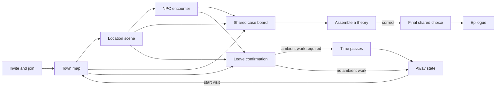
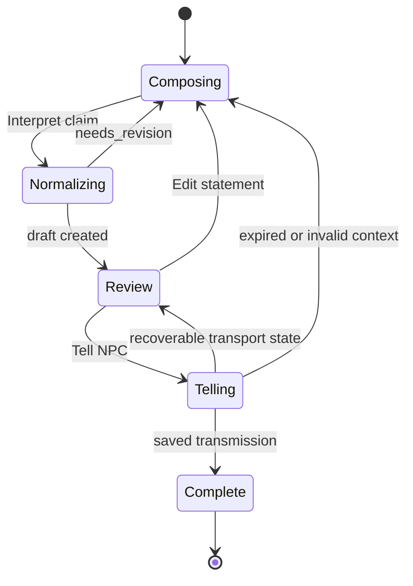

# Decision 011: Interface and Interaction Design

- **Project:** The Town Remembers
- **Status:** Accepted
- **Date:** 2026-08-02
- **Content version:** `bell-mystery-v1`
- **Scope:** Player-facing information architecture, screen layouts, claim
  confirmation, pending actions, retry recovery, ambient transitions, shared
  case board, responsive behavior, accessibility, and UI verification

## Decision

Ship a responsive illustrated storybook interface organized around a town map,
focused location scenes, one-exchange NPC encounters, and a shared evidence
board.

The interface is not a chat transcript and does not imitate a real-time virtual
world. It makes the simulation's boundaries legible:

- consequential actions wait for a saved server result before the UI presents
  them as fact;
- testimony, hearsay, physical evidence, and player notes always look
  different;
- the player explicitly confirms the normalized meaning of a claim before it
  can affect the town;
- one pending action follows the player across screens and can be retried under
  its original idempotency key;
- the ambient transition communicates waiting without pretending to expose
  hidden activity; and
- the case board shows only the player-safe projection already authorized by
  the HTTP contract.

The primary desktop composition resembles an open casebook: navigation on the
left, the current story scene in the center, and personal context on the right.
Smaller screens collapse those regions into drawers without changing the
information hierarchy.

## Experience principles

1. **Evidence has a visible source.** Never use one generic card style for
   physical evidence, testimony, hearsay, and notes.
2. **Saved before shown.** Do not optimistically move an item, change a
   relationship stance, add a board entry, or reveal a clue.
3. **One clear next action.** A scene may offer several verbs, but each modal or
   confirmation surface has one primary commitment button.
4. **Waiting is honest.** Use named states and calm activity, never a fictional
   percentage or a claim that gossip occurred.
5. **Recovery preserves intent.** A transport retry reuses the saved body and
   key. A changed or intentionally repeated action gets a new key.
6. **Mystery language, system precision.** Narrative headings may be
   atmospheric; buttons, warnings, and errors use direct language.
7. **No hidden-state leakage.** Generic lock and transition copy must not reveal
   missing evidence, queue failures, private conversations, or belief changes.
8. **Read while waiting.** Pending mutations block new mutations, not map,
   inventory, promise, case-board, or prior-result reading.

## Visual language

### Mood and materials

The app uses paper, ink, pinned cards, map lines, and restrained festival
colors. It should feel authored and tactile without sacrificing the clarity of
a modern web application.

| Token | Value | Use |
|---|---|---|
| `--ink` | `#25231f` | Primary text and line work |
| `--muted-ink` | `#625d54` | Secondary text |
| `--parchment` | `#f3e7cc` | Application background |
| `--paper` | `#fffaf0` | Cards and reading surfaces |
| `--burgundy` | `#7a303b` | Primary actions and resolution |
| `--moss` | `#526343` | Verified and successful state |
| `--gold` | `#a77928` | Physical evidence and focus accents |
| `--testimony` | `#3f6274` | Attributed testimony |
| `--hearsay` | `#725572` | Hearsay and provenance |
| `--warning` | `#8a4d24` | Expiry and recoverable delay |
| `--danger` | `#8b3434` | Terminal errors and irreversible warnings |

Color is always paired with a label, icon, or border pattern. The paper and ink
pair must meet WCAG AA contrast. Decorative texture sits behind opaque reading
surfaces and never behind body text.

Use Georgia or the platform serif stack for story headings and the platform UI
sans-serif stack for controls, metadata, and body copy. The MVP does not depend
on a remotely hosted font.

### Asset keys

The player-safe API supplies a `contentVersion` plus opaque `sceneKey` and
`portraitKey` values. The web build maps those keys to versioned local assets.
They are identifiers, not arbitrary URLs. An unknown key renders a neutral
illustrated placeholder and records a client error without breaking gameplay.

`bell-mystery-v1` uses these exact keys:

| Content | Presentation key |
|---|---|
| Festival Square | `bell-mystery-v1/scenes/festival-square` |
| The Lantern Inn | `bell-mystery-v1/scenes/lantern-inn` |
| Reed's Garden | `bell-mystery-v1/scenes/reeds-garden` |
| Old Chapel | `bell-mystery-v1/scenes/old-chapel` |
| Mara Venn | `bell-mystery-v1/portraits/mara-venn` |
| Corin Hale | `bell-mystery-v1/portraits/corin-hale` |
| Nessa Reed | `bell-mystery-v1/portraits/nessa-reed` |

### Motion

- Scene changes use a 180-millisecond crossfade and small vertical shift.
- Cards added to the board use a single 220-millisecond settle animation.
- Pending indicators use a low-motion ink-dot cycle, not a spinning festival
  icon or indeterminate progress bar.
- The time-passes screen may animate light and shadow slowly, but it must not
  imply that a particular NPC spoke.
- `prefers-reduced-motion` removes transforms and looping illustration while
  retaining state labels.

## Information architecture

The React application uses these browser routes. Navigation between them is a
read-only client operation unless a button explicitly names a game action.

| Route | Screen | Availability |
|---|---|---|
| `/join/:inviteToken` | Invite and join | Until town retirement |
| `/town/:townId/map` | Town map | Active visit; readable while frozen |
| `/town/:townId/location/:locationId` | Location scene | Active visit at that location |
| `/town/:townId/encounter/:npcId` | NPC encounter | Active, co-located visit |
| `/town/:townId/board` | Shared case board | Active, away, transitioning, frozen, or resolved |
| `/town/:townId/between-visits` | Time passes / away | After leaving |
| `/town/:townId/resolution` | Final choice or epilogue | Awaiting choice or resolved |

After a successful join, `history.replaceState` removes the invite token from
the address bar and opens the town route. The current `player-view` is the
router guard: a stale encounter URL redirects to the current location, an away
player redirects to between-visits, and a resolved town redirects to the
epilogue.



## Responsive application shell

### Desktop, 1100 pixels and wider

```text
+--------------------------------------------------------------------------+
| The Missing Festival Bell       Board (7)        Aishah       Leave Town |
+------------------+--------------------------------------+----------------+
| PLACES           | CURRENT SCENE                        | YOUR CASEBOOK  |
| Festival Square  |                                      | Inventory      |
| Lantern Inn      | Illustration / NPC / clue result     | Promises       |
| Reed's Garden    |                                      | Recent result  |
| Old Chapel       | Contextual action controls           |                |
+------------------+--------------------------------------+----------------+
| Global pending or recovery bar, present only while needed                |
+--------------------------------------------------------------------------+
```

- The left rail is 220 pixels and contains all four locations in authored map
  order. A lock icon plus the exact player-safe message identifies a locked
  destination.
- The center column is the only region replaced by scene navigation.
- The right casebook is 280 pixels and contains inventory and active promises.
  It never shows numeric trust, suspicion, or belief values.
- The header keeps Board and Leave Town reachable without scrolling. Leave is
  absent when away or resolved and disabled with an explanation while a player
  action is pending.

### Tablet and phone

- Below 1100 pixels, places become a `Map` drawer and the casebook becomes a
  `Satchel` drawer.
- Below 720 pixels, the header contains the mystery title, Board, and a `More`
  menu. Primary scene controls remain sticky above the safe-area inset.
- Modal dialogs become bottom sheets, except irreversible resolution choices,
  which remain centered alert dialogs.
- The board uses one card column below 720 pixels and two columns above it.
- Mobile-first optimization remains out of scope, but every action and all
  evidence must remain usable at 320 CSS pixels without horizontal scrolling.

## Global interaction surfaces

### Header

The header contains:

- mystery title;
- town status when it is not simply active;
- `Case board`, with the count of visible entries rather than a hidden-progress
  count;
- the player's immutable display name;
- `Leave town` during an active visit; and
- a compact pending marker when the full pending bar is outside the viewport.

Do not show an always-on network status. Show connectivity only when it changes
what the player can do.

### Personal casebook

The casebook has two sections:

- **Inventory:** item name and description, with contextual Show or Give
  actions available only inside a co-located encounter.
- **Promises:** NPC, plain-language terms, subject, and accepted time. Promise
  status is qualitative; no hidden evaluator detail appears.

An empty section uses one line of copy rather than a decorative blank card:
`You are carrying nothing.` or `You have made no active promises.`

### Toasts and notices

Toasts confirm navigation-independent results such as `Note added` or
`The case board has a new entry`. Dialogue, clues, promises, denials, and errors
remain in durable in-page result cards and are not toast-only.

Toasts never say that an NPC changed belief unless that change is explicitly
part of the player-safe result. A board refresh may say `New testimony was
added`, but not `Mara now believes you`.

## Screen specifications

### 1. Invite and join

The invite screen uses the public invite preview only. It shows:

- mystery title;
- tagline;
- spoiler-safe description;
- town state as `Open for visits`, `Awaiting its final choice`, `Story
  complete`, or `Closed`; and
- one primary action.

For an existing town cookie, the primary action is `Return as {displayName}`.
For a first-time visitor it is a display-name field and `Enter the town`.
Read-only towns label the action `Read what the town remembers`.

The display-name form validates allowed characters and the 2–24-grapheme bound
before submission. It does not preflight name availability. A server conflict
keeps the field, selects the name, and explains that another visitor already
uses it.

During first-time join, the tab writes the join idempotency key and join-attempt
secret to `sessionStorage` before sending. It reuses both on a lost transport
response, removes the secret only after the first authenticated player view,
and never presents the join secret to the player.

### 2. Opening and returning

A first active-town join opens Festival Square with the authored opening
narration above the location scene. It appears once per browser identity and
can be reopened from `What happened?` in the map drawer.

An away returning player sees:

- the mystery title and one-sentence premise;
- `Return to Festival Square` as the primary action;
- `Review the case board` as the secondary action; and
- active promises that may matter on the next visit.

Starting a visit is a saved action. The map appears only after the completed
response and refreshed player view establish the visit.

### 3. Town map

The map is the orienting screen, not a movement engine. It shows four authored
location cards in map order, connected by decorative paths.

Each card contains the location name, player-safe description, scene art, and
one state:

- **You are here** — opens the current location without an action;
- **Travel** — submits a Travel action; or
- **Locked** — not clickable and displays the server-provided generic message.

The map does not display NPC movement, other players, hidden items, clue counts
by location, or rumours travelling between locations.

### 4. Location scene

The scene contains:

1. location illustration, title, and description;
2. co-located NPC cards, each with portrait, role label, qualitative stance,
   and `Speak with {name}`;
3. inspectable cards with `Examine`; and
4. a compact destination strip for returning to the map or travelling.

An inspect result replaces the selected inspectable's action area with a result
card. A new clue uses the verified-evidence treatment and contribution credit.
An item reveal uses the inventory treatment. `Already known` says
`The town has already recorded what matters here` without manufacturing a new
discovery.

The result is rendered only from the completed action response. The following
player-view refresh may add the shared board card and update inventory.

### 5. NPC encounter

The encounter is a focused exchange, not a scrolling chat log.

```text
+----------------------------------------------------------------+
| <- Reed's Garden                         Nessa Reed · Wary       |
| [portrait]  "I can tell you what I saw, what I heard..."        |
|                                                                |
| Current response or last completed exchange                    |
|                                                                |
| [Ask] [Tell] [Show] [Give]                    [Promise offer]   |
+----------------------------------------------------------------+
```

- The NPC's portrait, role, stance label, and authored opening line anchor the
  scene.
- The latest completed exchange is the primary reading card. A repaired or
  fallback response is not visually stigmatized; `responseMode` is available
  only to inspection and client diagnostics.
- There is no endless chat transcript. The tab keeps the latest completed
  exchange through refresh for the current visit, while structured testimony
  and evidence live on the case board.
- Only action kinds supplied by `availableActionKinds` are enabled.
- Leaving the encounter is read-only navigation and does not end the visit.

#### Ask

`Ask` opens a 500-grapheme plain-text composer. The button is
`Ask {name}`. Enter inserts a newline; Command/Ctrl+Enter submits. Empty or
invalid input never allocates an idempotency key.

#### Show and give

Show opens a picker containing discovered clues and held items. Give contains
held portable items only. Each confirmation names the recipient and distinguishes
the verbs:

- `Show Nessa the Bent Clapper Pin` does not transfer custody.
- `Give Nessa the Old Chapel Key` transfers custody if accepted.

The Give confirmation includes `This changes who holds the item` and, when the
player-safe promise projection makes it relevant, `This may resolve or break a
promise.` The client does not predict which outcome will occur.

#### Promise offer

A promise offer appears directly below the response that produced it. The card
shows the NPC, exact summary, subject, and `Accept promise`. Acceptance uses the
opaque saved offer ID. If the context has become invalid, the denial remains in
the card with `This offer is no longer available`; the UI does not reconstruct
or silently replace it.

## Claim normalization and confirmation

Tell uses two visibly separate commitments: interpret the player's language,
then confirm the canonical claim.



### Composer

The Tell panel contains:

- label: `What do you want to tell {NPC}?`;
- 500-grapheme plain-text field;
- helper text: `If someone told you this, name them in the sentence.`; and
- primary button: `Interpret claim`.

There is no separate source selector in version one. Players express a source
in ordinary language, the normalizer returns any recognized alleged source,
and the confirmation makes it explicit. The client never builds predicate
JSON.

### Normalization result

`needs_revision` returns to the editable composer with a neutral notice:

> The town could not turn that into one supported claim. {explanation}

No NPC reaction, memory, transmission, or board change is implied. The next
interpretation is a new logical action with a new key.

A valid draft opens this confirmation sheet:

```text
+----------------------------------------------------------+
| Is this what you mean?                                   |
|                                                          |
| YOU WROTE                                                |
| "The bell is hidden in Reed's Garden."                   |
|                                                          |
| THE TOWN WILL REMEMBER                                   |
| The festival bell is at Reed's Garden.                   |
| Source named: You                                        |
|                                                          |
| Tell Nessa · Interpretation expires in 09:42             |
| This may change beliefs and may be repeated by others.   |
|                                                          |
| [Edit statement]                       [Tell Nessa]       |
+----------------------------------------------------------+
```

Rules:

- The raw text and canonical sentence receive equal visual weight; the
  canonical sentence is never hidden behind an expandable detail.
- `Source named` appears only when present. It says `You` for an original
  assertion.
- The target NPC is repeated beside the primary button.
- `Edit statement` discards the draft from the current client flow and returns
  the raw text to the composer. The server draft may remain harmlessly pending
  until expiry; the edited normalization uses a new key.
- The ten-minute expiry is shown as a timestamp-derived countdown. At zero the
  primary button becomes `Interpret again` and cannot submit the expired draft.
  The server time check remains authoritative if the browser clock is wrong.
- Navigation away asks `Discard this interpretation?` but does not claim to
  cancel the server row.
- `Tell {NPC}` is a distinct action with its own new idempotency key. It closes
  the sheet only after the saved Tell response arrives.
- If the visit, location, target, or draft is no longer valid, show the saved
  denial and return the original text to a fresh composer. Do not silently
  retarget or renormalize.

## Pending actions and retry recovery

### Local action journal

Before sending an action, the client writes one pending entry to IndexedDB,
keyed by town and player:

```ts
type PendingActionJournal = {
  townId: string;
  playerId: string;
  idempotencyKey: string;
  requestBody: ActionRequest;
  createdAt: string;
  actionId?: string;
  statusLocation?: string;
  pollAfterMs: number;
  takeoverPostSent: boolean;
};
```

The journal contains no cookie, invite token, join secret, or server credential.
It is written before the first POST, shared across same-origin tabs, and deleted
after a terminal response has been rendered and the subsequent player view has
been fetched. A display-only copy of the latest encounter response may remain
in `sessionStorage` until the visit ends.

`BroadcastChannel` announces journal changes so a second tab enters the same
read-only pending mode instead of offering another mutation. Server-side
`ACTION_IN_PROGRESS` remains authoritative when coordination is unavailable.

### Pending presentation

Every mutation uses the same bottom pending bar:

- action-specific present participle, such as `Asking Mara…`, `Interpreting
  your claim…`, `Examining the bell frame…`, or `Leaving town…`;
- `You can keep reading while this is saved`;
- an ink-dot activity mark; and
- `View action` to return to the originating result surface.

All mutation controls are disabled. Map, Board, Satchel, existing promises, and
prior results remain readable. The UI keeps the last confirmed player view and
does not optimistically apply the request.

### Recovery state machine

| Condition | UI behavior | Key behavior |
|---|---|---|
| Initial POST in flight | Show pending bar | Use newly journaled key |
| `202 processing` | Poll the private status URL every 2 seconds | Reuse key; polling starts no work |
| Network offline | Show `Connection lost. Your action is still safe.` and resume on `online` | Never mint another key |
| Still processing at 35 seconds | Show `Trying once more…` and resend the exact POST once | Same body and key |
| Still processing at 70 seconds | Stop automatic recovery and show manual controls | Retain body and key |
| `409 ACTION_CONFLICT` | Honor one-second delay and automatically resend once; later conflicts require `Retry safely` | Same body and key |
| `429` before action creation | Show a countdown and `Try now` when allowed | Same body and key is still unused |
| Terminal completion or denial | Render result, refresh player view, then clear journal | Never resubmit |
| Terminal error explicitly requiring a new action | Preserve editable input and offer `Try as a new action` | Allocate a new key only on click |

The 70-second manual surface says:

> This is taking longer than usual. Retrying is safe and will not apply the
> action twice.

Buttons are `Retry safely` and `Keep reading`. There is no Cancel button because
the API cannot cancel a running worker. `Keep reading` collapses the notice but
does not enable another mutation.

### Conflict and failure copy

- `ACTION_IN_PROGRESS`: follow the blocking status location, show
  `Another action from this browser is still being saved`, and preserve any
  unsent form text. After it resolves, the player must review and submit again.
- `ACTION_SUPERSEDED`: `The earlier action closed safely and changed nothing.`
- `ACTION_PROCESSING_EXHAUSTED`: `The town could not finish that action. Nothing
  changed.` Offer a new action only if the server contract permits it.
- `MODEL_UNAVAILABLE_RETRY_ACTION`: for normalization, return the original text
  and show `The town could not interpret that claim. Try again when ready.` The
  click creates a new key.
- `IDEMPOTENCY_KEY_REUSED`: clear no server state, block automatic retry, and
  show `This browser lost track of the action. Refresh the town before trying
  again.` Include the request ID in expandable technical details.
- `404` during a gameplay action: `That is no longer available. The town view
  has been refreshed.`
- `401`: `This browser no longer has its town pass. Reopen the invite link to
  join again.`
- `410` retired: route to the closed-town screen.

Unknown `500` and `503` problems use the server detail when it is player-safe,
state that no unconfirmed effect is being shown, and keep the request ID. The UI
never recommends changing a submitted action's key unless the terminal error
explicitly calls for a new logical action.

## Leave Town and the time-passes transition

### Leave confirmation

`Leave town` opens a sheet rather than immediately submitting:

> **End this visit?**
>
> You will step away from town. What you said and did may shape what happens
> between visits. You can return when the town is ready.

Active promise summaries appear below under `Promises you are carrying
forward`. The UI does not predict whether leaving fulfills or breaks them.

Buttons are `Stay in town` and `Leave town`. The latter submits the Leave action
and is disabled while another action is pending.

### Transition screen

When Leave returns `transitionStatus: "waiting"`, the app routes to the
full-height between-visits screen:

```text
+----------------------------------------------------------------+
|                       TIME PASSES                              |
|                 [town at dusk illustration]                    |
|                                                                |
|  1  The streets quiet    2  The town reflects    3  Dawn       |
|             current state label and calm explanatory copy      |
|                                                                |
|                [Review case board] [safe-to-close note]         |
+----------------------------------------------------------------+
```

The three player-facing states are:

| API state | Heading | Copy | Primary action |
|---|---|---|---|
| `waiting` | `The streets quiet` | `Your visit is over. The town is making room for what happened.` | None |
| `processing` | `The town reflects` | `The town is settling around the words and evidence left behind.` | None |
| `complete` | `Morning returns` | `The town is ready for another visit.` | `Return to Festival Square` |

This sequence does not claim that gossip occurred, identify an NPC, or expose
whether the job completed normally, did nothing, or was quarantined.

The screen fetches `player-view` with its ETag every five seconds while visible,
every thirty seconds while hidden, and immediately on visibility or network
recovery. Board may open as an overlaid full screen and remains read-only while
away. Closing the tab is explicitly safe.

After 90 seconds, add:
`The town is taking longer than usual. You may close this page and return
later.` Do not add a Retry button; ambient recovery belongs to the server.

At the five-minute deadline, enable `Return to Festival Square` even if the
last projection has not yet shown complete. Its Start Visit request allows the
server to perform the accepted conditional terminalization. A failed attempt
continues to show the ordinary safe retry system; it never exposes queue or
model failure.

If Leave returns `not_required`, skip the staged transition and show the away
screen with `Your visit is complete` and an immediately enabled return action.
If the town enters `awaiting_resolution` while the player is away, resolution
state supersedes the transition and routes to the final-choice screen.

## Shared case board

### Purpose and layout

The board is the shared memory players can reason from. It is a responsive CSS
grid with chronological DOM order, not a free-drag canvas. This keeps it
keyboard accessible, deterministic, and compatible with the API ordering.

```text
+--------------------------------------------------------------------------+
| CASE BOARD             All  Evidence  Accounts  Notes  Attempts          |
| 7 visible contributions                         [Add a note] [Theory]     |
+-----------------------------+--------------------------------------------+
| VERIFIED PHYSICAL EVIDENCE  | ATTRIBUTED TESTIMONY                       |
| Bent Clapper Pin            | Nessa: Corin's cart went chapel-ward       |
| Found by Aishah             | Nessa -> Aishah                            |
+-----------------------------+--------------------------------------------+
| HEARSAY                     | PLAYER NOTE · UNVERIFIED                    |
| Mara -> Nessa -> Ben        | "Check the inn hearth again." — Ben       |
| [Conflicts with 1 account]  |                                            |
+-----------------------------+--------------------------------------------+
```

The default filter is `All`; visible filters are:

- **Evidence** — verified physical clue cards;
- **Accounts** — testimony and hearsay;
- **Notes** — immutable player notes; and
- **Attempts** — submitted theories and outcomes.

The header count is a count of visible contributions, never `3 of 4 clues` or
another hidden-progress measure. New entries append at the end. When polling
finds entries while the player is scrolled elsewhere, preserve their scroll
and show `3 new contributions · Jump to newest`.

### Card semantics

#### Verified physical evidence

- Gold seal icon and explicit label `Verified physical evidence`.
- Exact authored clue title and description.
- `Found by {player}` and absolute local date/time in accessible metadata.
- Never labels a suspect, claim, or motive true unless the clue copy itself
  states an observed fact.

#### Testimony

- Blue ruled border and label `Attributed testimony`.
- Canonical claim sentence.
- Visible speaker and optional alleged source.
- Provenance chips from root speaker to final recipient.
- `Recorded by {player}` identifies the contributor without turning them into
  the speaker.

#### Hearsay

- Plum dashed border and label `Hearsay`.
- Same claim and provenance structure as testimony.
- Each arrow in the provenance path has accessible text `told`.
- It never uses a warning icon that implies falsehood; hearsay can be true.

#### Player note

- Handwritten-style heading but UI-sans body for legibility.
- Label `Player note · Unverified` remains visible at every size.
- Exact escaped plain text and `— {player}` attribution.
- No edit, delete, verification, or evidence-promotion control.

### Contradictions

When two visible board claims have a projected contradiction relation, both
cards show `Conflicts with another account`. Activating it filters to and
highlights the linked visible cards. Use a two-ended line only on wide screens;
the accessible relationship is expressed in text and `aria-describedby`.

The label is never `Lie`, `False`, or `Disproven` unless a post-resolution
authored view explicitly establishes that conclusion. A contradiction badge
does not appear when the other claim is hidden.

### Adding a note

`Add a note` is enabled only during an active, unfrozen visit. Away, waiting,
awaiting-resolution, and resolved players can read notes but not add them.

The composer contains a 280-grapheme counter and this permanent warning:

> Notes are shared, attributed, and unverified. They cannot be edited or
> deleted; add another note to correct one.

Buttons are `Discard` and `Pin note`. The note appears only after the completed
action and refreshed board projection. `Add correction` on an existing note
opens the same blank composer with that guidance; it does not create an edit or
structured link.

### Automatic board updates

- First clue discovery creates verified evidence automatically.
- Player-safe NPC-to-player claims may create testimony or hearsay
  automatically.
- Player-to-NPC Tell actions do not automatically publish the player's claim.
- Confidential dialogue stays off the board unless later exposed through an
  authorized transmission.
- Show and Give never let a note or ordinary testimony masquerade as evidence.

The client detects new `entryId` values after a player-view refresh and may
announce their safe type and contributor. It does not infer board entries from
dialogue text.

### Theory assembly

The Board header contains the final-confrontation region:

- While locked, show the exact generic message:
  `The town needs stronger verified evidence before it will confront anyone.`
- Do not render disabled or redacted suspect, motive, or location selectors.
- When open, show `Assemble a theory` and the three authored selectors supplied
  by the player view.

The confirmation repeats all three choices:

> You are accusing **{suspect}** of acting for **{motive}**, with the bell at
> **{location}**.

Buttons are `Keep investigating` and `Submit theory`. An incorrect completed
attempt appears in Attempts with `Incorrect` and no penalty language. A correct
attempt routes immediately to resolution.

## Resolution and epilogue screens

While `awaiting_resolution`, the scene shell becomes read-only and the
resolution screen explains who currently owns the choice and the reservation
time. Eligible owners see two equal-size choice cards:

- `Expose the cover-up`
- `Restore the bell quietly`

Each card contains only player-safe consequence language already established by
the mystery. Selecting a card opens an irreversible confirmation naming that
choice. No default is preselected. The commit button is
`Choose how the town remembers`; escape and outside-click do not confirm it.

An ineligible player sees the choices for context but no enabled commit button,
plus either `{owner} is deciding` or `A prior participant may now decide`.
Countdowns derive from `reservationExpiresAt` and refresh at expiry.

The resolved screen shows the authored epilogue as the primary content, then
contribution fragments, the chosen ending, and links to the read-only Board and
Map. It has no Start Visit, Leave, or mutation controls.

## Refresh and asynchronous multiplayer behavior

The application follows the accepted player-view schedule:

- immediately after a terminal action;
- every five seconds while visible;
- every thirty seconds while hidden; and
- immediately when a hidden tab becomes visible.

All polls use `If-None-Match`. A `304` produces no React state replacement.
When a changed projection arrives:

- preserve focused form input unless its target became invalid;
- preserve Board filter, scroll, and expanded provenance;
- append new board entries without moving earlier cards;
- close a now-invalid action picker with a direct explanation;
- redirect to resolution if the town froze or resolved; and
- never announce that hidden state changed merely because a request returned a
  different ETag.

## Accessibility and input behavior

- All actions are reachable by keyboard in DOM reading order.
- Focus moves to the heading of a newly opened screen, sheet, or result card.
- Dialogs trap focus and restore it to the invoking control on dismissal.
- Pending state uses `aria-live="polite"`; terminal errors use an assertive
  announcement once, not on every poll.
- Countdown text updates visually each second but announces only at one minute,
  ten seconds, and expiry.
- Stance, verification, hearsay, and contradiction meanings never rely on color
  alone.
- NPC portraits use the NPC's name as alt text only when the image adds identity;
  decorative location art has empty alt text because the adjacent heading and
  description provide the content.
- Plain-text user input rejects markup and control characters before submit and
  displays server field errors beside the matching field.
- Escape closes non-destructive sheets. It never confirms Tell, Give, Leave,
  Submit Theory, or Resolve.

## Client state boundaries

| State | Source | Persistence |
|---|---|---|
| Town, map, inventory, promises, board, resolution | `player-view` | Server authoritative |
| Completed action result | Saved action/status response | Current screen and visit cache |
| Pending body and idempotency key | IndexedDB action journal | Until terminal result and refresh |
| Join attempt secret | `sessionStorage` | Until authenticated bootstrap confirmation |
| Composer drafts not yet submitted | React state, optional `sessionStorage` | Current tab only |
| Board filter and drawer state | URL/search state | Navigation history |
| Illustration manifest | Versioned web bundle | Build artifact |

Never put session cookies, invite tokens, join-attempt secrets, model prompts,
exact scores, hidden entity IDs, or raw database rows in client state or logs.

## Required player-view presentation fields

The screens require a small player-safe extension to the accepted HTTP
projection:

- invite preview includes the authored tagline and spoiler-safe description;
- `town` includes `contentVersion` and tagline;
- every location includes its description and versioned `sceneKey`; and
- every encounter includes role label, versioned `portraitKey`, and authored
  opening line; and
- the player view includes sorted contradiction pairs that reference only
  visible case-board entries.

The values come from the town's frozen authored content version. They are part
of the hashed player-safe projection and cannot be inferred from opaque IDs in
the browser. No new database responsibility is required: `towns.content_version`,
`story_entities.content_key`, and the versioned authored manifest already own
the necessary identity.

## Verification requirements

### Component and accessibility tests

- Every board entry union renders the correct label, attribution, and source
  path without implying objective truth.
- Claim confirmation always displays raw and canonical text, target NPC, source
  when present, expiry, and the warning before Tell can be sent.
- Pending mutation state disables every mutation entry point while leaving
  Board, Map, Satchel, and prior results readable.
- Focus, keyboard order, dialog behavior, live regions, reduced motion, and
  color contrast pass automated and manual checks.

### Recovery tests

- A lost POST response reloads the journal and recovers through the status URL.
- A 35-second takeover resends the identical body and key once.
- A 70-second timeout exposes only same-key manual retry.
- Offline recovery, `ACTION_CONFLICT`, `ACTION_IN_PROGRESS`, `429`, and
  terminal new-action failures follow the key rules in this document.
- Refresh during claim review retains the recoverable normalization result or
  safely returns to the original composer without submitting Tell.

### Browser journeys

1. Join, see the opening, travel, inspect a clue, and observe its verified board
   card only after persistence.
2. Normalize an ambiguous claim, revise it, confirm the canonical sentence,
   and observe no effect from the abandoned draft.
3. Lose the network during Tell, recover the same action, and produce one
   transmission.
4. Leave, observe waiting and processing without hidden-state leakage, review
   the Board, and return after complete or the five-minute safe deadline.
5. In two browsers, append evidence and testimony without disturbing the other
   player's form, scroll, or pending action.
6. Add an immutable note, add a correction, and verify neither satisfies the
   confrontation gate.
7. Unlock Theory, submit an incorrect attempt, then complete the correct shared
   resolution and inspect the read-only epilogue.

## Deferred interface work

- Free-position board cards or connective graph editing
- Full dialogue history and transcript search
- Real-time push updates or presence indicators
- Mobile-specific native navigation
- Audio, voice, or character animation
- User-selectable themes
- Editable or deletable notes
- Drag-and-drop evidence submission
- An admin or queue-retry interface

## Related decisions

- [Decision 001: MVP Product Direction](001-mvp-product-direction.md)
- [Decision 002: MVP System Architecture](002-mvp-system-architecture.md)
- [Technical Architecture and Runtime Flows](003-technical-architecture-and-schema.md)
- [Logical Data Model and Schema Contract](005-logical-data-model-and-schema-contract.md)
- [HTTP API Contract](006-http-api-contract.md)
- [MVP Reliability Parameters](007-mvp-reliability-parameters.md)
- [Decision 008: Deterministic Game Rules](008-deterministic-game-rules.md)
- [Decision 009: Authored Game Content](009-authored-game-content.md)
- [Decision 010: Bedrock Prompt and Structured-Output Contracts](010-bedrock-prompt-contracts.md)
