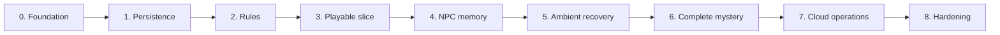

# MVP implementation map

- **Authority:** routing index; accepted decisions and linked phase plans define
  behavior.
- **Status baseline:** `main` at `031852e` (2026-08-15). Phases 0–4 are merged;
  Phase 5 implementation is active outside this snapshot; Phases 6–8 are
  planned.
- **Scope:** phase order, stable task IDs, reading routes, and cross-phase gates.

## Read only what the task needs

1. Start with the task's row below.
2. Read its parent plan for scope, contracts, and exit gate.
3. Read only relevant execution-detail sections for module boundaries, commands,
   tests, and baseline-specific decisions.
4. Follow parent-plan links to accepted decisions only when the task touches
   those contracts.
5. Before adding or changing tests, read
   [test ownership policy](../docs/agents/testing-policy.md), then search
   `verification/test-claims.json` and relevant suites.

Completed execution details are historical delivery records. Future execution
details are baseline-bound plans. Current source and tests describe landed
implementation; accepted decisions remain behavioral authority. When these
disagree, inspect source, record the discrepancy, and update the affected plan
instead of silently weakening a contract.

## Phase map

| Phase | Status at baseline | Parent plan | Execution detail | Task IDs |
|---:|---|---|---|---|
| 0 | Complete | [Engineering foundation](phase-00-engineering-foundation.md) | [Delivery record](phase-00-execution-detail.md) | `P0-01`–`P0-14` |
| 1 | Complete | [Persistence and authored seed](phase-01-persistence-and-authored-seed.md) | [Delivery record](phase-01-execution-detail.md) | `P1-01`–`P1-21` |
| 2 | Complete | [Deterministic simulation core](phase-02-deterministic-simulation-core.md) | Source/tests are delivery record | `P2-01`–`P2-21` |
| 3 | Complete | [First playable slice](phase-03-first-playable-vertical-slice.md) | [Baseline and delivery detail](phase-03-execution-detail.md) | `P3-01`–`P3-19` |
| 4 | Complete | [Grounded NPC and memory loop](phase-04-grounded-npc-and-memory-loop.md) | [Baseline and delivery detail](phase-04-execution-detail.md) | `P4-01`–`P4-24` |
| 5 | Active outside baseline | [Ambient propagation and recovery](phase-05-ambient-propagation-and-recovery.md) | [Execution detail](phase-05-execution-detail.md) | `P5-01`–`P5-22` |
| 6 | Planned | [Complete mystery experience](phase-06-complete-mystery-experience.md) | Not present in baseline | `P6-01`–`P6-11` |
| 7 | Planned | [Cloud operations and inspection](phase-07-cloud-operations-and-inspection.md) | Not present in baseline | `P7-01`–`P7-11` |
| 8 | Planned | [Hardening and demo readiness](phase-08-hardening-and-demo-readiness.md) | Not yet written | `P8-01`–`P8-11` |

Task IDs are stable and never reused. Change dependencies or record a decision;
never silently change an existing task's meaning.

## Phase outcomes

| Phase | Required outcome |
|---:|---|
| 0 | Workspace builds, tests, lints, and runs shell entry points. |
| 1 | CockroachDB stores authoritative state and causal history with enforced invariants. |
| 2 | Pure deterministic code owns gameplay decisions and effect plans. |
| 3 | Player completes a durable browser journey across real HTTP and DB boundaries. |
| 4 | Bounded model-backed NPC interactions use scoped memory without model authority over truth. |
| 5 | Leave triggers bounded, idempotent, recoverable ambient propagation. |
| 6 | Full mystery works from invite through accessible epilogue without soft locks. |
| 7 | System deploys and operates in AWS/CockroachDB Cloud within security, reliability, inspection, and cost contracts. |
| 8 | Repeated live demos survive dependency faults and remain explainable. |

Read each parent plan for full scope and exit proof.

## Planning rules

- Make contracts executable early.
- Build deterministic authority before model behavior.
- Integrate playable vertical slices.
- Use bounded safe fallbacks for external failures.
- Verify at the boundary promised by each exit gate.
- Preserve causal history and town isolation.
- Pull later work forward only after prerequisites stabilize; never bypass the
  active phase's exit gate.

## Original effort baseline

Historical estimates remain planning inputs, not promises. Re-estimate remaining
work after each exit gate.

| Phase | Engineer-days | Cumulative | Main driver |
|---:|---:|---:|---|
| 0 | 4–6 | 4–6 | Workspace, contracts, shells, CI |
| 1 | 12–18 | 16–24 | Schema, constraints, seed, DB tests |
| 2 | 14–20 | 30–44 | Rules, projections, deterministic coverage |
| 3 | 14–22 | 44–66 | Persistence layer, API, browser slice |
| 4 | 15–22 | 59–88 | Bedrock/Titan, recall, actions, evaluations |
| 5 | 13–19 | 72–107 | Outbox, FIFO worker, recovery UI |
| 6 | 12–18 | 84–125 | Mystery completion, board, endings, accessibility |
| 7 | 8–13 | 92–138 | Cloud, security, alarms, deployment |
| 8 | 8–12 | 100–150 | Faults, performance, compatibility, rehearsal |

Original total: **100–150 engineer-days**; with 20% contingency:
**120–180 engineer-days**. Phase 3 includes the query layer omitted from its
earlier 10–15 day estimate; see
[execution discrepancy §9.3](phase-03-execution-detail.md#93-the-repositories-phase-3-is-documented-as-inheriting-do-not-exist).

## Cross-phase completion gates

Every phase must:

- use the cheapest test boundary that proves each claim plus any boundary its
  exit gate explicitly promises;
- preserve town isolation in keys, queries, caches, events, queues, and vector
  search;
- avoid logging invite tokens, session secrets, cookies, or avoidable player
  text;
- keep external failure bounded and state unambiguous;
- update affected contracts and plans;
- label temporary stubs with an owning removal phase.

Behavior-changing tasks record a test-delta row: claim ID, existing owner,
proposed owner, boundary, unique proof for secondary owners, setup class, and
`add|extend|reuse|ask`. Phase exit summaries report named tests/rows, DB
lifecycles, browser journeys, model evaluations, and validation-stage deltas.
Documentation-only work states zero test delta and why.
