# Phased MVP Implementation Plan

- **Project:** The Town Remembers
- **Status:** Phases 0 and 1 complete; Phases 2–8 pending
- **Date:** 2026-08-04
- **Scope:** Implementation sequence from accepted contracts to a deployed,
  repeatable hackathon demo

## Purpose

The product, architecture, data, API, reliability, rules, content, prompt, and
interface contracts are accepted. The repository does not yet contain
application or infrastructure code. This plan turns those contracts into
implementation phases with explicit integration and verification gates.

This overview intentionally stays at the phase level. Each phase has a linked
detailed plan covering tasks, artifacts, dependencies, tests, risks, and exit
checks. Detail discovered during implementation must not silently weaken an
accepted contract; it either changes the implementation or is recorded as an
explicit decision change.

## Planning principles

1. **Make contracts executable early.** Shared schemas, value domains, and
   player-safe projections should fail fast when implementations drift.
2. **Build deterministic authority before model behavior.** Objective state,
   rules, validation, and persistence remain correct without Bedrock.
3. **Integrate in playable slices.** Do not leave the API, browser, database,
   and cloud topology isolated until the end.
4. **Use safe fallbacks from the start.** Model or queue unavailability must
   produce an accepted bounded result, not corrupt or ambiguous state.
5. **Verify every phase at its boundary.** Unit tests alone are insufficient
   when the phase promises persistence, HTTP, browser, queue, or deployment
   behavior.
6. **Keep causal history inspectable.** Every consequential state change must
   retain the event, evidence, provenance, and run information required by the
   judge inspection path.

## Phase map

```mermaid
flowchart LR
    P0["0. Engineering foundation"] --> P1["1. Persistence and authored seed"]
    P1 --> P2["2. Deterministic simulation core"]
    P2 --> P3["3. First playable vertical slice"]
    P3 --> P4["4. Grounded NPC and memory loop"]
    P4 --> P5["5. Ambient propagation and recovery"]
    P5 --> P6["6. Complete mystery experience"]
    P6 --> P7["7. Cloud operations and inspection"]
    P7 --> P8["8. Hardening and demo readiness"]
```

The order is the default dependency path for one developer. Work from a later
phase may be pulled forward only when its prerequisites are stable and doing so
does not bypass the current phase's exit gate.

## Detailed phase plans

Together, the nine plans define 154 stable implementation tasks. Task IDs are
never reused; if a later discovery changes sequencing, update dependencies
rather than silently changing what an existing ID means.

| Phase | Detailed plan | Task IDs |
|---:|---|---|
| 0 | [Engineering foundation](phase-00-engineering-foundation.md) — complete | `P0-01`–`P0-14` |
| 1 | [Persistence and authored seed](phase-01-persistence-and-authored-seed.md) — complete | `P1-01`–`P1-21` |
| 2 | [Deterministic simulation core](phase-02-deterministic-simulation-core.md) | `P2-01`–`P2-21` |
| 3 | [First playable vertical slice](phase-03-first-playable-vertical-slice.md) | `P3-01`–`P3-19` |
| 4 | [Grounded NPC and memory loop](phase-04-grounded-npc-and-memory-loop.md) | `P4-01`–`P4-24` |
| 5 | [Ambient propagation and recovery](phase-05-ambient-propagation-and-recovery.md) | `P5-01`–`P5-22` |
| 6 | [Complete mystery experience](phase-06-complete-mystery-experience.md) | `P6-01`–`P6-11` |
| 7 | [Cloud operations and inspection](phase-07-cloud-operations-and-inspection.md) | `P7-01`–`P7-11` |
| 8 | [Hardening and demo readiness](phase-08-hardening-and-demo-readiness.md) | `P8-01`–`P8-11` |

## Effort estimate

These are implementation-and-verification estimates, not calendar promises.
They assume one experienced TypeScript/React/AWS engineer working full-time,
roughly six productive engineering hours per day, starting from this
documentation-only repository. They include the tests, documentation, and real
CockroachDB/AWS boundary checks required by each exit gate. They exclude delays
for account approval, model access, stakeholder decisions, judging, and major
contract changes.

| Phase | Engineer-days | Cumulative | Primary effort driver |
|---:|---:|---:|---|
| 0 | 4–6 | 4–6 | Workspace, executable contracts, shells, CI |
| 1 | 12–18 | 16–24 | Forty-table schema, constraints, seed, CockroachDB tests |
| 2 | 14–20 | 30–44 | Pure rules, projections, property/scenario coverage |
| 3 | 10–15 | 40–59 | Auth/session/idempotency API and first browser slice |
| 4 | 15–22 | 55–81 | Bedrock/Titan, vector recall, six NPC actions, evaluations |
| 5 | 13–19 | 68–100 | Outbox/FIFO worker/recovery and fault-safe transition UI |
| 6 | 12–18 | 80–118 | Complete mystery, board, endings, accessibility closure |
| 7 | 8–13 | 88–131 | Production CDK, security, alarms, MCP, deployment proof |
| 8 | 8–12 | 96–143 | Fault campaigns, performance, compatibility, rehearsals |

The base one-engineer estimate is **96–143 engineer-days**, or approximately
**19–29 workweeks**. Use a 20% planning contingency for external-service
variance, integration discoveries, and release fixes: **115–172 engineer-days
(23–35 workweeks)**.

Useful cumulative milestones are:

- first saved playable slice through Phase 3: **40–59 engineer-days**;
- complete cross-player agentic-memory demo through Phase 5:
  **68–100 engineer-days**; and
- fully deployed, hardened release through Phase 8: **96–143 engineer-days**
  before contingency.

The default phase gates make substantial portions sequential. Adding engineers
can parallelize schema/content, rules/UI, and infrastructure work inside a
phase, but it will not divide elapsed time linearly. Re-estimate the remaining
range after every exit gate using measured throughput and newly discovered
integration work.

## Phase 0 — Engineering foundation

**Outcome:** A small TypeScript workspace can build, test, lint, and run the
web, Lambda, shared-contract, and CDK entry points through documented commands.

**Includes:** Repository structure, package management, TypeScript and test
configuration, environment validation, shared contract packages, local
developer commands, CI baseline, and minimal React, API, worker, recovery, and
CDK shells.

**Exit gate:** A clean checkout can install, validate, build, and test all
shells; the web app can call a local health endpoint; required configuration is
documented and secrets are not committed.

## Phase 1 — Persistence and authored seed

**Outcome:** CockroachDB can hold both authoritative game state and the causal
history defined by the logical schema contract.

**Includes:** SQL migrations, Kysely database types and access layer,
transaction-retry support, required constraints and indexes, vector columns,
inspection views, versioned `bell-mystery-v1` seed data, and repeatable town
creation from that content.

**Exit gate:** A fresh database migrates and seeds repeatably; schema invariants
reject invalid cross-town or invalid-domain data; a seeded town can be queried
through the required inspection views; migration and transaction tests pass on
CockroachDB rather than only on mocks.

## Phase 2 — Deterministic simulation core

**Outcome:** Pure application code is the single authority for all gameplay
decisions and state transitions.

**Includes:** Claim keys and contradiction rules, belief calculation,
relationships, disclosure and access gates, item custody, clues, promises,
grievances, visit/event ranges, case progression, accusation, resolution,
recall ranking, ambient candidate eligibility, and player-safe projections.

**Exit gate:** The required deterministic test matrix passes, including worked
balance examples, no-soft-lock routes, repeat protection, promise resolution,
and hidden-state leakage checks. The same inputs and state always produce the
same decisions without a model call.

## Phase 3 — First playable vertical slice

**Outcome:** An operator can create a seeded town and a player can enter it and
complete a small saved browser journey across the real HTTP and database
boundaries.

**Includes:** Judge-authenticated town creation, invite preview and join,
town-scoped browser sessions, player view, start visit, travel, inspect,
leave-without-ambient-work, HTTP errors, rate and input bounds, action
idempotency, the client action journal, router guards, application shell, map,
location scene, and durable result rendering.

NPC dialogue may use authored fallbacks in this phase; the goal is to prove the
authoritative request and recovery path before adding model variability.

**Exit gate:** A test creates a town idempotently, then a browser joins it,
resumes the same identity, starts a visit, travels, inspects, refreshes safely,
retries one action with the same idempotency key, and leaves. UI state is shown
only after the server commits it, and no player response exposes hidden fields.

## Phase 4 — Grounded NPC and memory loop

**Outcome:** `Ask` and `Tell` produce variable but bounded NPC interactions in
which CockroachDB memory affects dialogue without giving the model authority
over game truth.

**Includes:** Bedrock client and versioned run records, Titan embeddings,
scoped vector recall, claim normalization and confirmation drafts, dialogue
bundle construction, structured-output validation, one repair attempt,
authored fallbacks, transmission provenance, belief recomputation, and the NPC
encounter UI. `Show`, `Give`, and `Promise` are connected to the deterministic
outcomes needed for complete encounters.

**Exit gate:** Prompt evaluations pass; invalid or unavailable model output
cannot mutate structured state; confirmed claims create auditable
transmissions and evidence; retrieved memories are town- and NPC-scoped; and a
later encounter demonstrably changes because of committed memory.

This is an isolated integration checkpoint, not a standalone player-facing
release. Phase 4 actions can create ambient-eligible events while their Leave
path belongs to Phase 5, so shared/public exposure remains disabled until the
Phase 5 gate passes.

## Phase 5 — Ambient propagation and recovery

**Outcome:** Leaving after consequential activity advances the town through a
bounded, idempotent, and recoverable off-screen tick.

**Includes:** Transactional outbox, SQS FIFO publication, group and
deduplication keys, ambient worker leases, eligible share-or-do-nothing
choices, hop and action limits, transition polling, terminal no-effect
behavior, EventBridge recovery, stale-work recovery, and operational telemetry.

**Exit gate:** A claim can travel over an authored contact edge and affect a
later player while preserving its full provenance. Duplicate deliveries,
worker retries, timeouts, and stale leases do not duplicate effects or strand
the town; the time-passes UI reaches an honest terminal state in every tested
case.

Passing this gate closes the joint Phase 4/5 player-facing release: NPC actions,
eligible Leave, transition processing, and re-entry are enabled and verified
together.

## Phase 6 — Complete mystery experience

**Outcome:** The entire authored mystery is playable, legible, recoverable, and
accessible from invite through epilogue.

**Includes:** All locations, NPCs, inspectables, item and access routes,
promises, caught lies, shared board card semantics, notes, contradictions,
theory assembly, confrontation, irreversible shared choice, both endings,
complete responsive layouts, presentation assets, unknown-asset fallbacks,
and the remaining client recovery states.

**Exit gate:** End-to-end journeys cover both chapel access routes, correct and
incorrect theories, both resolutions, concurrent unique-item conflict, pending
action recovery, narrow viewport use, keyboard use, reduced motion, and the
documented no-soft-lock guarantees.

## Phase 7 — Cloud operations and inspection

**Outcome:** The complete system runs in its intended AWS and CockroachDB Cloud
topology and is operable within the documented reliability and cost bounds.

**Includes:** Production CDK resources and policies, S3 and CloudFront delivery,
API Gateway and Lambdas, SQS FIFO and DLQ behavior, EventBridge recovery,
Secrets Manager, Bedrock configuration, structured logs, metrics and alarms,
budget guardrails, deployment and rollback commands, data bootstrap, and the
read-only CockroachDB MCP inspection path.

**Exit gate:** A clean environment can be deployed from documented commands;
security and tenant-isolation checks pass; alarms and dashboards expose the
required failure modes; inspection views reconstruct the demo's causal chain;
and a deployment smoke test completes over public endpoints.

## Phase 8 — Hardening and demo readiness

**Outcome:** The project can survive repeated live judging runs and explain its
agentic and memory behavior clearly when a dependency is slow or unavailable.

**Includes:** Full regression suite, prompt regression gate, concurrency and
retry fault injection, latency and cost checks, browser compatibility,
accessibility audit, fresh-town reset/bootstrap procedure, demo fixtures,
operator runbook, rehearsal script, evidence capture, and submission material
verification.

**Exit gate:** The two-player demonstration succeeds repeatedly from a fresh
town, the inspection session explains every belief change and transmission,
documented failure rehearsals degrade safely, and the deployed commit, content
version, prompt versions, and runbook all agree.

## Cross-cutting completion rules

These are part of every phase rather than cleanup deferred to Phase 8:

- Add tests at the narrowest useful boundary and at the boundary promised by
  the phase exit gate.
- Record structured operational context without logging invite tokens, session
  secrets, raw cookies, or avoidable player text.
- Preserve town isolation in every key, query, cache, event, queue message, and
  vector search.
- Update affected documentation and keep versioned contracts backward-aware.
- Prefer a deterministic or authored safe result when an external model or
  asynchronous dependency is unavailable.
- Keep deployable code behind stable interfaces; temporary stubs must have an
  explicit removal phase and cannot impersonate a successful external effect.

## Detailed-plan template

Every detailed phase plan uses the same structure:

1. Objective and user-visible proof
2. In-scope and explicitly out-of-scope work
3. Prerequisites and accepted contracts
4. Implementation workstreams and ordered tasks
5. Data, API, UI, infrastructure, and observability artifacts
6. Verification matrix and commands
7. Risks, decisions, and fallback strategy
8. Exit checklist and handoff to the next phase

All phases now have task-level plans. During implementation, refine the active
phase when new evidence appears and propagate any changed dependency or
contract assumption into affected later plans before proceeding.
