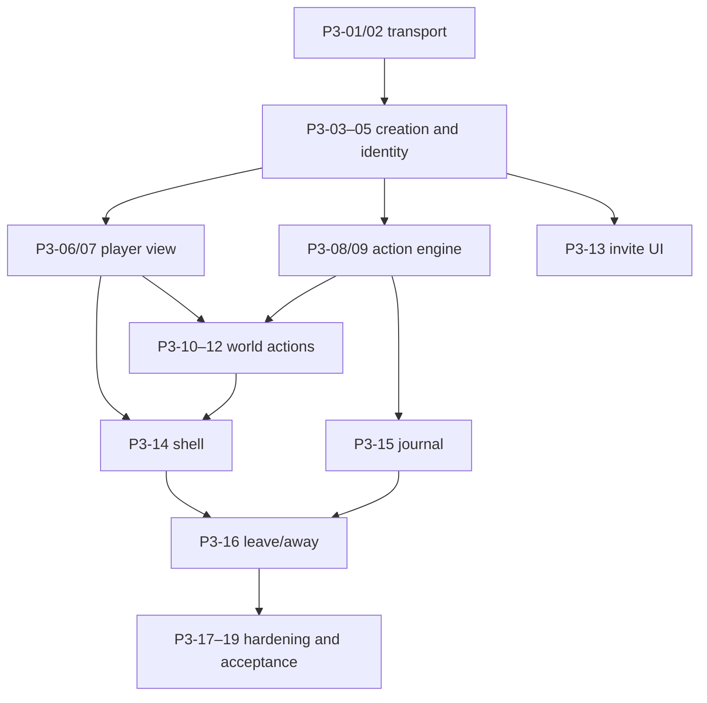

# Phase 3 — First Playable Vertical Slice

- **Status:** Detailed implementation plan
- **Depends on:** Engineering foundation, persistence and authored seed, and the deterministic simulation core
- **Primary boundary:** Browser → HTTP API → CockroachDB → saved response → refreshed player-safe view
- **Explicit phase constraint:** No live Bedrock, Titan, SQS, ambient worker, or Recovery Lambda is required in this phase

## 1. Objective and user-visible proof

Deliver the first saved browser journey through the real API and database. A
operator creates a seeded town through the judge-authenticated API, then a
visitor opens its invite, joins with a guest name, resumes the same town-scoped
identity, sees Festival Square, travels to an open location, inspects authored
content, refreshes without losing confirmed state, safely replays one action
under the same idempotency key, leaves a visit whose event range needs no
ambient work, and starts another visit.

The visible proof is one Playwright journey that uses the production-shaped
HTTP contracts and a real CockroachDB test database. It must demonstrate that:

- invite capability data disappears from the browser URL before the first
  preview or join request;
- the UI never shows a travel, clue, item, visit, or board state before its
  action and effects have committed;
- a refresh resumes the same player through the town-scoped HTTP-only cookie;
- the same action body and idempotency key replay the saved result without a
  second world effect; and
- leaving an event range with no ambient-eligible event ends honestly as
  `transitionStatus: "not_required"` without creating or pretending to process
  queued work.

## 2. Scope

### In scope

- API composition, routing, request IDs, problem responses, origin checks, and
  response/cache/security headers for the Phase 3 routes.
- Judge-authenticated, idempotent town creation using the Phase 1 content
  materializer, versioned HMAC invite derivation, and safe replay behavior.
- Invite preview, first-time join, join replay protection, town-scoped
  sessions, cookie refresh, and existing-identity resume.
- The complete version-one player-view shape, populated for the capabilities
  available in this phase and using empty or locked safe projections for later
  features.
- The shared authenticated action pipeline and action-status route, including
  fingerprints, processing claims, atomic saved responses, same-key replay,
  takeover, conflict handling, and one-processing-action-per-player.
- `start_visit`, `travel`, `inspect`, and `leave` over deterministic Phase 2
  rules and Phase 1 repositories.
- The no-ambient-work leave branch: atomic visit end, departure event, disjoint
  range consumption, and no outbox row when the range is ineligible.
- Application shell, invite/join experience, route guards, map, location scene,
  inspect results, personal casebook shells, away state, durable pending-action
  journal, and safe retry UI.
- Input/rate bounds that apply to exposed routes, tenant isolation, hidden-state
  leakage tests, structured logs, basic metrics, and implementation/operator
  documentation for this slice.

### Explicitly out of scope

- Live model calls, prompt evaluation, vector search, or episode embeddings.
- `ask`, `normalize_claim`, `tell`, `show`, `give`, and `accept_promise`; NPC
  cards may show authored opening material, but these mutations become active
  in Phase 4.
- Ambient outbox creation for eligible ranges, SQS publication, ambient worker
  execution, recovery sweeps, transition polling, or time-passes animation.
  Phase 3 data and interfaces must leave room for these without presenting a
  fake successful queue effect.
- Notes, accusation, resolution, the complete case board, all content routes,
  presentation assets, and final accessibility polish, which are completed in
  Phase 6.
- Production CloudFront/API Gateway/CDK hardening and public deployment, owned
  by Phase 7.

## 3. Prerequisites and accepted contracts

### Required earlier-phase capabilities

- A buildable TypeScript workspace with web, Game Lambda/API, shared-contract,
  database, and test entry points; environment validation; lint/typecheck/test
  commands; and local HTTP/browser test support.
- CockroachDB migrations, Kysely types, transaction retry helpers, all Phase 3
  creation/identity/current-state/history/operational tables, the versioned
  `bell-mystery-v1` content registry, and its transactional town materializer.
- Repositories that enforce composite `town_id` scope and transaction helpers
  that retry SQLSTATE `40001` within the accepted bounds.
- Pure deterministic rules for visit state, travel/access, inspections, clue
  discovery attribution, item reveal/custody, event allocation, player-safe
  projections, and stable ordering.

### Contract authority

- `docs/001-mvp-product-direction.md` — guest identity, closed action
  vocabulary, visit semantics, and objective/player-visible separation.
- `docs/002-mvp-system-architecture.md` and
  `docs/003-technical-architecture-and-schema.md` — request flow,
  idempotency, consistency, security, and runtime boundaries.
- `docs/005-logical-data-model-and-schema-contract.md` — tables, constraints,
  processing claims, event identities, visits, and no-work range allocation.
- `docs/006-http-api-contract.md` — exact route, request, response, caching,
  cookie, projection, ETag, error, and rate-limit contracts.
- `docs/007-mvp-reliability-parameters.md` — 30/28/24-second budgets, final
  four-second reserve, 35-second claim, retry limits, and database timeouts.
- `docs/008-deterministic-game-rules.md` and
  `docs/009-authored-game-content.md` — action authority, content keys, access,
  inspectables, clue/item behavior, and player-safe copy.
- `docs/011-interface-and-interaction-design.md` — invite sanitization, routes,
  shell, journal, retry state machine, saved-before-shown rule, responsive
  behavior, and accessibility baseline.

No task may weaken one of these contracts to make the slice easier. A mismatch
found during implementation is recorded as a contract decision before code is
changed.

## 4. Ordered implementation workstreams

Task IDs are stable. A task is complete only when its listed deliverables and
tests are present.

### Workstream A — Transport and safe contracts

#### P3-01 — Materialize HTTP schemas and canonical transport helpers

**Deliverables**

- Strict runtime schemas and TypeScript types for invite preview, join,
  `PlayerView`, Phase 3 action requests/results, processing responses, and
  `ProblemResponse`.
- Canonical JSON and `player-view:v1` hashing utilities implementing all stable
  array orders and excluding `viewVersion`, request metadata, and canonical
  town revision.
- Request-ID middleware; exact JSON/content-type/origin validation; reusable
  cache, `Vary`, ETag, `Referrer-Policy`, and security-header helpers.
- Contract tests that reject unknown properties, invalid IDs/headers, malformed
  JSON, and response-shape drift.

#### P3-02 — Build the API router and uniform failure boundary

**Depends on:** P3-01

**Deliverables**

- `/api/v1/health`, `POST /api/v1/towns`, invite, join, player-view, action,
  and action-status route dispatch with route-template-based logging.
- A single exception-to-problem mapper using stable public codes and no stack,
  SQL, hidden ID, secret, cookie, or raw request-event leakage.
- Explicit `404` equivalence for missing, inaccessible, hidden, and cross-town
  resources.
- API tests for method/route errors, cache headers, no-store mutation/status
  responses, request IDs, origin enforcement, and error content type.

### Workstream B — Invite, identity, and sessions

#### P3-03 — Implement idempotent town creation and minimal invite preview

**Depends on:** P3-01, P3-02

**Deliverables**

- Judge bearer-code verification with constant-time secret comparison, exact
  `{}` body enforcement, Origin/content-type checks, and no credential value in
  logs or responses.
- Exact `POST /api/v1/towns` request and `201` response behavior from Decision
  006, including `Cache-Control: no-store`.
- `town_creation_requests` processing and replay using the request key,
  canonical fingerprint, frozen content version, and frozen derivation-key
  version; concurrent retries create exactly one town through the Phase 1
  materializer.
- Versioned HMAC invite derivation that stores only the invite hash and
  reconstructs the same `inviteUrl` for valid replays without persisting the
  token in the terminal response.
- Hash-only invite lookup and the exact spoiler-safe preview for active,
  awaiting-resolution, resolved, and retired towns.
- No player names, counts, evidence, case progress, objective state, or internal
  status in the query or response.
- API and database-backed tests for creation replay, mismatched fingerprints,
  invalid judge codes, key-version retention, and valid, unknown, cross-town,
  and retired previews. Response snapshots prove the judge code is absent;
  persistence and log snapshots prove both the judge code and raw invite are
  absent. The authorized `201` response is expected to contain the reconstructed
  invite URL required by Decision 006.

#### P3-04 — Implement idempotent first-time join and replay closure

**Depends on:** P3-03

**Deliverables**

- Unicode NFKC/trim/whitespace-collapse/full-case-fold display-name validation,
  grapheme bounds, allowed characters, and race-safe uniqueness against players
  and authored NPCs.
- `join_requests` processing-claim flow with a request fingerprint, hashed
  256-bit join-attempt secret, ten-minute window, three-session issuance cap,
  and stable `JOIN_REPLAY_CLOSED`, `JOIN_REPLAY_EXPIRED`, and
  `JOIN_REPLAY_EXHAUSTED` terminal behavior.
- One transaction that creates player actor/subtype, zeroed NPC relationships,
  initial session, and—only for an active town—the internally completed
  `start_visit`, Festival Square visit, and corresponding event.
- Database/API concurrency tests proving that retries create one player, name
  races cannot impersonate NPCs, and terminal replay cannot mint a session.

#### P3-05 — Authenticate and refresh town-scoped sessions

**Depends on:** P3-04

**Deliverables**

- Independently named/path-scoped `Secure`, `HttpOnly`, `SameSite=Lax`
  cookies with one-year `Max-Age`; token hashes only in CockroachDB.
- Authentication scoped to `(town_id, token_hash)`, active-until-revoked or
  retirement semantics, and first authenticated view bootstrap confirmation
  that clears the join-secret hash atomically.
- Conditional monthly cookie reissuance using `last_cookie_issued_at`, including
  resolved-town views, with only one concurrent response emitting the cookie.
- API/security tests for two independent town cookies, wrong-town replay,
  revoked/retired sessions, bootstrap closure, monthly issuance, and absence of
  token material from logs and inspection-safe projections.

### Workstream C — Player-safe read model

#### P3-06 — Implement the version-one player-view projection

**Depends on:** P3-05 and Phase 2 projection rules

**Deliverables**

- An explicit SQL/application projection for town/player/visit, authored map,
  current location, co-located encounters, inspectables, revealed inventory,
  discovered clues, and the contract-required empty/locked promises, board,
  attempts, ambient, and resolution portions.
- Content-version lookups for player-safe strings, `sceneKey`, `portraitKey`,
  role, opening line, and unknown-key-safe identifiers; no raw row serializer.
- Stable ordering and qualitative stance only; no belief/trust/suspicion score,
  hidden item, case solution, private claim, canonical revision, or ambient
  detail.
- `ETag`/`If-None-Match` behavior with bootstrap confirmation on both `200` and
  `304`, plus tests showing a hidden-state-only database change leaves the
  projection hash unchanged.

#### P3-07 — Add route-level read-model rate limiting

**Depends on:** P3-05, P3-06

**Deliverables**

- Transactional player-view token bucket at 30/minute with burst 10, a
  town-creation-attempt bucket per rotating IP hash at 5 per 15 minutes with
  burst 5, and a new-join bucket per rotating IP hash at 10 per 15 minutes with
  burst 10. Invite preview has no additional application bucket in v1.
- Existing town-creation/join replays and existing-session resumes are
  recognized before consuming a new-operation bucket, exactly as Decision 006
  requires.
- Rotating HMAC IP hashes only; no raw IP persistence.
- `429` plus `Retry-After` tests proving a rejected request does not consume an
  idempotency key or create an operation row.

### Workstream D — Durable action execution

#### P3-08 — Implement action request identity and processing claims

**Depends on:** P3-01, P3-05

**Deliverables**

- SHA-256 fingerprint over canonical API version, action kind, relational
  targets, and payload; cookie/key/transport fields excluded.
- Create/read/replay state machine for `processing`, `retryable`, `completed`,
  and `failed`; 35-second nonrenewing claim; conditional token ownership on
  completion; maximum three claimed attempts before terminal exhaustion.
- One live processing action per player, same-key resolution before blocker
  checks, `ACTION_IN_PROGRESS`, conditional `ACTION_SUPERSEDED`, and different-
  input `IDEMPOTENCY_KEY_REUSED` behavior.
- Action-status ownership checks and `202` response with `Retry-After: 2` and
  `Location`; status reads never start work.
- CockroachDB concurrency tests for double execution, lost response replay,
  stale takeover, old-worker rejection, mismatched input, ambiguous-commit
  ledger read, and serialization retry exhaustion.

#### P3-09 — Add the atomic deterministic action executor

**Depends on:** P3-08 and Phase 2 action rules

**Deliverables**

- Shared command executor that authenticates and validates before record
  creation, loads an explicitly town-scoped snapshot, applies a pure decision,
  and atomically commits numbered events, state changes, saved safe response,
  completion state, and town revision.
- `player:<idempotency-key>:<effect-index>` event identities and versioned
  request/response payload validation at persistence boundaries.
- Rule denials stored as replayable `200` completed responses; unsupported
  action kinds remain stable `422` errors until their owning phase enables
  them.
- Absolute deadline plumbing, three bounded CockroachDB serialization retries,
  final commit/serialization reserve, and no dependency/network call inside a
  transaction.

#### P3-10 — Connect `start_visit` and `travel`

**Depends on:** P3-06, P3-09

**Deliverables**

- Start at Festival Square, return `already_active` without duplicate rows,
  block non-active towns, and require the prior ambient transition to be
  terminal or absent.
- Travel to accessible authored locations only, return `already_there` as
  `no_change`, use generic not-found behavior for inaccessible identifiers,
  update visit location and revision atomically, and emit one numbered event.
- HTTP/database tests for away/active states, locked chapel, cross-town IDs,
  retries, and conflicting requests.

#### P3-11 — Connect `inspect`

**Depends on:** P3-06, P3-09

**Deliverables**

- Location/access validation and authored inspectable lookup with no remote or
  hidden identifier oracle.
- Exact `new_to_town`, `new_to_player`,
  `already_discovered_by_player`, and `none` outcomes; first shared verified
  board record; one contribution row per player; portable versus location-held
  item reveal semantics; conditional item custody where authored.
- Stable completed response and refreshed player-view behavior, with no
  optimistic browser inference.
- Database/API tests for repeated and concurrent discovery, contributor order,
  nonportable bell handling, unauthorized location, and no duplicate effects.

#### P3-12 — Connect `leave` for an ineligible ambient range

**Depends on:** P3-09–P3-11

**Deliverables**

- One short transaction that ends the visit, appends `visit_ended`, assigns the
  next sequence, evaluates the newly allocated disjoint range, advances
  `ambient_scheduled_through_sequence`, and returns `not_required` when the
  range contains no ambient-eligible event.
- No outbox row, no queue publication, no fake `waiting` result, and immediate
  eligibility to start the next visit for this Phase 3 branch.
- Concurrency/database tests for repeat Leave, two departures allocating
  nonoverlapping boundaries, empty/ineligible range consumption, and atomic
  rollback. The fresh-seed fixture proves the first range begins strictly after
  the final `system_seed` sequence and never reconsiders authored backstory.
- An explicit interface and contract test marking the eligible-range branch as
  Phase 5 work; Phase 3 fixtures must not generate such a branch silently.

### Workstream E — Browser application

#### P3-13 — Build secure invite bootstrap and join UI

**Depends on:** P3-03–P3-05

**Deliverables**

- `/join/:inviteToken` bootstrap that copies the token to ephemeral memory,
  synchronously replaces history with `/join`, and only then performs network
  work; no token in storage, diagnostics, analytics, or later routes.
- Preview, existing-session resume, display-name validation, and first-time
  join with key/secret written to `sessionStorage` before send and cleared only
  after authenticated player-view confirmation.
- Reopen-invite recovery on pre-auth refresh and exact active/read-only/closed
  labels.
- Browser tests asserting URL replacement occurs before the first fetch and
  that network/log/storage snapshots contain no retained invite capability.

#### P3-14 — Build application shell, route guards, map, and location scene

**Depends on:** P3-06, P3-10, P3-11

**Deliverables**

- Desktop casebook composition and responsive Map/Satchel drawers, usable at
  320 CSS pixels without horizontal scrolling.
- Player-view-driven guards for active/away/frozen/resolved states and stale
  location/encounter URLs; read-only navigation never submits an action.
- Four ordered location cards with open/locked/current state; location NPC and
  inspectable cards; durable inspect result cards; empty inventory/promise
  copy; authored asset-key resolver with a neutral unknown-key placeholder and
  safe diagnostic.
- Immediate conditional player-view refresh after terminal actions and 5s/30s
  visible/hidden polling with `304` preserving React state.

#### P3-15 — Implement the local action journal and recovery UI

**Depends on:** P3-08, P3-09

**Deliverables**

- IndexedDB journal matching the accepted town/player/key/body/status shape,
  written before the first POST and removed only after terminal rendering plus
  the subsequent player-view refresh.
- `BroadcastChannel` coordination, one pending mutation across tabs, global
  pending bar, readable navigation while pending, and zero optimistic state
  changes.
- Poll-only handling for `202`; same-body/key takeover POST once at 35 seconds;
  manual same-key retry after 70 seconds; offline recovery; one-second
  `ACTION_CONFLICT`; pre-record `429`; and terminal-new-action handling.
- Browser/component tests that inspect outbound bodies and keys across reload,
  offline, duplicate click, conflict, and takeover paths.

#### P3-16 — Complete leave/away/start-visit presentation

**Depends on:** P3-12, P3-14, P3-15

**Deliverables**

- Leave confirmation showing active promise summaries without predicting
  outcomes, pending presentation, and routing for `not_required` directly to
  the away state.
- Away screen with case-board link and saved Start Visit action; the map appears
  only after completion and refreshed view.
- No time-passes stage, gossip language, progress indicator, or transition
  retry control when ambient work was not required.

### Workstream F — Security, observability, verification, and docs

#### P3-17 — Add slice security controls and adversarial tests

**Depends on:** P3-02–P3-16

**Deliverables**

- Parameterized SQL, mandatory town scope, least-privilege runtime repository
  use, three-second connection/statement limits, and bounded pools inherited
  from the foundation.
- No raw API event/URL/body/header/cookie/invite/join secret/session token,
  connection string, or unescaped player input in logs.
- XSS/markup/control-character rejection, CSRF origin enforcement, inaccessible
  ID equivalence, cookie isolation, and safe error/detail tests.
- A route/logging configuration checklist that keeps CloudFront/S3 raw access
  logging disabled and API access logs limited to request ID, route template,
  status, and latency when deployed later.

#### P3-18 — Instrument the synchronous slice

**Depends on:** P3-02, P3-08–P3-12

**Deliverables**

- Structured events for request route/status/latency, action kind/status,
  attempt number, safe operation ID, transaction retry count, claim takeover,
  stale-worker rejection, ambiguous-commit resolution, and terminal error code.
- Metrics for HTTP latency/status, action processing age, retries/conflicts,
  rate-limit decisions, and `ACTION_PROCESSING_EXHAUSTED`; no high-cardinality
  player text or secret dimensions.
- Test logger/sink assertions proving sensitive fields are redacted and a
  documented baseline for p50/p95/p99 timing to be measured in Phase 7.

#### P3-19 — Run the vertical-slice acceptance suite and document operation

**Depends on:** all prior Phase 3 tasks

**Deliverables**

- API contract suite, real-CockroachDB integration suite, browser journey, and
  tenant/security suite mapped to the verification matrix below.
- A fresh-seed test setup with deterministic IDs/times only where the contract
  allows them, plus cleanup that cannot target a non-test database.
- Developer documentation for starting the web/API/database, seeding the test
  town, running each suite, interpreting action recovery, and known Phase 4/5
  feature boundaries.
- Trace evidence from one acceptance run containing safe request/action/event
  IDs and no secrets, without claiming public-cloud deployment.

## 5. Artifacts

Exact paths may follow the workspace layout established in Phase 0, but Phase 3
must leave these owned artifacts:

| Area | Required artifact |
|---|---|
| Shared contracts | Strict API schemas/types, canonical JSON, projection hashing, public error catalog |
| API | Router, middleware, town-creation/invite/join/session handlers, player-view handler, action/status handlers |
| Application | Town-creation service, projection builder, session service, rate limiter, action ledger/executor, four action handlers |
| Persistence | Town-scoped queries and transactions for identity, sessions, views, actions, visits, discoveries, and event ranges |
| Web | Invite bootstrap, shell, guards, map, location/inspect/away screens, journal, polling and retry state machine |
| Tests | Contract, HTTP, CockroachDB concurrency/isolation, component/a11y, and Playwright vertical-slice fixtures |
| Operations | Safe structured-log definitions, metrics, local test configuration, and run instructions |

## 6. Dependencies and sequencing

- Contract schemas precede handlers and components so neither side invents a
  temporary response shape.
- Identity precedes authenticated projections and action execution.
- The action ledger is implemented once before individual action kinds.
- Browser mutation controls are enabled only after the corresponding API path
  passes database-backed tests.
- Security and observability assertions are added with each handler; P3-17 and
  P3-18 close coverage gaps rather than beginning those concerns.

## 7. Verification matrix

Commands are planned workspace commands; Phase 0 may choose equivalent script
names, which this plan should then be updated to reference rather than adding
duplicate runners.

| Boundary | Required proof | Planned command |
|---|---|---|
| Shared contracts | Strict parsing, canonical ordering/hash, safe errors | `pnpm test --filter contracts -- phase-03` |
| HTTP | Exact create/preview/join/view/action/status routes, headers, errors, rates | `pnpm test --filter api -- phase-03` |
| CockroachDB | Join/action concurrency, isolation, event/discovery invariants, no-work leave range | `pnpm test:db -- phase-03` |
| Browser/component | Guards, no optimism, pending/a11y behavior, responsive shell | `pnpm test --filter web -- phase-03` |
| Browser journey | Join → resume → travel → inspect → refresh → same-key replay → leave → restart | `pnpm test:e2e -- phase-03-first-playable` |
| Security | Invite/cookie/session isolation, hidden-state ETag, log redaction, XSS/origin cases | `pnpm test --filter security -- phase-03` |
| Static quality | Type, lint, build, schema drift | `pnpm typecheck && pnpm lint && pnpm build` |

The browser acceptance test must run against the real HTTP server and a real
CockroachDB test database. Route tests may use fakes for narrow failure cases,
but they do not satisfy the phase exit gate by themselves.

## 8. Risks, decisions, and fallback strategy

| Risk or decision | Required handling |
|---|---|
| Phase 3 has no ambient worker, but Leave owns range semantics | Enable only actions whose ranges are ineligible, implement and test the no-job branch, and leave the eligible branch explicitly unexposed until Phase 5. Never report `waiting` without a durable outbox job. |
| Phase 4 actions exist in the public union but are not implemented yet | Parse only enabled Phase 3 kinds at the handler boundary and return stable `422` for well-formed unsupported kinds; do not create an action row or placeholder NPC effect. |
| Full `PlayerView` contains later-feature fields | Return contract-valid empty, null, or locked projections derived from state. Do not omit required fields or leak canonical rows. |
| A response may be lost after commit | Read and replay the durable action/join ledger; never blind-reapply effects. |
| Hidden state can leak through ETag or errors | Hash only the complete safe projection and use identical `404` treatment for unavailable identifiers. |
| Browser journal and server action state diverge | Server ledger is authoritative; retain the exact body/key until terminal recovery, then refresh view before clearing. |
| Asset work is incomplete | Use the contract-defined neutral local placeholder and safe client diagnostic; no remote arbitrary URL. |
| Dependency latency exceeds the API budget | Save a contract-safe terminal response where defined; no model or queue dependency exists in this phase. |

## 9. Exit checklist

- [ ] A clean seeded test town supports the complete Phase 3 browser journey.
- [ ] Judge-authenticated town creation is idempotent, freezes the content and
      derivation-key versions, stores no invite capability, and reconstructs
      the same invite only for an authorized valid replay.
- [ ] Invite preview and join expose no case/player data or retained capability
      URL, and join replay obeys confirmation, expiry, and issuance limits.
- [ ] One browser resumes the same identity; cookies for two towns do not cross.
- [ ] `PlayerView` validates exactly, orders deterministically, supports `304`,
      and does not change its ETag for hidden-only changes.
- [ ] Start, Travel, Inspect, and Leave use the common durable action ledger.
- [ ] Same-key replay returns the byte-equivalent saved response and produces
      no duplicate event or discovery.
- [ ] A stale worker cannot commit after takeover; only one action processes
      per player.
- [ ] Inspect results and refreshed UI appear only after commit; concurrent
      discovery preserves one shared card and correct contribution history.
- [ ] Leave consumes an ineligible disjoint range, creates no outbox row, and
      permits immediate re-entry.
- [ ] The browser journal survives refresh/offline state and reuses the exact
      body and key through polling, takeover, conflict, and manual retry.
- [ ] No response, ETag, log, browser store, or error leaks objective truth,
      canonical revision, exact scores, invite/join/session secrets, cookies,
      raw URLs, or connection material.
- [ ] HTTP, database, browser, security, typecheck, lint, and build gates pass.
- [ ] Run instructions and the deliberate Phase 4/5 exclusions are documented.

## 10. Handoff to Phase 4

Phase 4 receives a stable authenticated HTTP shell, idempotent town creation,
exact player projection, durable action engine, browser journal, and
NPC/location surfaces.
It should extend the existing action union and encounter UI rather than create
a second command path.

Before Phase 4 starts, record the following handoff evidence:

- action executor extension points for pre-model snapshot, outside-transaction
  model work, revision check, atomic effect/response commit, and authored
  fallback;
- the exact safe NPC encounter/disclosure input types that exclude objective
  state;
- the Phase 3 action/HTTP/database/browser test fixtures reusable for model-
  backed actions; and
- the eligible-range leave seam reserved for Phase 5, with no Phase 3 stub that
  claims ambient success.
