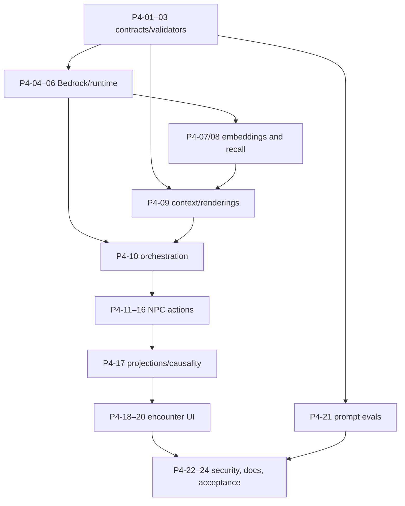

# Phase 4 — Grounded NPC and Memory Loop

- **Status:** Detailed implementation plan
- **Depends on:** Phase 3 first playable plus the accepted persistence and deterministic-rule foundations
- **Primary boundary:** Saved player action → NPC-scoped recall → bounded Bedrock selection → deterministic validation → atomic causal persistence
- **Explicit phase constraint:** This phase owns live Bedrock dialogue, claim normalization, Titan embeddings, and vector recall; it does not own SQS or ambient propagation

## 1. Objective and user-visible proof

Make each NPC encounter variable in emphasis but fixed in authority. Players can
Ask, Tell, Show, Give, and accept an authored Promise. CockroachDB memory and
current deterministic state decide what information and mechanics are eligible;
Bedrock may normalize one bounded claim or select exact application-authored
rendering IDs, but it cannot invent truth, prose, entities, evidence, or game
effects.

The user-visible proof is a two-browser, same-town journey without ambient
work: Player A confirms a claim to one NPC; after that action commits, Player B
asks the same NPC a relevant question and receives a response selected from a
bundle affected by the committed episode/belief. A second action shows a
verified clue and produces a deterministic belief/relationship change plus a
grounded response. Database inspection reconstructs the claim, transmission,
episode, evidence, current belief, selected rendering, and model run while the
authoritative item row remains unchanged by a false claim.

The encounter loop must still terminate safely when Titan, Sonnet, or Haiku is
unavailable: Ask and grounded dialogue may use deterministic scoped recall and
authored responses, while failed claim normalization creates no draft and asks
the player to retry as a new action. Invalid model output never mutates
structured state.

## 2. Scope

### In scope

- Versioned prompt constants and checked-in schema snapshots for claim
  normalization, NPC dialogue selection, and structured repair.
- Bedrock `Converse` adapters for Claude Haiku 4.5 and Claude Sonnet 4.6,
  Titan Text Embeddings V2 at 256 dimensions, explicit deadlines, bounded
  transport retry, token/cost accounting, and durable `agent_runs` telemetry.
- NPC/town-scoped vector candidate search, structured anchors, deterministic
  reranking, top-eight authorization, query-embedding fallback, and episode
  embedding persistence/retry.
- Approved disclosure/outcome/rendering bundle construction that cannot receive
  objective truth or raw database rows.
- `ask`, `normalize_claim`, `tell`, `show`, `give`, and `accept_promise` through
  the existing action ledger, time budget, revision retry, and atomic saved
  response path.
- Claims, relations, drafts, interactions, transmissions, episodes/references,
  belief evidence/current beliefs, relationship changes, promises, item
  custody, capabilities, player-safe testimony/hearsay board entries, and
  versioned promise offers.
- NPC encounter UI, Ask/Tell confirmation, Show/Give pickers, promise offer and
  active-promise presentation, and recovery through the existing client action
  journal.
- Prompt evaluations, live opt-in Bedrock integration tests, CockroachDB vector
  integration tests, HTTP/browser tests, security, cost controls,
  observability, and phase documentation.

### Explicitly out of scope

- Ambient candidate execution, outbox publishing, SQS, ambient worker leases,
  EventBridge recovery, transition polling, and NPC-to-NPC off-screen effects;
  Phase 5 owns those.
- Model-authored player-visible prose, model-calculated belief/relationship
  scores, model-controlled access/item/promise decisions, or direct database
  access by a model.
- New predicates, arbitrary promises, open-ended actions, NPC movement, or
  autonomous object manipulation.
- Complete mystery progression, notes, accusations, endings, asset polish, and
  full accessibility audit, completed in Phase 6.
- Production model IAM, alarms, public deployment, and prompt-warmup scheduling
  hardening, completed in Phase 7; this phase must nevertheless define and test
  the runtime interfaces and least-privilege requirements.

## 3. Prerequisites and accepted contracts

### Required earlier-phase capabilities

- The Phase 3 HTTP/session/player-view/action-status surfaces and client action
  journal pass their browser and database gates.
- `player_actions` processing claims, revision checks, saved-response replay,
  event-effect identities, and ambiguous-commit recovery are extension-ready
  for calls performed outside transactions.
- The Phase 1 schema includes vector columns/index prerequisites, all causal
  and current-state tables, authored seed observations/transmissions, and
  `agent_runs`.
- Phase 2 owns the exact deterministic rules for claims, contradictions,
  beliefs, relationships, disclosure, access, recall, promises, and player-safe
  projection. Phase 4 calls those rules; it does not duplicate them in prompts.
- `bell-mystery-v1` contains NPC profiles, disclosures, rendering templates,
  fallback matrix, item/promise bindings, and seed memories.

### Contract authority

- `docs/001-mvp-product-direction.md` — memory concepts, mechanical
  consequences, claim confirmation, and model authority boundary.
- `docs/002-mvp-system-architecture.md` and
  `docs/003-technical-architecture-and-schema.md` — Observe/Recall/Decide/
  Validate/Act/Persist loop, revision handling, and NPC information boundary.
- `docs/004-infrastructure-cost-estimate.md` — token ledger and cost-mode
  thresholds.
- `docs/005-logical-data-model-and-schema-contract.md` — claim/memory/belief/
  relationship/promise tables, causal identities, agent runs, and vector index.
- `docs/006-http-api-contract.md` — exact action unions, response envelopes,
  input bounds, promise offer IDs, action time budget, and player projections.
- `docs/007-mvp-reliability-parameters.md` — dependency deadlines, one
  transport retry, one repair, one revision rerun, claim lifetime, and commit
  reserve.
- `docs/008-deterministic-game-rules.md` — score calculations, gates, recall,
  repeat protection, action ordering, and relationship/promise consequences.
- `docs/009-authored-game-content.md` — NPC knowledge/voice, disclosure tiers,
  clues, routes, offers, exact fallbacks, and no-soft-lock content.
- `docs/010-bedrock-prompt-contracts.md` plus `docs/schemas/*.json` — immutable
  prompts, model inputs, structured schemas, validators, repair rules, and
  evaluation gate.
- `docs/011-interface-and-interaction-design.md` — encounter, claim review,
  Show/Give/Promise, pending/recovery, and accessibility behavior.

## 4. Ordered implementation workstreams

### Workstream A — Model-independent prompt and bundle contracts

#### P4-01 — Check in immutable prompt, input, and schema definitions

**Deliverables**

- Exact system prompt constants for `claim-normalization/1.0.0`,
  `npc-dialogue/1.0.0`, and `structured-repair/1.0.0`; stable schema names and
  checked-in JSON snapshots; versioned task-input and validation-policy IDs.
- Runtime Zod/TypeScript schemas matching every JSON snapshot byte-for-
  semantics, including the Bedrock-supported JSON Schema subset.
- Canonical prompt hashing, including the ordered target-prompt-plus-repair
  overlay composition, and schema cache keys that do not vary per town.
- Drift tests that fail when runtime schemas, JSON snapshots, exact prompt
  text, or version metadata diverge.

#### P4-02 — Define trusted model-input and grounding types

**Depends on:** P4-01

**Deliverables**

- Explicit `ApprovedDisclosureBundle`, approved outcome, episode, actor,
  entity, rendering, response-limit, normalization-context, and repair-input
  types.
- Constructors that accept only player-safe canonical values and labeled
  untrusted text; no `SimulationRepository`, case solution, `world_facts`
  wholesale, raw row, database client, or arbitrary URL in model-facing code.
- Runtime validation for every rendering record before it enters a bundle,
  including exact text, response kind, grounding membership, limit metadata,
  and absence of raw player text/markup/internal IDs in rendered output.
- Static/dependency tests proving `DialogueService` has no database dependency
  and red-team fixtures proving instruction-like names, summaries, and player
  text remain quoted data.

#### P4-03 — Implement semantic validators and authored fallback resolver

**Depends on:** P4-01, P4-02

**Deliverables**

- Claim validator for entity/context/source membership, predicate type matrix,
  complete/null field combinations, reason-code classes, and application-owned
  normalized key.
- Dialogue validator for response kind, unique rendering membership, complete
  required disclosure/outcome coverage, derived grounding limits, exact
  concatenation, sentence/word limits, and no Markdown/metadata.
- One reusable structured-repair input builder with sanitized stable errors,
  original trusted bundle, original output schema, no repair-of-repair, and no
  increased authority.
- Authored fallback lookup keyed by NPC/action/response kind/gate/required
  outcome, including every mechanical success/denial and Corin's full final-
  truth fallback; startup/content validation rejects missing coverage.
- Unit tests showing unknown, incomplete, incompatible, injected, duplicate, or
  overlong selections cannot reach a player or persistence.

### Workstream B — Bedrock, deadlines, telemetry, and cost

#### P4-04 — Implement bounded Bedrock Runtime adapters

**Depends on:** P4-01

**Deliverables**

- Synchronous `Converse` adapter using `outputConfig.textFormat.type =
  json_schema`, stable schema name/description, no citations, and no streaming.
- Resolved model/inference-profile configuration for Haiku normalization and
  repair, Sonnet dialogue by default, and Haiku dialogue in reduced-cost mode.
- Temperature/output-token settings exactly matching Decision 010, abort
  deadlines derived from the 24-second action budget, at most one throttling/
  5xx transport retry, and no call that cannot finish before the four-second
  reserve.
- Typed dependency outcomes distinguishing transport failure, timeout/content
  stop, parse/schema failure, semantic rejection, accepted, repaired, and
  fallback; raw rejected output never leaves the in-memory validation boundary.

#### P4-05 — Persist model run telemetry and enforce the cost ledger

**Depends on:** P4-04

**Deliverables**

- Append-only short transaction for every invocation recording purpose,
  resolved model/profile, prompt/target version, prompt hash, input/schema/
  validator versions, token/cache dimensions, latency, estimated decimal USD,
  validation code, and outcome.
- Causal source validation for action/world event as available; revision-lost
  accepted outputs recorded as `superseded` rather than silently discarded.
- Internal monthly estimated-cost aggregation and mode selection: Sonnet below
  $8, Haiku dialogue from $8, tighter new-town/action behavior from $9.50, and
  authored fallbacks at $10.35. Public responses never expose dollar values.
- Safe structured logs/metrics that contain IDs, versions, counts, latency,
  cost, and stable error codes but no prompt text, raw output, player text,
  credentials, or connection data.
- Unit/database tests for decimal calculations, thresholds, inference-profile
  rates, repair accounting, fallback, and concurrent ledger reads.

#### P4-06 — Add live model smoke and schema prewarm entry points

**Depends on:** P4-03–P4-05

**Deliverables**

- Explicit operator command that warms Haiku normalization, Haiku dialogue
  repair, and Sonnet dialogue with exact schemas and tiny synthetic inputs,
  creating no town or `agent_runs` rows.
- Credential-gated live Bedrock smoke tests that are skipped with an explicit
  reason when credentials/model access are absent; local unit suites remain
  deterministic through recorded adapter fixtures, not by accepting arbitrary
  text.
- Metrics for warmup success/latency/cost and a documented handoff for Phase 7
  to add the fourth ambient pair and the 20-hour EventBridge schedule.

### Workstream C — CockroachDB vector memory

#### P4-07 — Implement Titan embedding service and episode lifecycle

**Depends on:** P4-04, P4-05

**Deliverables**

- Titan Text Embeddings V2 adapter fixed at 256 dimensions with task-specific
  abort deadline, at most one eligible transport retry, output length/finite-
  value validation, and `episode_embedding`/`query_embedding` agent runs.
- One-time episode embedding flow preserving immutable episode text/causal
  identity; conditional `pending|failed -> ready` update and idempotent retry;
  failure never deletes or hides an episode.
- Seed-memory embedding command and resumable backfill limited by town/content
  version, with bounded concurrency and no whole-database unscoped scan.
- Unit/live-smoke tests for success, wrong dimension, timeout, retry,
  conditional race, and failed-episode preservation.

#### P4-08 — Implement scoped candidate retrieval and deterministic reranking

**Depends on:** P4-07 and Phase 2 recall rules

**Deliverables**

- Vector query requiring both `town_id` and `npc_id`, returning at most 30
  ready episodes through the prefixed CockroachDB vector index.
- Up to ten structured anchors for recent/importance-80+, active commitment or
  grievance, and active contradiction cases, using episode references and
  stable order.
- Deduplication and exact recall score/tie-break implementation: 45% similarity,
  15% seven-day recency, 15% effective importance, 10% directness, 10%
  commitment/grievance, 5% contradiction; final top eight authorized episodes.
- Query-embedding failure path using only scoped structured anchors with
  similarity zero; no cross-NPC/town widening and authored fallback if no safe
  context remains.
- Real-CockroachDB tests for vector prefix isolation, ready-only behavior,
  limits, formula boundaries/ties, failed embeddings, anchor union, and query
  plan/index use where the test cluster exposes it.

#### P4-09 — Build NPC-scoped dialogue context and rendering candidates

**Depends on:** P4-02, P4-03, P4-08 and Phase 2 gates

**Deliverables**

- `NpcContextBuilder` that loads the active visit, NPC snapshot, current
  belief/relationship/promise state, retrieved memories, and disclosures using
  explicit town/NPC/player scope.
- Deterministic selected-belief/contestation, disclosure tier, cover-story,
  access/item/promise gate, and post-action predicted-state application before
  any bundle is built.
- Versioned exact rendering construction from authored templates, canonical
  claim text, safe episode summaries, and deterministic outcomes; required
  disclosures capped at four, outcomes at three, memories at eight.
- Regression fixtures proving Mara receives no chapel truth, Nessa no cart-load
  truth, Corin no private player conversation without transmission, and
  confidential/final truth cannot enter an unpassed bundle.

### Workstream D — Model-backed action orchestration

#### P4-10 — Extend the action executor for outside-transaction model work

**Depends on:** P4-04, P4-05, P4-09 and the Phase 3 action executor

**Deliverables**

- Reusable Observe → Recall → Decide → Validate → Act → Persist orchestration
  under the existing processing token and absolute deadline.
- Transactional model-action token buckets at 6/minute with burst three per
  player and 30/minute with burst ten per town, applied before new operation
  creation. Processing/terminal replays bypass quota; a retryable action that
  will invoke models again consumes quota before reclaiming and remains
  retryable if rate-limited.
- Pre-model snapshot/revision load, all Titan/Bedrock calls outside SQL
  transactions, one bounded relevant-state reload/rerun, `superseded` telemetry
  for discarded runs, and saved retryable `409 ACTION_CONFLICT` on a second
  relevant revision loss.
- Atomic final transaction that revalidates the processing token, revision,
  visit/co-location, custody/gates, and commits all effects plus the complete
  validated/fallback response.
- Time-budget tests covering transport retry, repair, revision rerun, final
  four-second reserve, 500ms serialization margin, late-worker rejection, and
  atomic rate-limit/replay/reclaim behavior.

#### P4-11 — Implement `ask`

**Depends on:** P4-08–P4-10

**Deliverables**

- Strict 1–500-grapheme plain-text input, active co-located NPC authorization,
  scoped query embedding/recall, approved disclosure bundle, dialogue selection
  and one repair, then authored fallback.
- Atomic `npc_interaction`, `npc_interaction` event, applicable NPC-to-player
  claim transmissions in selected rendering order, receiving-player board
  cards, NPC player-interaction episode/references, and saved Ask response with
  ordered promise offers.
- Tests for no-disclosure questions, hearsay/provenance classification,
  required grounding, embedding/model failure, fallback, action replay, and no
  hidden prompt or response fields.

#### P4-12 — Implement `normalize_claim` and single-use drafts

**Depends on:** P4-03–P4-05, P4-10

**Deliverables**

- Trusted context containing canonical entities/actors/aliases, predicate
  signatures, supported contexts/default, and labeled untrusted player text.
- Valid `normalized` result persisted as a ten-minute pending draft bound to
  player/visit/NPC; canonical text and explicit alleged source projected safely.
- Valid clarification/unsupported outputs mapped to `needs_revision` with
  authored reason copy and no draft/effect; invalid-plus-failed-repair stored as
  terminal `503 MODEL_UNAVAILABLE_RETRY_ACTION` requiring a new logical action.
- Tests for every predicate/polarity/context, explicit alleged source only,
  ambiguity/multiple propositions/unknown entity, lies treated as claims, prompt
  injection, expiry, and no partial structured persistence.

#### P4-13 — Implement `tell` confirmation and belief effects

**Depends on:** P4-12, P4-09, P4-10 and Phase 2 claim/belief rules

**Deliverables**

- Single-use draft confirmation by the same player in the same active,
  co-located visit/NPC; stale/expired/changed context produces a completed safe
  denial rather than implicit renormalization.
- One atomic commit that creates/reuses the claim, creates deterministic
  contradiction relations/backfill mirrors, marks the draft confirmed, records
  player-to-NPC transmission with exact alleged source, recipient episode/
  references, testimony/corroboration/mirror evidence, current belief, any
  promise/grievance effects, interaction/event, dialogue, and saved response.
- Testimony trust snapshots, independent-root deduplication, repeat protection,
  claim-truth neutrality, and false-claim tests proving no item/world-fact
  mutation.
- Dialogue selection over the predicted post-effect state, with one repair and
  exact Tell fallback.

#### P4-14 — Implement `show` and deterministic evidence consequences

**Depends on:** P4-09, P4-10 and Phase 2 evidence/relationship rules

**Deliverables**

- Town-discovered clue or currently held item authorization; Show never moves
  custody and an item produces structured evidence only through its authored
  inspectable/clue links.
- Exact physical clue support/contradiction, mirror coalescing, source reversal
  and narrow caught-lie rule, belief recomputation, repeat-protected
  relationship effects, same-action post-effect disclosure/offer/capability
  gates, and sorted `appliedClueIds`.
- Interaction/event/episode/rendering persistence and authored fallback that
  expresses every required mechanical outcome.
- Database/HTTP tests for another player showing a town-discovered clue,
  unheld item rejection, no-effect item, repeated Show, one clue overturning
  testimony, knowing-lie versus mere contradiction, and Corin capability grant.

#### P4-15 — Implement `give`

**Depends on:** P4-09, P4-10 and Phase 2 custody/promise rules

**Deliverables**

- Conditional item-revision transfer from the current player to the co-located
  NPC, authored acceptance/refusal, unique-item race handling, requested-item
  relationship reward, and return-item promise fulfill/break evaluation.
- Atomic custody, item-transfer event, promise/relationship consequences,
  episode, interaction, grounded outcome dialogue, and saved response.
- Database/HTTP tests for concurrent Give, wrong custodian, NPC refusal,
  requested lens/seal, key return fulfillment, incompatible transfer break,
  replay, and stale fallback consistency.

#### P4-16 — Implement versioned promise offers and `accept_promise`

**Depends on:** P4-11, P4-13–P4-15

**Deliverables**

- Ordered canonical offer descriptors stored inside source action responses and
  exact base64url `promise-offer:v1\n<sourceActionId>\n<ordinal>` encoding.
- Acceptance that loads the retained descriptor and terms evaluator, validates
  same town/player/visit/NPC/current gates, prevents duplicate active promises,
  and never reconstructs from current dialogue/content.
- Atomic promise acceptance and, for Nessa's key offer, conditional key transfer
  plus required grounded response; stale context is a completed denial.
- Tests for forged/malformed/source-mismatched ordinal, later content version,
  duplicate acceptance, terms retention, key custody race, keep-secret creation,
  and saved-response replay.

#### P4-17 — Close causal persistence and player-safe projection coverage

**Depends on:** P4-11–P4-16

**Deliverables**

- Repository-level invariant checks for interaction/event identity,
  transmission ordinals and provenance roots, episode uniqueness/references,
  evidence/source snapshots, relationship ledger reconstruction, promise state,
  and board classification.
- Player-view support for inventory, active promises, NPC stance/action kinds,
  discovered clues eligible for Show, and player-safe testimony/hearsay with
  ordered provenance; exact scores, objective truth, private reasoning, raw
  model results, and canonical revision remain absent.
- Inspection-view verification queries proving each accepted interaction can be
  reconstructed without widening player API access.

### Workstream E — NPC encounter interface

#### P4-18 — Build focused NPC encounter and Ask flow

**Depends on:** P4-11, P4-17

**Deliverables**

- Player-view-guarded encounter route with portrait, role, stance, opening
  line, latest durable exchange, and only server-supplied available actions.
- 500-grapheme Ask composer, Ctrl/Cmd+Enter behavior, client-side plain-text
  validation, existing Phase 3 pending/recovery integration, and post-terminal
  view refresh.
- No scrolling chat transcript and no visual stigma for selected/repaired/
  fallback dialogue; response mode is diagnostic rather than narrative.
- Component/browser tests for focus, keyboard submit, unavailable actions,
  fallback rendering, refresh, and stale co-location redirect.

#### P4-19 — Build Tell interpretation and confirmation flow

**Depends on:** P4-12, P4-13, P4-18

**Deliverables**

- Separate Interpret and Tell actions/keys; editable raw text; authored
  `needs_revision`; confirmation with equal-weight raw/canonical text, target,
  recorded/alleged source, expiry countdown, and propagation warning.
- Edit/discard behavior that leaves the server draft harmlessly pending,
  navigation warning, server-authoritative expiry, and fresh normalization key
  after edits or terminal dependency failure.
- Journal-safe recovery of normalization/Tell without ever silently
  retargeting, renormalizing, or confirming a draft.
- Browser tests for ambiguity/revision, refresh during review, expiry,
  navigation, offline Tell, single transmission, and claim-source display.

#### P4-20 — Build Show, Give, promise, inventory, and durable result UI

**Depends on:** P4-14–P4-18

**Deliverables**

- Show picker for town-discovered clues and held items; Give picker for held
  portable items; confirmations that distinguish viewing from custody change
  and warn only that a promise may be affected.
- Promise offers anchored to the response that produced them, opaque offer ID
  acceptance, stale-offer denial, and active promise presentation in the
  casebook.
- Result cards driven only by completed action responses/refreshed view; no
  client inference of belief, relationship, custody, capability, or promise
  outcome.
- Keyboard/focus/live-region tests for pickers, destructive confirmation,
  simultaneous item conflict, offer expiry/context change, and narrow viewport.

### Workstream F — Evaluations, security, observability, and docs

#### P4-21 — Build and gate prompt evaluations

**Depends on:** P4-01–P4-06

**Deliverables**

- Deterministic fixture suites covering every control, known failure, injection,
  and boundary case in Decision 010 for normalization, dialogue, and repair.
- Assertions over schema, IDs, grounding, gates, persistence safety, and
  fallback—not fuzzy prose equivalence.
- Baseline results tied to prompt/model/schema/validator versions; model or
  prompt changes cannot regress hard-safety cases.
- Optional live evaluation command separated from fast deterministic tests and
  documented expected cost.

#### P4-22 — Add model and memory security tests

**Depends on:** P4-07–P4-17

**Deliverables**

- Adversarial prompt-injection fixtures in player text, aliases, rendering
  text, episode summaries, and invalid output.
- Cross-town/NPC vector and relational isolation, objective-truth exclusion,
  inaccessible ID equivalence, parameterized queries, safe logging, and no raw
  rejected output persistence.
- Tests proving only supplied rendering/claim/entity/actor IDs can be accepted,
  dialogue has no database/tool access, and model results alone cannot alter
  items, beliefs, relationships, promises, access, or case progress.

#### P4-23 — Instrument and document the grounded loop

**Depends on:** P4-04–P4-22

**Deliverables**

- Metrics segmented by purpose/model/outcome for latency, tokens, cost,
  validation failure, repair, fallback, embedding failure, recall candidate
  count, revision rerun, and deadline exhaustion.
- Structured causal trace guidance for action → run → interaction/event →
  transmission/episode → evidence/belief/relationship, using safe IDs only.
- Developer docs for Bedrock/Titan configuration, seed embedding, prompt
  prewarm, deterministic/live evals, cost modes, fallback testing, and local
  two-browser memory proof.
- Phase boundary documentation stating that no NPC-to-NPC transmission occurs
  until Phase 5 and direct player-to-NPC memory is sufficient for this exit
  gate.

#### P4-24 — Run phase acceptance and capture evidence

**Depends on:** all prior Phase 4 tasks

**Deliverables**

- Full contract/unit/database/API/component/browser/prompt evaluation run.
- Opt-in live Bedrock/Titan smoke against a seeded test town with recorded
  version/cost/latency metadata and no secret/raw-output capture.
- Two-browser proof that a committed direct NPC memory changes a later safe
  bundle/response and that physical evidence deterministically changes the
  ledger while objective state remains authoritative.

## 5. Artifacts

| Area | Required artifact |
|---|---|
| Prompts/contracts | Immutable prompts, input schemas, JSON schema snapshots, semantic validators, prompt hashes |
| Model runtime | Bedrock/Titan adapters, deadline/retry policy, model resolver, structured repair, cost-mode selector |
| Memory | Episode embedding lifecycle, vector repository, anchor query, reranker, NPC context builder |
| Gameplay | Ask/Normalize/Tell/Show/Give/Promise handlers and deterministic effect coordinators |
| Persistence | Causal repositories for runs, claims, drafts, transmissions, episodes, evidence, beliefs, relationships, promises, interactions, board entries |
| Web | Encounter, Ask/Tell review, Show/Give pickers, offer/promise/inventory/result components |
| Tests | Prompt eval fixtures, model adapter tests, CockroachDB vector/isolation tests, HTTP tests, two-browser memory journey |
| Operations/docs | Prewarm and seed-embedding commands, safe metrics/logs, cost/fallback documentation |

## 6. Dependencies and sequencing

- Validators and fallback coverage precede live model calls.
- Embedding/vector retrieval is proven in CockroachDB before Ask depends on it.
- Each action reuses one model orchestration and one deterministic ruleset.
- Tell is implemented only after normalization drafts are safe; promise
  acceptance follows actions that can produce saved offers.
- UI controls remain disabled until the corresponding HTTP/database contract
  passes.

## 7. Verification matrix

Commands are planned workspace commands and should be reconciled with Phase 0
script names.

| Boundary | Required proof | Planned command |
|---|---|---|
| Prompt/schema | Snapshot drift, semantic validators, repair/fallback coverage | `pnpm test --filter prompts -- phase-04` |
| Prompt evaluations | Control/failure/injection/boundary fixtures for normalization/dialogue/repair | `pnpm prompts:eval -- phase-04` |
| Model adapter | Deadlines, retry, model resolution, token/cost telemetry through fixtures | `pnpm test --filter model-runtime -- phase-04` |
| Live Bedrock/Titan | Structured output, exact schema pairs, 256-d embedding, safe telemetry | `pnpm test:model:live -- phase-04` |
| CockroachDB | Vector scope/ranking, drafts, causality, repeat protection, beliefs, relationships, promises, item races | `pnpm test:db -- phase-04` |
| HTTP | Exact six action inputs/envelopes, failures, replays, time budgets, player-safe projections | `pnpm test --filter api -- phase-04` |
| Browser/component | Encounter, claim review, Show/Give, offers, journal recovery, a11y | `pnpm test --filter web -- phase-04` |
| Two-browser journey | Direct committed NPC memory changes later dialogue; clue changes belief without changing false-claim truth | `pnpm test:e2e -- phase-04-grounded-memory` |
| Security | Prompt injection, hidden truth, vector tenant boundary, no raw output/log secrets | `pnpm test --filter security -- phase-04` |
| Static quality | Type, lint, build, contract drift | `pnpm typecheck && pnpm lint && pnpm build` |

Live tests may require explicit AWS credentials and model access, but the phase
cannot be declared complete solely on mocked model responses. At least one
recorded, opt-in live smoke must pass against the configured models and a real
CockroachDB vector index.

## 8. Risks, decisions, and fallback strategy

| Risk or decision | Required handling |
|---|---|
| Model selection returns plausible but ungrounded output | Validate schema, membership, required grounding, kind, and derived limits; repair once; then use exact authored fallback. No generated prose is persisted or shown. |
| Normalization has no safe semantic fallback | A failed original plus repair creates no draft/effect and stores terminal `503 MODEL_UNAVAILABLE_RETRY_ACTION`; intentional retry uses a new key. |
| Titan is unavailable | Use only scoped structured anchors with similarity zero; never widen NPC/town authority. If nothing safe remains, use authored dialogue. |
| Episode embedding fails | Persist the episode and references with failed/pending embedding status; allow conditional later retry. Memory identity is never lost. |
| Town changes during model work | Record the run, rebuild once against a fresh revision, and mark discarded valid output superseded. A second conflict is retryable under the same action key with no effects. |
| Repair/retry/revision combinations exceed 24 seconds | Start only a step whose worst-case bound fits before the reserve. Prefer fallback or safe terminal outcome over API timeout. |
| Cost mode changes the dialogue model | Use the identical prompt/schema/validator and require prompt-eval passage for Haiku dialogue before switching. At the hard threshold, authored fallbacks preserve readability. |
| A false normalized claim resembles objective truth | Claims remain truth-neutral. Only deterministic evidence affects beliefs, and only simulation repositories alter items/world state. |
| Saved promise offers outlive a deploy | Persist exact descriptors and retain their terms evaluator; never reinterpret using newest content. |
| Ambient behavior is tempting to add for the demo | Do not. Phase 4 proof uses direct player-to-NPC committed memory; Phase 5 owns every NPC-to-NPC off-screen effect. |

## 9. Exit checklist

- [ ] Exact prompt/schema snapshots, hashes, versions, and semantic validators
      are executable and drift-tested.
- [ ] Live Haiku/Sonnet/Titan calls use bounded deadlines, correct structured
      output, safe telemetry, and no database transaction.
- [ ] Every run records model/profile/prompt/schema/validator/token/cache/
      latency/cost/outcome metadata without prompt, raw output, or secrets.
- [ ] Vector search is scoped by town and NPC, anchors remain scoped, and exact
      top-eight reranking passes with and without embeddings.
- [ ] Ask uses only authorized memories/disclosures and falls back safely.
- [ ] Normalize creates either one bounded draft or no effect; Tell confirms a
      draft once and persists exact provenance.
- [ ] Show, Give, and Promise outcomes are deterministic, transactional,
      repeat-protected, and reflected by grounded or authored dialogue.
- [ ] Invalid, unavailable, timed-out, or injected model output cannot mutate
      claims, transmissions, episodes, beliefs, relationships, items,
      capabilities, promises, or board state.
- [ ] A false claim changes belief memory without changing objective item state.
- [ ] Player views expose qualitative, attributed, player-safe state only.
- [ ] Encounter/Tell/Show/Give/Promise UI obeys saved-before-shown and same-key
      recovery behavior with keyboard and narrow-viewport coverage.
- [ ] Prompt evals, real CockroachDB vector tests, HTTP tests, browser tests,
      security tests, live smoke, typecheck, lint, and build pass.
- [ ] Two browsers demonstrate that committed direct NPC memory changes a later
      interaction without any ambient work.

## 10. Handoff to Phase 5

Phase 5 receives reusable services for scoped recall, ambient-compatible
episodes/transmissions/belief effects, Haiku structured selection/repair,
deadline-aware model calls, agent-run telemetry, and the persistent action/event
causal model.

The handoff must identify:

- the deterministic function that builds ambient candidates from a disjoint
  event range without calling a model;
- the reusable Haiku invocation/repair API and the additional
  `ambient-choice/1.0.0` prompt/schema pair still to activate;
- the transaction function that applies one validated NPC-to-NPC transmission
  and its episode/evidence effects under an ambient event identity;
- how new ambient episodes obtain or later retry embeddings without making the
  tick partial; and
- the Phase 3 eligible-range leave seam that Phase 5 will replace with durable
  outbox creation and transition status.
