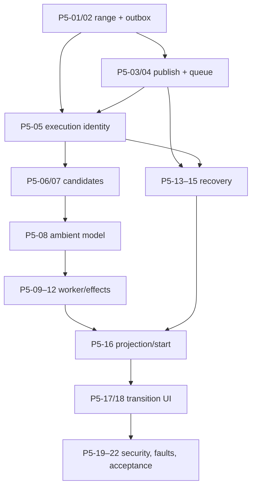

# Phase 5 — Ambient Propagation and Recovery

- **Status:** Detailed implementation plan
- **Execution companion:** [Phase 5 execution detail](phase-05-execution-detail.md)
- **Depends on:** Phase 4 grounded NPC/memory loop and the Phase 3 leave/action/browser foundations
- **Primary boundary:** Atomic Leave/outbox → SQS FIFO → bounded ambient choice → atomic causal effects → recoverable player transition
- **Explicit phase constraint:** This phase owns outbox delivery, SQS, ambient execution, recovery, and time-passes UI; it does not broaden model or simulation authority

## 1. Objective and user-visible proof

Make a consequential visit advance the shared town safely after the player
leaves. The visit transaction assigns a disjoint event range and durable job,
SQS delivers it at least once, a bounded worker may share at most two existing
claims across authored contact edges or do nothing, and every result remains
idempotent, provenance-complete, inspectable, and terminal before the transition
deadline.

This phase also closes the joint Phase 4/5 player-facing release gate. The six
NPC mutations introduced at the Phase 4 integration checkpoint are enabled in
shared/public player traffic only after eligible Leave, terminal transition,
and re-entry pass `P5-22` together.

The user-visible proof is the canonical two-browser rumour path:

1. Player A tells Mara that the bell was at Reed's Garden and leaves.
2. The UI honestly moves through `waiting` and `processing` without naming an
   NPC or claiming gossip occurred.
3. The worker selects a supplied Mara-to-Nessa candidate (or the valid Corin
   fallback), persists one NPC-to-NPC transmission and recipient memory, and
   completes the transition.
4. Player B later receives materially changed grounded dialogue from that
   recipient.
5. Inspection reconstructs Player A → Mara → recipient, hop count, trust
   snapshot, belief evidence, outbox range, job/run identity, and unchanged
   authoritative bell location.

Fault variants must also end honestly. Duplicate publication/delivery, worker
timeout, stale processing claims, failed send acknowledgement, deadline expiry,
model failure, or a late message must neither duplicate effects nor strand the
player away. A valid no-op and a quarantined failure are both projected as an
eventual player-visible `complete`, without leaking their internal difference.

## 2. Scope

### In scope

- Leave Town's complete disjoint-range and transactional-outbox branch for
  ranges containing ambient-eligible events.
- Best-effort post-commit publication, durable outbox delivery claims/state,
  stable payload hashes, and uncertain-send recovery.
- SQS FIFO and DLQ definitions/configuration required to exercise the slice:
  queue-level delay, town grouping, job deduplication, one-record batches,
  concurrency/visibility/retention/redrive bounds, and least-privilege access.
- Ambient execution ledger, processing claims, deadlines, corruption checks,
  deduplication, retries, completed no-op, and quarantine.
- Deterministic ambient candidate eligibility, scoring, ordering, top-12
  shortlist, and commit-time validation.
- `ambient-choice/1.0.0`, its exact schema/validator, one repair, deterministic
  `do_nothing`, and agent-run/cost telemetry through the Phase 4 model runtime.
- Atomic NPC-to-NPC transmissions, episodes/references, belief evidence/current
  beliefs, events, optional relationship consequences allowed by the rules,
  embeddings lifecycle, and completion.
- Once-per-minute Recovery Lambda for due outbox rows, uncertain sends,
  deadline abandonment/quarantine, and expired join-replay secret cleanup.
- Player-view ambient states, start-visit deadline terminalization, time-passes
  UI/polling, fault injection, security, observability, and operational docs.

### Explicitly out of scope

- Continuous scheduled simulation, NPC movement, autonomous item transfer, new
  facts/claims/entities/locations/promises, or chaining tick-created events in
  their own tick.
- Confidential/final-truth ambient sharing, unrestricted graph traversal, more
  than two actions, more than one hop for one claim per tick, or ambient
  delivery to an NPC at hop four.
- A player or admin retry button for ambient work. Recovery is server-owned;
  manual redrive is an operator procedure preserving original keys.
- Production-complete dashboards, budgets, public deployment, cross-account
  policies, and managed-MCP operations, finalized in Phase 7. Phase 5 still
  emits and tests every telemetry signal needed there.
- Complete mystery/endings/UI polish, owned by Phase 6.

## 3. Prerequisites and accepted contracts

### Required earlier-phase capabilities

- Phase 3 Leave atomically ends a visit and consumes an ineligible disjoint
  range; its eligible-range seam can be extended without changing the public
  action contract.
- Phase 3 player-view, `start_visit`, action idempotency, polling, router guards,
  and browser ETag schedule are stable.
- Phase 4 persists exact player-to-NPC transmission roots, episodes/references,
  beliefs/evidence, disclosures, promises/grievances, `agent_runs`, and scoped
  recall; the ambient path can reuse these without inventing a parallel model.
- Phase 4 Bedrock adapter supports Haiku structured selection, repair, deadlines,
  cost modes, and telemetry; Titan embedding lifecycle can handle new recipient
  episodes.
- The database schema contains `outbox`, `ambient_job_executions`, required
  uniqueness/indexes, composite town foreign keys, inspection views, and all
  state checks.
- Phase 2 provides pure event eligibility, ambient candidate rules/priority,
  belief effects, hop/provenance checks, disclosure/promise gates, tick limits,
  and deterministic `do_nothing` validation.

### Contract authority

- `docs/001-mvp-product-direction.md` — leave-triggered bounded tick, two-action
  and one-hop limits, and safe terminal failure.
- `docs/002-mvp-system-architecture.md` and
  `docs/003-technical-architecture-and-schema.md` — outbox/SQS/worker/recovery
  flow, contact graph, consistency, and idempotency.
- `docs/004-infrastructure-cost-estimate.md` — queue/model/recovery cost bounds.
- `docs/005-logical-data-model-and-schema-contract.md` — outbox/execution
  states, payloads, event ranges, indexes, job/effect identity, and atomicity.
- `docs/006-http-api-contract.md` — Leave result, ambient player projection,
  Start Visit terminalization, deadline, and no internal leakage.
- `docs/007-mvp-reliability-parameters.md` — all queue, claim, timeout,
  backoff, recovery, database, concurrency, retention, and DLQ values.
- `docs/008-deterministic-game-rules.md` — candidate eligibility/priority,
  shortlist/tick constraints, testimony weights, and propagation limits.
- `docs/009-authored-game-content.md` — directed contact/trust graph, narrative
  preferences, disclosure exclusions, canonical garden-rumour demo, and safe
  alternatives.
- `docs/010-bedrock-prompt-contracts.md` and
  `docs/schemas/ambient-choice-v1.schema.json` — exact ambient prompt, schema,
  semantic validator, repair boundary, and evaluation fixtures.
- `docs/011-interface-and-interaction-design.md` — leave confirmation,
  time-passes states/copy, polling, 90-second notice, five-minute recovery, and
  no hidden-state claims.

## 4. Ordered implementation workstreams

### Workstream A — Durable range allocation and outbox publication

#### P5-01 — Complete ambient event classification and range allocation

**Deliverables**

- One versioned deterministic mapping from every implemented world event type
  to `ambient_eligible`, with content bindings that mark only events creating
  or materially changing belief about an existing claim. `system_seed` origins
  are categorically false because authored backstory is already materialized
  and scheduled through before play begins.
- Leave transaction that appends departure, calculates
  `(ambient_scheduled_through_sequence, last_event_sequence]`, checks the
  authoritative stored event flags, and advances the boundary whether or not a
  job is needed.
- Concurrency tests proving ranges are nonoverlapping, no event is skipped or
  scheduled twice, ineligible ranges produce no outbox row, and tick-created
  sequences cannot fall into the tick that created them. Seed-boundary fixtures
  also prove no `system_seed` event can enter the first or any later
  player-triggered range.

#### P5-02 — Create the transactional ambient outbox job

**Depends on:** P5-01

**Deliverables**

- For an eligible range, one `ambient_tick` outbox row created in the Leave
  transaction with server UUID `job_key`, source departure event/visit,
  relational range columns, canonical `{version, visitId,
  afterEventSequence, throughEventSequence}` payload, SHA-256 payload hash,
  `not_before = commit + 20s`, and `transition_deadline_at = commit + 5m` using
  CockroachDB time.
- Unique visit/job/range protections and a Leave response of `waiting` only
  after the durable row commits; a failed post-commit queue send never rolls
  back the visit.
- Database/API tests for eligible/no-eligible Leave, same-key replay,
  concurrent departures, payload/column agreement, and rollback at every write
  boundary.

#### P5-03 — Implement outbox send claims and initial publication

**Depends on:** P5-02

**Deliverables**

- Delivery state machine for `pending -> sending -> sent`, expired `sending`
  takeover, `sending -> pending` with one-/two-minute backoff, and terminal
  `abandoned`; only current 30-second send token may change the claimed row.
- One best-effort post-commit send with a total two-second budget. An
  acknowledged publish conditionally saves `sent_at`; timeout/ambiguous
  acknowledgement leaves durable state for Recovery.
- Queue adapter that sends only `town_id`, `outbox_id`, and `job_key`, with
  `MessageGroupId = town_id` and `MessageDeduplicationId = job_key`; the
  authoritative payload is never trusted from SQS.
- Unit/database tests for acknowledgement, definite failure, uncertain send,
  stale sender, backoff, deadline, and same-key republish.

### Workstream B — Queue and execution identity

#### P5-04 — Define the Phase 5 SQS FIFO/DLQ slice

**Depends on:** P5-03

**Deliverables**

- Infrastructure definitions for a FIFO source queue with 20-second queue-level
  delay, 180-second visibility, four-day retention, batch size one,
  `maxReceiveCount = 5`, and event-source maximum concurrency five.
- DLQ with 14-day retention, ambient function 30-second timeout and reserved
  concurrency five, plus IAM limited to the exact queue operations and resource
  ARNs required by Game, Ambient, and Recovery roles.
- Configuration assertions/synth tests for every coupled parameter and a local
  queue-adapter contract test. Phase 7 may promote these definitions into the
  complete production stack but must not silently change their protocol.

#### P5-05 — Implement ambient execution claims and corruption checks

**Depends on:** P5-02, P5-04

**Deliverables**

- Create/read state machine keyed uniquely by both outbox ID and job key;
  `processing`, `completed`, and `quarantined` column rules; 45-second
  nonrenewing processing claim; current-token conditional completion.
- Authoritative outbox load and exact town/outbox/job/payload-hash agreement;
  malformed queue bodies, mismatches, premature `not_before`, non-active towns,
  and terminal deliveries cannot apply effects.
- Completed duplicate exits immediately; after five expired/failed claims the
  next owner quarantines without effects. A valid no-op completes with action
  count zero.
- Database/worker tests for concurrent duplicate delivery, stale takeover,
  late old worker, identity corruption, early delivery, non-active town, and
  attempt exhaustion.

### Workstream C — Deterministic ambient choice boundary

#### P5-06 — Build the ambient event/recall input set

**Depends on:** P5-01, P5-05 and Phase 4 recall

**Deliverables**

- Load only ambient-eligible events within the outbox's exclusive/inclusive
  range and the NPC memories/claims explicitly connected by direct event
  reference or canonical entity overlap.
- Reuse Phase 4 top-eight NPC-scoped recall. A recall/embedding failure uses
  scoped structured anchors and cannot widen the event range, town, NPC, claim,
  or disclosure authority.
- Tests proving events below/above the range, ineligible events, unrelated
  memories, another town/NPC, and tick-created events are excluded.

#### P5-07 — Generate and rank the complete valid candidate set

**Depends on:** P5-06 and Phase 2 ambient rules

**Deliverables**

- Candidate constructor requiring existing selected belief score ≥20 or
  enabled Corin cover story; exact repeat/direct-observation provenance;
  directed contact edge; allowed disclosure; promise constraints; recipient
  not in chain; unique independent source; proposed NPC hop ≤3.
- Exclude confidential and final-truth tiers; dynamic player claims default to
  guarded; listener trust and disclosure are directionally correct.
- Exact integer priority, stable tie-break order, and top-12 cap; narrative
  preferences are descriptive prompt data and never modify eligibility,
  score, or order.
- Deterministic tests for every gate, cover story, contact asymmetry, no
  Nessa–Corin edge, chain cycle, repeated source, hop 3/4 boundary, priority,
  ties, empty set, and shortlist length.

#### P5-08 — Activate the ambient prompt, schema, validator, and eval gate

**Depends on:** P5-07 and Phase 4 model runtime

**Deliverables**

- Exact `ambient-choice/1.0.0` prompt, `ambient_choice_v1` snapshot/runtime
  schema drift test, task-input/validator versions, prompt hash, Haiku settings
  (`temperature 0.2`, `maxTokens 128`), and fourth prewarm pair.
- Semantic validation for decision/null/reason combinations, supplied IDs,
  distinct selections, one claim hop and one outgoing action per speaker.
- One repair only for schema/cross-field inconsistency before IDs are
  interpreted. Unknown/stale/duplicate/out-of-list/repeated-claim/repeated-
  speaker selection after interpretation becomes deterministic `do_nothing`;
  repair never substitutes a different choice.
- Prompt evaluation fixtures for zero/one/two selection, injection, unknown or
  duplicate ID, same claim/speaker, stale contact, secret/promise conflict,
  empty/redundant/all-invalid candidates, and repair failure.

### Workstream D — Ambient worker and atomic effects

#### P5-09 — Implement bounded ambient worker orchestration

**Depends on:** P5-05–P5-08

**Deliverables**

- One-record Lambda handler with absolute 24-second application budget inside
  30-second timeout, final four-second validation/no-op/quarantine/commit
  reserve, Phase 4 dependency abort deadlines, and no model/embedding call
  inside a transaction.
- Observe execution/outbox/range → recall → deterministic candidate shortlist
  → Haiku select/repair → validate in returned order → stage effects → atomic
  completion flow.
- Commit permitted only before the transition deadline, under the current
  processing token, with unchanged payload identity and active town.
- Safe behavior for model transport failure, invalid output, embedding failure,
  deadline pressure, town freeze, and ambiguous database commit; no partial
  effects or blind retry.

#### P5-10 — Persist one validated NPC-to-NPC transmission effect

**Depends on:** P5-09 and Phase 4 causal repositories

**Deliverables**

- Reusable transactional effect that creates one
  `ambient:<job-key>:<effect-index>` `claim_transmitted` world event, exact
  parent/source/root/hop transmission, recipient heard-claim episode and
  references, testimony/corroboration/contradiction evidence, updated belief,
  and allowed deterministic consequence records.
- Listener trust snapshot uses listener-to-speaker authored edge; repeated
  testimony keeps root independent-source identity; claim/world truth and item
  custody never change.
- Recipient episode embedding prepared outside the transaction when time
  permits or persisted failed/pending for later Phase 4 retry; embedding
  availability cannot make the causal commit partial.
- Database tests for Mara-to-Nessa expected +32 hop-one testimony, same-root
  repeat protection, contradiction mirrors, provenance path, and unchanged bell
  item.

#### P5-11 — Apply up to two choices and complete atomically

**Depends on:** P5-10

**Deliverables**

- Ordered selection validation against pre-tick state plus any earlier valid
  choice; at most two transmissions, one per claim and one outgoing per NPC.
- One transaction containing every valid action's effects, town revision, final
  `action_count` 0–2, and `ambient_job_executions.completed_at`; any failure
  rolls back the entire tick.
- Event effect indexes 0 and 1 remain distinct; duplicate delivery both inside
  and outside SQS deduplication window replays completion and creates neither
  event again.
- Tests for 0/1/2 choices, second-choice invalidation, same claim/speaker,
  atomic rollback, exact effect keys, duplicate delivery, and serialization
  retry.

#### P5-12 — Record ambient model/embedding telemetry safely

**Depends on:** P5-08–P5-11

**Deliverables**

- `ambient_choice`, repair, query/episode embedding `agent_runs` linked to the
  ambient execution/world event as available, including selection/fallback/
  failed/superseded outcomes and exact cost dimensions.
- No player text, raw invalid output, hidden prompt content, queue payload beyond
  safe IDs, credentials, processing tokens, or claim prose in logs.
- Tests ensuring a rejected/invalid selection has an inspectable run but no
  world event, transmission, episode, or evidence.

### Workstream E — Recovery and terminal transition semantics

#### P5-13 — Implement Recovery Lambda due-send processing

**Depends on:** P5-03, P5-05

**Deliverables**

- Once-per-minute handler, 30-second timeout, at most 25 rows, bounded
  parallelism compatible with the two-connection database pool and own deadline.
- EventBridge once-per-minute schedule definition and invoke permission, with
  synth assertions for cadence, target, timeout configuration, and least
  privilege; Phase 7 attaches production alarm/rollback operations.
- Due `pending` and expired `sending` scan, original-key/payload republish,
  conditional acknowledgement, one-/two-minute backoff bounded by transition
  deadline, and no replacement job identity.
- Failed/uncertain-send integration tests with a controllable queue fake and
  real database; later SQS integration test proves republish preserves message
  group/deduplication values.

#### P5-14 — Implement deadline abandonment, quarantine, and late no-op

**Depends on:** P5-05, P5-13

**Deliverables**

- At/after deadline, conditionally abandon pending or expired-sending delivery,
  ensure any nonterminal execution is quarantined with no effects, and preserve
  historical `sent` state while quarantining its execution.
- Worker and Start Visit check the same CockroachDB-time terminal condition;
  sent/abandoned/quarantined/complete late delivery is acknowledged without
  state change.
- Alerts/metrics for infrastructure quarantine and abandonment; completed
  deterministic no-op is not mislabeled as failure.
- Fault tests at deadline boundaries, live send claims, sent-but-not-executed,
  worker/Recovery/Start Visit races, and a late message after terminalization.

#### P5-15 — Add expired join-replay secret cleanup

**Depends on:** P5-13 and Phase 3 join semantics

**Deliverables**

- Recovery scan that conditionally closes unconfirmed expired join requests,
  sets exact closure reason/time, clears the hash, and never authenticates,
  creates a session, or recovers a player.
- Request-time expiry remains authoritative and races safely with the sweep.
- Database/API tests for cleanup, request race, already confirmed/closed rows,
  and absence of join-secret material in logs/inspection.

#### P5-16 — Integrate transition state into Start Visit and player view

**Depends on:** P5-11, P5-14

**Deliverables**

- Player projection maps durable internal delivery/execution state only to
  `waiting`, `processing`, or `complete`, with `canStartVisit` false/false/true;
  complete and quarantined/no-op are intentionally indistinguishable to players.
- Start Visit denies before terminal state, conditionally performs deadline
  terminalization if Recovery has not, and then starts Festival Square exactly
  once; non-active towns remain blocked.
- Hidden queue IDs, send/execution states, attempts, model outcome, error code,
  selected NPC/claim, and quarantine reason never enter response or ETag.
- Add a validated release capability that can expose the six Phase 4 NPC
  mutations only when eligible Leave, outbox publication, Ambient consumption,
  Recovery terminalization, and transition projection are all configured.
  Production/shared configuration fails closed if these capabilities differ.
- HTTP/database tests for every state/race and hidden-only transition changes
  that do or do not affect the safe projection as contractually appropriate.

### Workstream F — Time-passes browser experience

#### P5-17 — Build Leave waiting route and honest transition presentation

**Depends on:** P5-02, P5-16

**Deliverables**

- Route `waiting` Leave to `/between-visits`; keep `not_required` on the direct
  away path; resolution state supersedes either route.
- Exact `waiting`, `processing`, and `complete` headings/copy; Board remains
  readable; closing the tab is stated safe; no percentage, specific NPC, gossip
  assertion, internal retry, or failure detail.
- Visible/hidden/visibility/network polling reuses player-view ETags at 5s/30s
  and preserves board/filter state.
- Component/browser tests for all state transitions, `304`, direct no-work
  leave, and resolution redirect.

#### P5-18 — Add slow/deadline recovery UI

**Depends on:** P5-17

**Deliverables**

- After 90 seconds, exact longer-than-usual/safe-to-close notice with no Retry
  button.
- At five minutes, enable `Return to Festival Square` even when the last
  projection is stale; submit ordinary saved Start Visit so the server may
  terminalize safely.
- Start failure/recovery uses the existing action journal; the client never
  publishes, redrives, quarantines, or mints a job key.
- Reduced-motion behavior removes looping illustration/transforms while state
  labels remain clear; keyboard/focus/live-region behavior is tested.

### Workstream G — Security, telemetry, fault tests, and docs

#### P5-19 — Enforce queue/worker security boundaries

**Depends on:** P5-04–P5-16

**Deliverables**

- Queue messages contain only opaque IDs; worker loads/validates authoritative
  town-scoped outbox payload; all SQL remains parameterized and composite-
  scoped.
- Least-privilege role assertions for queue send/consume/delete, runtime DB
  secret access, Bedrock model invocation, and recovery; no Lambda receives
  migration or inspection credentials.
- Malformed, cross-town, replayed, forged, oversize, or corrupt messages cannot
  reveal or apply effects and emit only stable safe codes.
- Security tests for IAM synth, town/key/hash mismatch, log redaction, prompt
  injection through event/memory text, and no confidential/final-truth
  shortlist candidate.

#### P5-20 — Instrument queue, worker, and recovery health

**Depends on:** P5-03–P5-16

**Deliverables**

- Structured safe events for outbox send attempt/ack/uncertainty, queue receive
  count, claim attempt/takeover/stale rejection, candidate count, selected count,
  transaction retry, completion/no-op/quarantine, recovery scan, abandonment,
  and deadline latency.
- Metrics and alarm-ready signals for oldest pending outbox, transition age,
  abandonment, infrastructure quarantine, DLQ visible messages,
  max-receive/timeout, claims older than twice duration, and Recovery failures.
- Trace/correlation identifiers linking departure event, outbox/job/execution,
  ambient run, numbered effects, transmissions, and terminal transition without
  processing token or raw claim text.
- Metric/log tests with cardinality and secret-field assertions; dashboards and
  deployed alarms are completed in Phase 7.

#### P5-21 — Build queue/recovery fault-injection suites

**Depends on:** P5-04–P5-20

**Deliverables**

- Deterministic queue harness and, where available, AWS integration fixture for
  duplicate sends/deliveries inside and outside dedupe window, ordering within
  one town, parallel towns, visibility redelivery, DLQ/redrive, lost send ack,
  worker crash before/after commit, stale claim, model timeout/invalid output,
  deadline race, and late delivery.
- Assertions over one durable job, at most two original effects, unchanged
  effect keys on redrive, one useful retry opportunity before deadline, and
  guaranteed re-entry after completion/quarantine/deadline.
- Cleanup guarded to test resource names/account and documented cost/credential
  requirements; no destructive wildcard queue operations.

#### P5-22 — Document operations and run phase acceptance

**Depends on:** all prior Phase 5 tasks

**Deliverables**

- Developer/operator documentation for queue configuration, local adapters,
  AWS integration fixture, recovery schedule, DLQ inspection/redrive with
  original body/key, failure meanings, safe correlation queries, and transition
  deadline behavior.
- Updated prompt prewarm instructions including Haiku + ambient schema and
  content notes explaining that an ambient no-op is valid.
- Full verification matrix execution plus canonical two-browser rumour proof
  and each terminal fault variant; evidence captures safe IDs/provenance and no
  credentials/raw model output.

## 5. Artifacts

| Area | Required artifact |
|---|---|
| Gameplay/persistence | Event eligibility map, complete Leave transaction, outbox repository, ambient execution/effect repositories |
| Queue/runtime | SQS publisher, FIFO/DLQ infrastructure slice, Ambient handler, Recovery handler, message schemas |
| Agent loop | Candidate builder/ranker, ambient prompt/schema/validator/evals, bounded worker orchestration |
| Memory | NPC-to-NPC transmission/evidence persistence and recipient episode embedding handoff |
| HTTP/web | Ambient player-view projection, Start Visit terminalization, between-visits UI and polling |
| Observability/security | Structured logs, metrics/alarm-ready signals, IAM/config assertions, corruption/redaction tests |
| Verification/docs | Queue fault harness, AWS integration fixture, two-browser demo, recovery/redrive runbook |

## 6. Dependencies and sequencing

- The durable outbox precedes any send. Queue publication is never the source
  of job identity or authority.
- Execution identity/corruption checks precede model work.
- Candidate generation is deterministic and fully tested before Haiku can
  select IDs.
- Recovery is built alongside worker execution, not after the happy path, so
  the browser transition cannot ship without a terminal failure route.
- Player-visible waiting is enabled only after outbox creation, worker/recovery,
  and Start Visit terminalization all pass.

## 7. Verification matrix

Commands are planned workspace commands and should be reconciled with Phase 0
script names.

| Boundary | Required proof | Planned command |
|---|---|---|
| Deterministic rules | Eligibility, priority/order, shortlist, hop/contact/disclosure/tick limits | `pnpm test --filter simulation -- phase-05-ambient` |
| Prompt/schema | Ambient snapshot, validator, repair/no-op, injection and boundary evals | `pnpm prompts:eval -- ambient-choice/1.0.0` |
| CockroachDB | Range/outbox/execution states, atomic effects, provenance, duplicates, deadlines | `pnpm test:db -- phase-05` |
| Queue adapter/config | FIFO group/dedupe, delay, visibility, concurrency, retention, DLQ, IAM synth | `pnpm test --filter queue -- phase-05` |
| AWS queue integration | Real FIFO delivery/order/redelivery/redrive with original keys | `pnpm test:queue:live -- phase-05` |
| Worker/recovery | Time budget, no-op/quarantine, uncertain send, backoff, join cleanup, late no-op | `pnpm test --filter workers -- phase-05` |
| HTTP | Leave waiting/no-work, transition projection, Start Visit deadline terminalization | `pnpm test --filter api -- phase-05` |
| Browser/component | Time-passes copy/states, polling, 90s notice, 5m return, reduced motion/a11y | `pnpm test --filter web -- phase-05` |
| End-to-end | Player A claim → Leave → ambient hop → Player B changed dialogue → contradiction | `pnpm test:e2e -- phase-05-rumour` |
| Fault journey | Duplicate, lost ack, worker crash, stale claim, timeout, deadline, late delivery all unblock | `pnpm test:e2e -- phase-05-recovery` |
| Security | Message corruption/cross-town isolation, IAM, prompt boundary, redaction | `pnpm test --filter security -- phase-05` |
| Static quality | Type, lint, build, infrastructure synth | `pnpm typecheck && pnpm lint && pnpm build && pnpm cdk:synth` |

The phase exit gate requires a real CockroachDB test database and at least one
real SQS FIFO integration run. Deterministic queue fakes remain necessary for
rare timing/fault cases but cannot alone prove FIFO configuration.

## 8. Risks, decisions, and fallback strategy

| Risk or decision | Required handling |
|---|---|
| SQS is at-least-once and FIFO dedupe is time-bounded | Durable execution identity plus unique numbered event keys is authoritative; every publication/redrive reuses the original job key. |
| Leave commits but send acknowledgement is lost | Preserve outbox `sending`/retryable state; Recovery republishes the same identity. Never roll back or create a replacement visit/job. |
| Queue/model failure could strand the player | Five-minute CockroachDB-time deadline terminalizes delivery/execution; Recovery or Start Visit can enforce it; late delivery is no-op. |
| Two ambient actions can be mistaken for duplicates | Job key identifies the tick; effect indexes 0 and 1 identify its legitimate distinct effects. Both are committed with completion. |
| Model selects an invalid or newly stale choice | Before ID interpretation, one schema repair is allowed. After interpretation, invalid selection becomes `do_nothing`; no replacement ID or partial effect. |
| New recipient episode embedding misses the worker budget | Persist causal memory with pending/failed embedding and retry through the established embedding lifecycle; structured recall remains available. |
| Tick-created events self-chain | Range upper bound is frozen at Leave and every ambient event sequence is greater; tests enforce exclusion until a later Leave range. |
| Confidential truth leaks through semantic similarity | Candidate eligibility and disclosure gates operate after scoped recall and before prompt construction; confidential/final truth is categorically excluded. |
| Player-facing UI exposes operational failure | Map completed/no-op/quarantined/deadline terminal states to `complete`; log/alert internal cause separately. |
| Phase 7 later changes infrastructure | Treat Phase 5 message protocol and reliability parameters as accepted contracts; Phase 7 may harden deployment, not alter identity/atomicity without decision update. |

## 9. Exit checklist

- [ ] Eligible Leave ranges atomically create exactly one correct outbox job;
      ineligible ranges create none and both advance the boundary.
- [ ] All publications use the stable town group/job dedupe keys and minimal
      message; uncertain sends are recoverable.
- [ ] FIFO/DLQ delay, visibility, batch, concurrency, retention, and receive
      bounds match Decision 007 and pass synth plus live integration checks.
- [ ] Duplicate delivery, stale worker, corrupt payload, model failure, and
      ambiguous commit cannot duplicate or partially apply a tick.
- [ ] Candidate sets are complete, stable, top-12 bounded, contact/disclosure/
      promise/provenance/hop safe, and never include confidential/final truth.
- [ ] Haiku chooses only supplied IDs, repair never broadens authority, and
      invalid/exhausted output becomes a recorded no-op.
- [ ] A tick commits at most two actions, one per claim and outgoing NPC, with
      exact event/transmission/episode/evidence provenance and action count.
- [ ] Mara's garden rumour can reach a valid recipient at hop one, affect later
      dialogue, and leave the bell's authoritative location unchanged.
- [ ] Recovery republishes original keys, cleans expired join secrets safely,
      and terminalizes every overdue transition.
- [ ] Completion, valid no-op, quarantine, or the five-minute deadline always
      permits another visit; a late message applies no effect.
- [ ] Time-passes UI uses only accepted safe states/copy, has no retry button,
      and remains accessible/reduced-motion friendly.
- [ ] Logs/metrics correlate the complete path without credentials, raw model
      output, player text, processing tokens, or hidden queue/game detail.
- [ ] Deterministic, prompt, database, queue, worker, HTTP, browser, security,
      live integration, typecheck, lint, build, and synth gates pass.
- [ ] The joint Phase 4/5 release test enables the NPC mutations, creates an
      ambient-eligible belief event, leaves through the durable outbox path,
      reaches a terminal transition, and starts the next visit without a
      missing or placeholder branch.

## 10. Handoff to Phase 6

Phase 6 receives a complete saved multiplayer memory loop: direct player
interactions, off-screen propagation, honest transition recovery, and a browser
that can resume after every terminal outcome. Phase 6 should use this loop to
complete the mystery, not add new ambient authority.

The handoff must include:

- the canonical fresh-town two-browser rumour fixture and its expected
  provenance/belief deltas;
- stable helpers for waiting until player-safe transition completion without
  exposing internal queue state;
- failure fixtures for completed no-op, infrastructure quarantine, deadline,
  and duplicate delivery so complete-game E2E tests can reuse them;
- an operations inventory of metrics/alarms still awaiting Phase 7 deployment;
  and
- documented invariants that gameplay freezes while awaiting resolution and
  queued ambient effects then become no-op/quarantine, to be exercised when
  Phase 6 adds accusation and endings.
